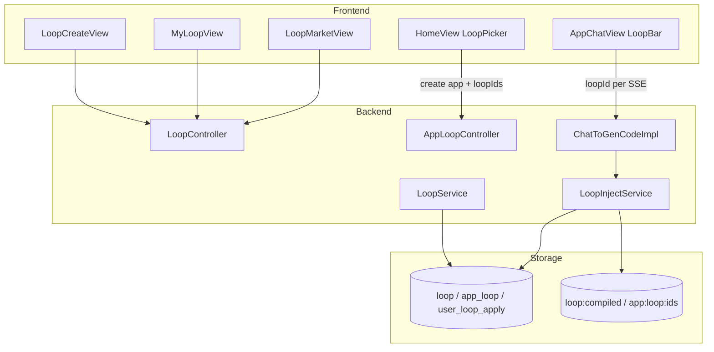
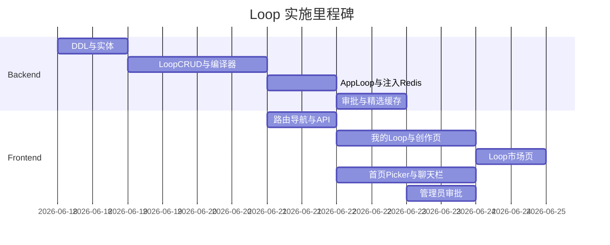

# Loop Skill 市场实施计划

## 已确认约束（复述）

| 项 | 决策 |
|----|------|
| Loop 创作 | **标准工作流模板卡片**（固定步骤示意图 + 每步填内容 → 编译为 skill），**不做**拖拽编辑器 |
| 首页红框 | **可多选** Loop，创建应用时全部写入该应用的 **Loop 库** |
| 聊天注入 | 应用 Loop 库可继续追加；**每轮生成仅选 1 个** Loop 注入 `ChatToGenCodeImpl` |
| 聊天 UI | 输入区底部展示应用已添加的 Loop，单选（radio）决定本轮注入 |
| 命名 | 顶栏独立页 **「Loop」**；用户菜单 **「我的 Loop」** |

---

## 架构总览



---

## 一、数据模型（MySQL）

新增 DDL：[`sql/loop_tables.sql`](sql/loop_tables.sql)（并在 `DbSchemaGuardRunner` 或启动 guard 中可选注册）

### `loop` 表（对标 `app`，独立制品）

| 字段 | 说明 |
|------|------|
| `id` | 雪花 ID |
| `loopName` | 名称 |
| `description` | 市场简介 |
| `cover` | 封面/icon key（可复用 OSS 或渐变色占位） |
| `userId` | 创建者 |
| `priority` | 精选阈值：**>= 99**（复用 [`AppConstant.GOOD_APP_PRIORITY`](src/main/java/com/dbts/glyahhaigeneratecode/constant/AppConstant.java) 语义） |
| `workflowJson` | 标准模板步骤 JSON（见下） |
| `compiledPrompt` | 由 workflow 编译出的注入文本（落库，避免每次重算） |
| `sourceType` | `created` / `imported` |
| `visibility` | `private` / `public`（市场仅展示 public + 精选） |
| `isDelete` / 时间戳 | 与现有表一致 |

**`workflowJson` 标准模板（v1）示例：**

```json
{
  "templateId": "standard_v1",
  "steps": [
    { "key": "role", "label": "角色设定", "placeholder": "你扮演…", "content": "" },
    { "key": "context", "label": "背景上下文", "content": "" },
    { "key": "constraints", "label": "约束与边界", "content": "" },
    { "key": "workflow", "label": "执行步骤", "content": "" },
    { "key": "output", "label": "输出格式", "content": "" }
  ]
}
```

导入 skill：解析 `.md` / `.json`（OpenSkills 风格 frontmatter + body）映射为 `workflowJson` + `compiledPrompt`。

### `app_loop` 表（应用 Loop 库）

| 字段 | 说明 |
|------|------|
| `appId` | 应用 ID |
| `loopId` | Loop ID |
| `addedFrom` | `creation` / `chat` / `market` |
| `createTime` | 加入时间 |

唯一索引 `(appId, loopId)` 防重复。

### `user_loop_apply` 表（审批，镜像 [`user_app_apply`](src/main/java/com/dbts/glyahhaigeneratecode/model/Entity/UserAppApply.java)）

| 字段 | 说明 |
|------|------|
| `loopId` | 申请精选的 Loop |
| `operate` | `1` = 申请精选（后续可扩展） |
| `status` | 0 待审 / 1 通过 / 2 拒绝 |
| 其余 | `applyReason`, `reviewUserId`, `reviewRemark`, `reviewTime` |

审批通过：`loop.priority = 99`，清精选列表缓存。

---

## 二、后端 API 与分层

遵循 [`backend-design` SKILL](.cursor/skills/backend-design/SKILL.md)：`LoopController` / `AppLoopController` → `LoopService` / `AppLoopService` → Mapper；`BaseResponse` + `ThrowUtils`。

### Loop CRUD / 市场

| 端点 | 说明 |
|------|------|
| `POST /loop/add` | 模板创作保存 |
| `POST /loop/update` | 更新（重编译 `compiledPrompt`，删 Redis） |
| `POST /loop/delete` | 逻辑删除 |
| `POST /loop/get/vo` | 详情（含 workflowJson） |
| `POST /loop/my/list/page/vo` | 我的 Loop 分页 |
| `POST /loop/good/list/page/vo` | 精选/公开市场（`priority >= 99` 或 `visibility=public` 策略可配置） |
| `POST /loop/import` | multipart：`.md` / `.json` |
| `POST /loop/apply` | 用户申请精选 |
| `POST /loop/admin/list/page/vo` | 管理员列表 |
| `POST /loop/admin/update` | 管理员改 priority / visibility |
| `POST /loop/apply/list/pending` 等 | 复刻 [`UserAppApplyServiceImpl`](src/main/java/com/dbts/glyahhaigeneratecode/service/impl/UserAppApplyServiceImpl.java) 模式 |

缓存：精选分页 `@Cacheable(value="good_loop_page")`，key 用 [`CacheKeyUtils`](src/main/java/com/dbts/glyahhaigeneratecode/utils/CacheKeyUtils.java)，TTL 对齐 `good_app_page`（5min）。

### 应用 Loop 库

| 端点 | 说明 |
|------|------|
| `POST /app/loop/bind` | 创建应用后批量绑定（body: `appId`, `loopIds[]`） |
| `POST /app/loop/add` | 聊天/市场向当前应用追加单个 Loop |
| `POST /app/loop/list/vo` | 查询应用 Loop 库（含 loop 摘要） |
| `POST /app/loop/remove` | 从库移除（可选，非 MVP 可后置） |

扩展 [`AppAddRequest`](src/main/java/com/dbts/glyahhaigeneratecode/model/DTO/AppAddRequest.java) 增加 `List<Long> loopIds`；[`AppServiceImpl.createApp`](src/main/java/com/dbts/glyahhaigeneratecode/service/impl/AppServiceImpl.java) 创建成功后调用 `appLoopService.bindLoops`。

### 生成注入（核心）

1. **扩展 SSE 参数** — [`ChatToGenCodeController`](src/main/java/com/dbts/glyahhaigeneratecode/controller/ChatToGenCodeController.java)：

```java
@RequestParam(required = false) Long loopId
```

`/gen/code` 与 `/gen/workflow` 均支持。

2. **新建 `LoopInjectService`**（`service/support` 或 `core/loop/`）：
   - `buildInjectBlock(Long userId, Long appId, Long loopId)`
   - 校验：`loopId` 属于该 `appId` 的 `app_loop` 库 **或** 用户本人拥有的 Loop（防越权）
   - 输出 tagged 块（对齐个性化注入风格）：

```text
[loop_skill name="旅行规划助手"]
...compiledPrompt...
[/loop_skill]
```

3. **接入 [`ChatToGenCodeImpl`](src/main/java/com/dbts/glyahhaigeneratecode/service/impl/ChatToGenCodeImpl.java)**：

```java
// 在 injectPersonalizationPrompt 之后拼接
String enhanced = injectPersonalizationPrompt(message, userId);
enhanced = loopInjectService.injectIfPresent(enhanced, userId, appId, loopId);
```

优先级注释：**用户本轮 message > Loop 注入 > 个性化前缀 > SystemMessage**（与现有 `injectPersonalizationPrompt` 注释对齐）。

4. **Redis（Cache-Aside，参考 [`UserPersonalizationServiceImpl`](src/main/java/com/dbts/glyahhaigeneratecode/service/impl/UserPersonalizationServiceImpl.java)）**：

| Key | 值 | TTL |
|-----|-----|-----|
| `loop:compiled:{loopId}` | compiledPrompt 纯文本 | 基础 TTL + 随机抖动 |
| `app:loop:ids:{appId}` | loopId 列表 JSON | 与 state 类似 或 1h |
| 空值占位 | `"{}"` 60s | 防穿透 |

写路径：`loop` update/delete → 删 `loop:compiled:{id}` + 相关 `app:loop:ids:*`；`app_loop` 变更 → 删对应 `app:loop:ids:{appId}`。

5. **编译器 `LoopWorkflowCompiler`**：将 `workflowJson.steps[].content` 按模板顺序拼成 `compiledPrompt`；导入 md 时 body 直写 `compiledPrompt`，steps 可自动生成单步。

---

## 三、前端页面与组件

遵循 [`frontend-design.md`](ai-generate-code-frontend/frontend-design.md)；改完后 `npm run openapi2ts` 生成 `src/api/loopController.ts` 等。

### 路由（[`router/index.ts`](ai-generate-code-frontend/src/router/index.ts)）

| path | 组件 | 说明 |
|------|------|------|
| `/loop` | `page/Loop/LoopMarketView.vue` | 顶栏「Loop」市场 |
| `/user/loops` | `page/Loop/MyLoopView.vue` | 用户菜单「我的 Loop」 |
| `/loop/create` | `page/Loop/LoopCreateView.vue` | 模板卡片创作 |
| `/loop/:id/edit` | `page/Loop/LoopEditView.vue` | 编辑（可复用 Create） |

### 导航改动 — [`GlobalHeader.vue`](ai-generate-code-frontend/src/components/GlobalHeader.vue)

- `baseMenuItems` 增加 `{ key: 'loop', path: '/loop', label: 'Loop' }`（插在「代码生成」后）
- 用户下拉增加「我的 Loop」→ `/user/loops`

### 1) Loop 市场页（高级感）

设计方向（`frontend-design` + `ui-ux-pro-max`）：
- **比首页精选应用更灵动**：卡片 hover 微光边框、stagger 入场、`prefers-reduced-motion` 降级
- 分区：**精选 Loop**（priority>=99）+ **探索**（public 分页）
- 卡片：图标区 + 名称 + 描述 + 作者 + 「加入我的应用」/「预览详情」
- 复用 [`HomeView`](ai-generate-code-frontend/src/page/HomeView.vue) 的 CSS 变量（`--bg-card`, `--text-base`）保证亮/暗主题一致
- 图标用内联 SVG（Lucide 风格），不用 emoji

### 2) 我的 Loop（参考 sinas Skills 卡片栅格）

- 顶部 CTA：**创建 Loop** / **导入 Skill**
- 响应式 grid（2~4 列）：每卡展示名称、简介、步骤数、public/私有、申请精选按钮
- 点击进入编辑页（模板表单）

### 3) Loop 创作页（标准工作流示意图）

- 左侧/顶部：**固定 5 步流程示意图**（只读节点 + 连线 SVG）
- 右侧/下方：每步 `textarea` + label + placeholder
- 底部：名称、简介、可见性；保存时调 `POST /loop/add`
- **导入**：拖拽/选择 `.md`，预览解析结果后确认保存

### 4) 首页红框 — Loop 多选器

位置：[`HomeView.vue`](ai-generate-code-frontend/src/page/HomeView.vue) `.prompt-actions` 内，`?` 按钮与工作流按钮之间（对应截图红框）。

组件：[`components/loop/LoopPickerTrigger.vue`](ai-generate-code-frontend/src/components/loop/LoopPickerTrigger.vue)
- Pill 按钮「Loop · N」打开 Popover/Drawer
- 列表：我的 Loop + 已收藏/常用（首期：我的 Loop + 公开市场简要列表）
- **Checkbox 多选**；展示名称 + 一行介绍
- `appAddUsingPost` 传 `loopIds`；若后端 create 未内联 bind，则 create 成功后 `appLoopBind`

### 5) 聊天页 Loop 栏

位置：[`AppChatView.vue`](ai-generate-code-frontend/src/page/App/AppChatView.vue) `.chat-input-bar` 上方新增 `AppLoopInjectBar`。

行为：
- 加载 `app/loop/list/vo`
- **Radio 单选**本轮注入 Loop（可选项含「无」）
- 支持从 Loop 市场「添加到本应用」快捷入口
- `sendMessage` 构建 SSE URL 时附加 `loopId`（[`~2601`](ai-generate-code-frontend/src/page/App/AppChatView.vue) 行附近 EventSource URL）

状态：`selectedLoopId` 本地 state；切换不影响库，仅影响本轮请求。

---

## 四、管理员与审批

| 能力 | 实现 |
|------|------|
| Loop 列表管理 | 新页 `AdminLoopManage.vue` 或扩展 [`AdminAppManage.vue`](ai-generate-code-frontend/src/page/Admin/AdminAppManage.vue) 为 Tab |
| 精选审批 | 扩展 [`AdminApplyManage.vue`](ai-generate-code-frontend/src/page/Admin/AdminApplyManage.vue) 支持 `user_loop_apply`，或独立 Tab |
| 直设精选 | `loop/admin/update` 设 `priority=99` |

---

## 五、实施顺序（建议）



1. **后端地基**：DDL → Entity/Mapper → `LoopWorkflowCompiler` → Loop CRUD
2. **注入链路**：`LoopInjectService` + `ChatToGenCodeImpl` + Controller `loopId` 参数 + 单测
3. **App Loop 库**：`app_loop` API + 创建应用绑定
4. **前端核心**：我的 Loop + 模板创作 + 导入
5. **市场与集成**：Loop 市场页 + 首页 Picker + 聊天 InjectBar
6. **治理**：审批 + Admin + `openapi2ts`

---

## 六、验收标准

- 用户可在「我的 Loop」用**标准 5 步模板**创建 Loop，或导入 `.md` skill
- 顶栏「Loop」可浏览精选与他人公开 Loop；可申请精选，管理员可审批
- 首页创建应用时可**多选** Loop 写入应用库
- 聊天页底部展示应用 Loop 库；**每轮仅选 1 个**注入；SSE 请求带 `loopId`
- 后端在 [`ChatToGenCodeImpl`](src/main/java/com/dbts/glyahhaigeneratecode/service/impl/ChatToGenCodeImpl.java) 将 `[loop_skill]` 块拼入 userMessage；Redis 缓存 compiled prompt；Loop 更新后缓存失效
- 未选 Loop / loopId 无效 / 非本应用库成员 → 不注入、不报错（或 Param 校验友好提示）
- 亮/暗主题、移动端 375px 无横向滚动；可键盘操作 Picker

---

## 七、明确不在本阶段

- 拖拽式 / 节点连线自定义工作流编辑器
- Loop 作为 LangChain4j Tool 暴露（仅 **system/userMessage 注入**）
- 每轮多 Loop 同时注入
- 修改 `ai-generate-code-frontend` 以外的生成核心（LangGraph 新节点）— 后续可扩展

---

## 八、关键参考文件

| 用途 | 路径 |
|------|------|
| 注入扩展点 | [`ChatToGenCodeImpl.java`](src/main/java/com/dbts/glyahhaigeneratecode/service/impl/ChatToGenCodeImpl.java) |
| 个性化注入范例 | [`UserPersonalizationServiceImpl.java`](src/main/java/com/dbts/glyahhaigeneratecode/service/impl/UserPersonalizationServiceImpl.java) |
| 精选/审批范例 | [`AppServiceImpl.java`](src/main/java/com/dbts/glyahhaigeneratecode/service/impl/AppServiceImpl.java), [`UserAppApplyServiceImpl.java`](src/main/java/com/dbts/glyahhaigeneratecode/service/impl/UserAppApplyServiceImpl.java) |
| 首页工具栏 | [`HomeView.vue`](ai-generate-code-frontend/src/page/HomeView.vue) L614+ |
| 聊天 SSE | [`AppChatView.vue`](ai-generate-code-frontend/src/page/App/AppChatView.vue) L2504+, L3310+ |
| 顶栏 | [`GlobalHeader.vue`](ai-generate-code-frontend/src/components/GlobalHeader.vue) |
