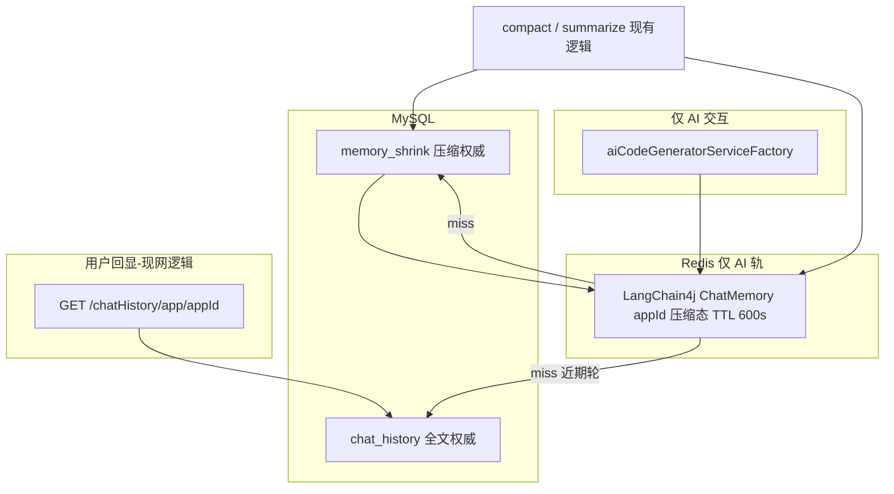

# memory_shrink 双轨存储（用户全文 / AI 压缩）

## 目标（一句话）

**同一会话两份 MySQL 数据**：`chat_history` 全文（用户回显，**按现网逻辑**）与 `memory_shrink` 压缩态（**仅 AI**）；压缩算法不改，只改落库与 AI 加载路径；**前端仍走老接口读 `chat_history`**，不读 shrink、不读 AI Redis。

---

## 轨道约定（与实现对齐）

| 轨道 | MySQL | Redis | TTL |
|------|--------|-------|-----|
| **chat_history（回显）** | `addChatMessage`、分页、导出等 **保持现网**；禁止 summary/truncate **写回** `message` | **不新增** `chat:echo:{appId}`；回显 **不依赖** 新 Redis key | **不改为 600s**（`spring.data.redis.ttl` 仍 3600，且仅作用于既有 ChatMemoryStore 配置；本轨以 DB 为权威） |
| **memory_shrink（AI）** | `conversation_summary` + `message_truncate` 持久化 | LangChain4j `memoryId = appId`（压缩上下文） | **600s（10 分钟）**；新一轮 USER 或生成入口 **EXPIRE 重置** |

---

## 根因

[`trySummarizeOldestRoundsIfNeeded`](src/main/java/com/dbts/glyahhaigeneratecode/service/impl/ChatHistoryServiceImpl.java) 把会话摘要 **写入并替换** `chat_history`，导致 [`AppChatView`](ai-generate-code-frontend/src/page/App/AppChatView.vue) 回显摘要文案。

---

## 双轨架构



| 轨道 | MySQL | Redis | 用途 |
|------|--------|-------|------|
| **用户回显** | `chat_history`（只增全文；合并/截断**不再改**此表 `message`） | 无新增 key；HTTP 直读 DB | 与改前一致 |
| **AI 上下文** | `memory_shrink` | LangChain4j `memoryId = appId` | 仅生成链路 |

---

## 1. 表 `memory_shrink`（MySQL）

[`sql/memory_shrink.sql`](sql/memory_shrink.sql)：

| 字段 | 说明 |
|------|------|
| `id`, `appId`, `userId`, `message`, `messageType` | 与 chat_history 对齐 |
| `shrinkType` | `conversation_summary` \| `message_truncate` |
| `sourceChatHistoryIds` | JSON 数组；summary 为 4 条 id；truncate 为单条 `[chatHistoryId]` |
| `chatHistoryId` | truncate 时源行 id（便于 upsert 唯一） |
| `anchorCreateTime` | 时间轴排序（summary 用最早轮锚点；truncate 用源行 createTime） |
| `createTime`, `updateTime`, `isDelete` | 惯例字段 |
| 索引 | `(appId, anchorCreateTime)`；`(appId, chatHistoryId, shrinkType)` 唯一（truncate 幂等） |

---

## 2. 压缩写库（算法不变，压缩结果进 shrink）

### 2.1 `conversation_summary`（两轮合并）

[`trySummarizeOldestRoundsIfNeeded`](src/main/java/com/dbts/glyahhaigeneratecode/service/impl/ChatHistoryServiceImpl.java)：

- **保留**：`summarizeTwoRoundsWithAi` / `parseSummaryResponse` / while 循环
- **禁止**：`removeById(oldestFour)`、`saveMergedRoundSummaryRows` → `chat_history`
- **改为**：向 `memory_shrink` 插入 2 行（USER+AI），`sourceChatHistoryIds` = 4 个 id；`chat_history` 四条 **保持原文、isDelete=0**

### 2.2 `message_truncate`（单条 AI 超长）

- **保留**：[`compactAiMessageForMemory`](src/main/java/com/dbts/glyahhaigeneratecode/core/util/ChatHistorySchemaMigrationSupport.java) 实现不变
- **新增落库**：在以下时机，对「被压缩」的 AI 行 **upsert** `memory_shrink`（`shrinkType=message_truncate`，`message`=压缩正文，`chatHistoryId`=源 id）：
  - AI 路径灌 Redis / 重建时（由 shrink 组装逻辑触发，**非豁免行**）
  - [`compactMemoryMessagesIfNeeded`](src/main/java/com/dbts/glyahhaigeneratecode/service/impl/ChatHistoryServiceImpl.java) 在线改 AI Redis 后
- **禁止**：把压缩正文写回 `chat_history.message`

豁免「本轮主 AI」逻辑不变。

---

## 3. Redis 策略（仅 AI 轨：600s + 每轮刷新）

配置：**仅** AI 用 LangChain4j [`RedisChatMemoryStore`](src/main/java/com/dbts/glyahhaigeneratecode/config/RedisChatMemoryStoreConfig.java) 的 TTL 改为 **`600`（10 分钟）**。推荐新增 `conversation.memory.chat-ttl-seconds: 600` **只绑定 ChatMemoryStore**，避免误伤 Spring Session；**不要**把全局 `spring.data.redis.ttl` 一刀切改成 600（除非确认无其它 Redis 用途依赖 3600）。

**刷新时机**（任一发生则对 AI `appId` **EXPIRE 重置为 600s**）：

- 用户新一轮：`addChatMessage` 写入 USER 后（与生成预加载衔接），或
- 生成入口：`getAiCodeGeneratorService` / `chatToGenCode*` 开始前（二选一实现，避免重复刷新）

**chat_history 轨**：不写 echo、不单独刷 600s；`GET /chatHistory/*` 仍查 MySQL。

### 3.1 AI Redis 加载逻辑

入口：[`aiCodeGeneratorServiceFactory.getAiCodeGeneratorService`](src/main/java/com/dbts/glyahhaigeneratecode/ai/aiCodeGeneratorServiceFactory.java) / [`loadConversationMemoryStateAndInject`](src/main/java/com/dbts/glyahhaigeneratecode/service/impl/ChatHistoryServiceImpl.java)

```
若 Redis(appId) 存在且 messages 非空:
  → 直接使用现有列表（内容为压缩态，非回显全文）
  → 按现逻辑执行 trySummarizeOldestRoundsIfNeeded / compactMemoryMessagesIfNeeded
  → 变更写回 Redis(appId)，并同步落库 memory_shrink（summary / truncate）
否则 Redis miss 或已过期:
  → 从 MySQL 读取 memory_shrink（按 anchorCreateTime 升序）
  → 合并未纳入 sourceIds 的 chat_history 近期行（limit 40、跳过最新 USER 等现规则）
  → 对仍需 truncate 且 shrink 无行的 AI，用 chat_history 原文现场 compact 后 upsert shrink
  → 写入 Redis(appId)，设置 TTL 600s
```

**要点**：现场压缩可读 `chat_history` **原文**；持久化压缩结果只进 `memory_shrink` + AI Redis。**HTTP 回显与 `chat_history` 表不受影响。**

---

## 4. 有效轮数（合并阈值）

合并判定用 **有效 USER 轮数**（避免 chat_history 未删导致永远 >3）：

```
memory_shrink(conversation_summary) 的 USER 条数
+ chat_history 的 USER 条数（id ∉ 全部已合并 sourceIds）
```

[`listOldestMessagesForMerge`](src/main/java/com/dbts/glyahhaigeneratecode/core/util/ChatHistorySchemaMigrationSupport.java) 排除已出现在任意 `sourceChatHistoryIds` 中的 id。

---

## 5. 前端 / 用户回显（现网逻辑）

**不变**：

| 步骤 | 操作 | 期望 |
|------|------|------|
| 1 | 打开应用对话页，F12 → Network | 仅见 `GET /api/chatHistory/app/{appId}?size=10&...` |
| 2 | 看响应 `records[].message` | 为用户当时输入的 **完整原文** + AI **完整回复** |
| 3 | 触发多轮直至后台执行 conversation_summary | 刷新后 **最早几轮仍为原文**，不出现合并摘要文案 |
| 4 | 搜索响应体 | 不应出现 `[历史AI代码已压缩`、不应出现 `【用户总结】`（除历史脏数据） |
| 5 | 导出 | `GET /api/chatHistory/export/{appId}` 仅 `chat_history` 全文 |

**明确不经过**：`memory_shrink`、LangChain4j AI Redis。

前端 **0 改动**，无需 `openapi2ts`。

---

## 6. 历史脏数据（forward_only）

已写入 `chat_history` 的摘要行不自动修复；新逻辑生效后新合并不再污染。

---

## 7. 改动文件（预估 ~450–600 行，后端）

| 文件 | 内容 |
|------|------|
| `sql/memory_shrink.sql` | 建表 |
| `MemoryShrink*` entity/mapper/service | CRUD + upsert truncate |
| `ChatHistorySchemaMigrationSupport` | 写 shrink、轮数、listOldest 过滤 |
| `ChatHistoryServiceImpl` | summarize 落点、AI 组装灌 Redis、truncate 落库 |
| `RedisChatMemoryStoreConfig` / `application.yml` | **仅 AI** ChatMemory TTL 600 |
| `aiCodeGeneratorServiceFactory` | AI Redis hit/miss 分支 |
| 单测 | shrink 落库 + AI miss 重建 + 原 MemoryCompressionTest |

**本版不做**：`ChatEchoRedisSupport`、`chat:echo:{appId}`。

---

## 8. 验收标准

1. **前端现网逻辑**：`GET /chatHistory/app/{appId}` 仅全文；合并后刷新仍见原文（新会话）；响应无压缩标记（除历史脏数据）。
2. **MySQL 隔离**：`memory_shrink` 含 summary + truncate；对应 `chat_history` 行 `message` 未被摘要/截断覆盖。
3. **AI Redis 命中**：10 分钟内再次生成，走 Redis hit；`trySummarize`/`compact` 行为与现网一致，但只写 shrink + AI Redis。
4. **AI Redis 未命中**：清空该 `appId` ChatMemory 后生成，能从 `memory_shrink` + `chat_history` 重建，且 **TTL 为 600s**；**新一轮交互后 TTL 重置**。
5. **chat_history 轨不变**：无 echo key；`addChatMessage`/分页/导出与改前一致；全局 Redis TTL 不因本需求误改为 600（Session 等不受影响）。
6. **算法回归**：`summarizeTwoRoundsWithAi`、`compactAiMessageForMemory` 输出语义不变；[`ChatHistoryServiceImplMemoryCompressionTest`](src/test/java/com/dbts/glyahhaigeneratecode/service/impl/ChatHistoryServiceImplMemoryCompressionTest.java) 通过。
7. **无垃圾代码**：无临时 debug / 一次性测试残留。

---

## 9. 相对上一版 plan 的调整

- ~~`chat:echo:{appId}` + 双 key 同 TTL~~ → **不做**；回显只走 MySQL + 现网 HTTP
- ~~chat_history 轨 Redis 600s~~ → **仅 memory_shrink / AI ChatMemory 600s + 每轮刷新**
- ~~message_truncate 不落表~~ → **必须落 `memory_shrink`**
- ~~全局 spring.data.redis.ttl 改 600~~ → **优先独立配置项，仅绑 ChatMemoryStore**
