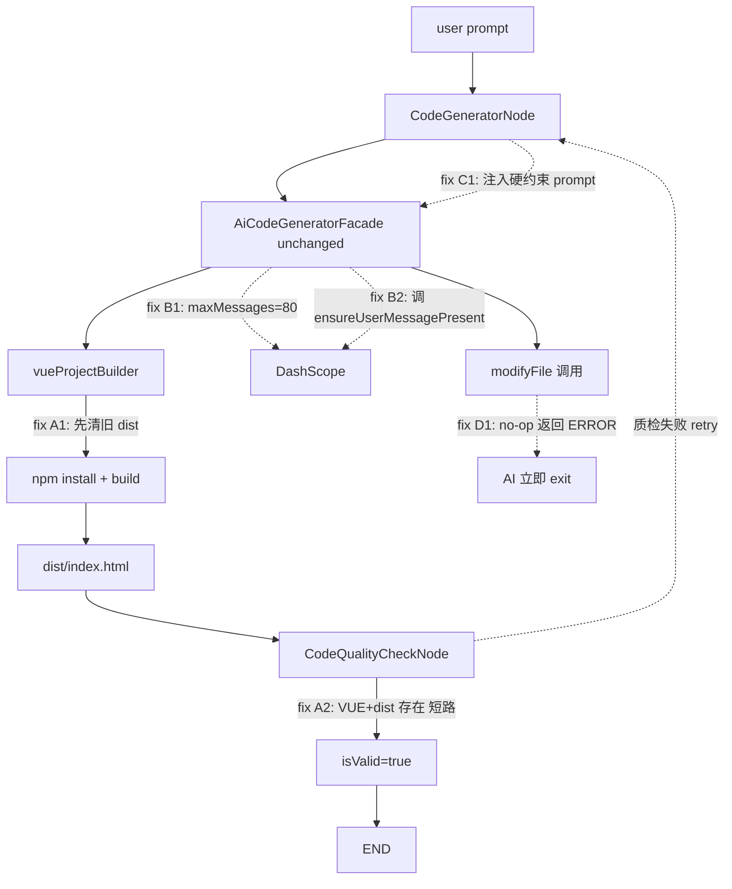

# Workflow Vue 稳定性修复 Plan v4（最终最小化版本）

## 关键决策与简化思路

- 不动 `@Tool` 注解（用户明确要求）
- 不动 `AiCodeGeneratorFacade` 方法签名（侵入性最大，跳过）
- 不动 `WorkflowContext` 结构（用 dist 文件存在性替代字段）
- 不动 `ChatToGenCodeController`（前端过滤已能兜住脏字符）
- 不做 modify-only 工具集（P1 留作后续，不阻断本轮）
- 保留必要改动：内存扩容 + 内存保底 + 质检短路 + Prompt 注入 + modifyFile no-op ERROR + 前端过滤

## 故障链路与修复点



---

## 改动清单（8 个文件）

### A1. [`src/main/java/com/dbts/glyahhaigeneratecode/core/Builder/vueProjectBuilder.java`](src/main/java/com/dbts/glyahhaigeneratecode/core/Builder/vueProjectBuilder.java)

**位置**：L64 `log.info("开始构建...")` 之后插入

```java
// === 修复 A1：每轮 build 前清理旧 dist ===
// 这样 dist/index.html 是否存在就准确反映"本轮"build 是否成功，
// CodeQualityCheckNode 据此短路 AI 质检，避免对成功构建的项目再调一次大模型。
File distDirToClean = new File(projectDir, "dist");
if (distDirToClean.exists()) {
    try {
        cn.hutool.core.io.FileUtil.del(distDirToClean);
        log.info("已清理旧 dist 目录，准备本轮构建");
    } catch (Exception e) {
        log.warn("清理旧 dist 失败（继续构建，但短路判定可能误判）: {}", e.getMessage());
    }
}
```

**改动量**：约 10 行（含注释），不改任何已有逻辑。

---

### A2. [`src/main/java/com/dbts/glyahhaigeneratecode/LangGraph4j/node/CodeQualityCheckNode.java`](src/main/java/com/dbts/glyahhaigeneratecode/LangGraph4j/node/CodeQualityCheckNode.java)

**位置**：L74-78 之间，`String generatedCodeDir = ...` 之前插入

```java
// === 修复 A2：Vue 项目构建已成功时短路 AI 质检 ===
// 依赖 vueProjectBuilder 在 build 前清理旧 dist 的承诺：
// 只要 dist/index.html 存在，就证明本轮 npm run build 通过了 SFC 校验与编译，
// 没必要再调用大模型对源码做一次会误判的"软"质检。
String tentativeDir = context.getGeneratedCodeDir();
if (context.getGenerationType() == com.dbts.glyahhaigeneratecode.model.enums.CodeGenTypeEnum.VUE
        && cn.hutool.core.util.StrUtil.isNotBlank(tentativeDir)) {
    java.io.File distIndex = new java.io.File(tentativeDir, "dist/index.html");
    if (distIndex.isFile()) {
        log.info("Vue 项目 dist/index.html 已存在，短路 AI 质检。appId={}", context.getAppId());
        QualityResult ok = QualityResult.builder()
                .isValid(true)
                .errors(java.util.Collections.emptyList())
                .suggestions(java.util.List.of("Vue 项目构建已通过，跳过 AI 质检"))
                .build();
        context.setCurrentStep("代码质量检查");
        context.setQualityResult(ok);
        return WorkflowContext.saveContext(context);
    }
}
```

**改动量**：约 18 行（含注释）。

---

### A3a. [`src/main/resources/Prompt/code_exam.txt`](src/main/resources/Prompt/code_exam.txt)

**位置**：L48 已有的"下列内容只能写入 suggestions"段落后追加：

```text
- package.json 缺少 "type": "module"（Vite 5+ 与 Node 20+ 默认 ESM，不影响 Vite 构建）
- 缺少 README、CHANGELOG、LICENSE 等说明性文件
- 文件路径大小写偏好、空行/缩进风格问题
- "建议添加 xxx" 形式的所有泛化建议

【重要规则】只要 Vite/Vue 项目能完成 npm run build，isValid 必须为 true。
即便存在风格偏好或缺失说明文件，只要不影响构建产物可执行，一律 isValid=true。
```

---

### A3b. [`src/main/java/com/dbts/glyahhaigeneratecode/LangGraph4j/ai/CodeQualityCheckService.java`](src/main/java/com/dbts/glyahhaigeneratecode/LangGraph4j/ai/CodeQualityCheckService.java)

**位置**：L52 之前插入白名单降级（在合并 errors→suggestions 之前先做降级）

```java
// === 修复 A3：白名单降级 ===
// 模型偶发把"非阻断项"写到 errors 字段（如 package.json 缺 "type":"module"），
// 这里在合并到 suggestions 前先把白名单关键词从 errors 移到 suggestions，
// 避免下游因为这些非阻断项触发整轮 retry。
if (qualityResult.getErrors() != null && !qualityResult.getErrors().isEmpty()) {
    java.util.List<String> realErrors = new java.util.ArrayList<>();
    java.util.List<String> downgraded = new java.util.ArrayList<>();
    for (String err : qualityResult.getErrors()) {
        if (isNonBlockingError(err)) {
            downgraded.add("[降级建议] " + err);
        } else {
            realErrors.add(err);
        }
    }
    if (!downgraded.isEmpty()) {
        java.util.List<String> merged = new ArrayList<>(qualityResult.getSuggestions());
        merged.addAll(downgraded);
        qualityResult.setSuggestions(merged);
        qualityResult.setErrors(realErrors);
        if (realErrors.isEmpty()) qualityResult.setIsValid(Boolean.TRUE);
    }
}
```

**新增私有方法**：

```java
/**
 * 判断 errors 条目是否属于"非阻断"问题，应降级为 suggestions。
 * 命中条件：package.json 缺 "type":"module"、缺 README/favicon、SEO/meta、注释/命名风格、a11y 等。
 */
private static boolean isNonBlockingError(String err) {
    if (err == null) return false;
    String lower = err.toLowerCase(java.util.Locale.ROOT);
    if (lower.contains("type") && lower.contains("module")) return true;
    if (lower.contains("readme") || lower.contains("favicon")) return true;
    if (lower.contains("seo") || lower.contains("meta")) return true;
    if (lower.contains("注释") || lower.contains("comment")) return true;
    if (lower.contains("命名") || lower.contains("naming")) return true;
    if (lower.contains("a11y") || lower.contains("accessibility")) return true;
    return false;
}
```

**改动量**：约 30 行。

---

### B1+B2. [`src/main/java/com/dbts/glyahhaigeneratecode/ai/aiCodeGeneratorServiceFactory.java`](src/main/java/com/dbts/glyahhaigeneratecode/ai/aiCodeGeneratorServiceFactory.java)

**改动 B1**：L156

```java
.maxMessages(20)
```

改为：

```java
// === 修复 B1：从 20 扩容到 80 ===
// 原因：单次工具调用会向 chat memory 写入 2 条消息（assistant tool_call + tool result）。
// 配合 maxSequentialToolsInvocations=20，最坏情况会写入 40 条工具消息，
// 把最早的 UserMessage 挤出窗口，导致 DashScope 报 400「无 user role」。
// 80 条 = 40(工具) + 20(常规对话) + 余量，足以覆盖现有上限。
.maxMessages(80)
```

**改动 B2**：类内新增方法（放在 `isRedisMemoryEmpty` 之后）

```java
/**
 * === 修复 B2：内存保底注入 UserMessage ===
 * 当 retry 发生时，前一轮的工具调用可能已经把最早的 UserMessage 挤出 chat memory 窗口，
 * 调用方在 retry 入口调用本方法，若窗口已无任何 UserMessage 则把 retry prompt 补回去，
 * 防止 DashScope 因「无 user role」直接 400。
 *
 * @param appId           对话 memoryId
 * @param userMessageText 兜底注入用的 user 文本（通常是 retry 后的 enhancedPrompt）
 */
public void ensureUserMessagePresent(Long appId, String userMessageText) {
    if (appId == null || appId <= 0 || cn.hutool.core.util.StrUtil.isBlank(userMessageText)) {
        return;
    }
    try {
        java.util.List<dev.langchain4j.data.message.ChatMessage> msgs = chatMemoryStore.getMessages(appId);
        boolean hasUser = msgs != null && msgs.stream()
                .anyMatch(m -> m instanceof dev.langchain4j.data.message.UserMessage);
        if (!hasUser) {
            log.warn("Chat memory 已无 UserMessage（被工具消息挤出），注入 retry prompt 作为兜底。appId={}", appId);
            java.util.List<dev.langchain4j.data.message.ChatMessage> next =
                    msgs == null ? new java.util.ArrayList<>() : new java.util.ArrayList<>(msgs);
            next.add(dev.langchain4j.data.message.UserMessage.from(userMessageText));
            chatMemoryStore.updateMessages(appId, next);
        }
    } catch (Exception e) {
        log.error("ensureUserMessagePresent 失败，appId={}", appId, e);
    }
}
```

**改动量**：B1 改 1 个数字 + 注释，B2 新增 ~25 行。**不改任何已有方法签名**。

---

### C1. [`src/main/java/com/dbts/glyahhaigeneratecode/LangGraph4j/node/CodeGeneratorNode.java`](src/main/java/com/dbts/glyahhaigeneratecode/LangGraph4j/node/CodeGeneratorNode.java)

**位置**：L31 之后、L46 facade 调用之前插入

```java
// === 修复 C1：retry 分支检测 + 错误注入 ===
// 当 routeAfterCodeGenerator 把 firstRound 设为 false 且 retryCount>=1，且 qualityResult.isValid=false，
// 说明这是一次质检失败后的重试。此时强行在 enhancedPrompt 前置一段硬约束，
// 引导 AI 用 modifyFile 做"针对性修复"而不是 writeFile 把整个项目重写一遍。
boolean isRetry = !Boolean.TRUE.equals(context.getFirstRound())
        && context.getRetryCount() != null && context.getRetryCount() >= 1
        && context.getQualityResult() != null
        && Boolean.FALSE.equals(context.getQualityResult().getIsValid());

if (isRetry && generationType == CodeGenTypeEnum.VUE) {
    java.util.List<String> errors = context.getQualityResult().getErrors();
    StringBuilder sb = new StringBuilder();
    sb.append("【上轮代码已生成并部分构建，仅存在以下质检问题，请仅用 modifyFile 工具针对性修复】\n");
    if (errors != null) {
        for (String err : errors) sb.append("- ").append(err).append('\n');
    }
    sb.append('\n');
    sb.append("硬性约束：\n");
    sb.append("1) 禁止使用 writeFile / deleteFile，本轮只能用 modifyFile / readFile / readDir / exit。\n");
    sb.append("2) 若 modifyFile 返回\"未发生变化\"或\"未找到要替换的内容\"，必须立即调用 exit 退出。\n");
    sb.append("3) 改动需聚焦上述具体错误，禁止重写整个文件。\n\n");
    sb.append("原始需求（仅供上下文参考）：\n").append(userMessage);
    userMessage = sb.toString();

    // === 修复 B2 调用点：retry 时检查 chat memory 是否还有 UserMessage，没有则补回 ===
    com.dbts.glyahhaigeneratecode.ai.aiCodeGeneratorServiceFactory factory =
            SpringContextUtil.getBean(com.dbts.glyahhaigeneratecode.ai.aiCodeGeneratorServiceFactory.class);
    factory.ensureUserMessagePresent(appId, userMessage);
}
```

**改动量**：约 30 行（含注释），不改 facade 调用本身（仍传旧签名 `firstRound + compactMemoryOnCacheHit`）。

---

### D1. [`src/main/java/com/dbts/glyahhaigeneratecode/ai/tool/tools/FileModifyTool.java`](src/main/java/com/dbts/glyahhaigeneratecode/ai/tool/tools/FileModifyTool.java)

**注意**：L32 `@Tool` 注解**保持不动**。

**位置**：L78-79 改写

```java
if (originalContent.equals(modifiedContent)) {
    return "信息：替换后文件内容未发生变化 - " + relativeFilePath;
}
```

改为：

```java
// === 修复 D1：no-op 改返回 ERROR ===
// 原行为：返回"信息：替换后文件内容未发生变化"，AI 判断为软提示后会再次用相同参数重试，
// 导致 modifyFile 死循环，把 chat memory 撑爆并触发 DashScope 400。
// 新行为：返回明确 ERROR 文本，并显式提示调用 exit，让 AI 立即停止当前工具循环。
if (originalContent.equals(modifiedContent)) {
    return "错误：替换后文件内容未发生变化（" + relativeFilePath + "）。"
            + "原因可能是 oldContent 与 newContent 等价。"
            + "禁止使用相同参数重复调用 modifyFile；若无需进一步修改，请立即调用 exit 工具结束。";
}
```

**改动量**：1 行实质改动（替换 return 字符串）+ 7 行注释。**@Tool 注解一字未动**。

---

### E1. [`ai-generate-code-frontend/src/utils/workflowChatFilters.ts`](ai-generate-code-frontend/src/utils/workflowChatFilters.ts)

**改动**：`filterAssistantSseChunkForUi` 函数 L213-236 的 `for (const line of completeLines)` 循环重写

```typescript
// === 修复 E1：每行先用全局正则擦除残留 [workflow] 片段，再做后续判断 ===
// 后端 SSE chunk 偶尔会把 [workflow] 文案与正文粘在同一行（跨 chunk 拼接所致），
// 仅靠 WORKFLOW_STEP_LINE_RE（^...$ 锚定）会漏过滤，导致前端把 [workflow] 文本作为 markdown 渲染到正文里。
const kept: string[] = []
for (const line of completeLines) {
  const cleanedLine = line.replace(WORKFLOW_STEP_GLOBAL_RE, (_match, step, label) => {
    const s = Number(step)
    const l = (label ?? '').trim()
    if (Number.isFinite(s) && l) newSteps.push({ step: s, label: l })
    return ''
  })
  const trimmed = cleanedLine.trim()
  if (trimmed) {
    if (WORKFLOW_DONE_LINE_RE.test(trimmed)) {
      maybeAppendDoneStep(trimmed, newSteps)
      continue
    }
    if (WORKFLOW_NOTICE_MERMAID_ERROR_RE.test(trimmed)) {
      mermaidErrorNotice = true
      continue
    }
    if (INTERNAL_DIR_LINE_RE.test(trimmed)) continue
  }
  kept.push(cleanedLine)
}

// === 修复 E1 兜底：丢弃单独成行 + 长度 ≤2 + 全为非中英文数字的孤立 token（解决 " v" 类脏字符） ===
const filteredKept = kept.filter((line) => {
  const t = line.trim()
  if (!t) return true
  if (t.length <= 2 && !/[A-Za-z0-9\u4e00-\u9fa5]/.test(t)) return false
  return true
})
const uiText = normalizeUiText(filteredKept.join('\n') + (endsWithBreak && completeLines.length > 0 ? '\n' : ''))
return { uiText, newSteps, mermaidErrorNotice }
```

**改动量**：约 30 行，替换原循环（功能等价 + 强化）。

---

## 文件汇总表

| # | 文件 | 改动量 | 性质 |
|---|---|---|---|
| 1 | `vueProjectBuilder.java` | +10 行 | 新增清理逻辑，不动既有流程 |
| 2 | `CodeQualityCheckNode.java` | +18 行 | 新增短路分支，不动既有 AI 调用 |
| 3 | `code_exam.txt` | +8 行 | Prompt 追加 |
| 4 | `CodeQualityCheckService.java` | +30 行 | 新增白名单方法 + 调用 |
| 5 | `aiCodeGeneratorServiceFactory.java` | 改 1 数字 + 新增 25 行方法 | 不改既有签名 |
| 6 | `CodeGeneratorNode.java` | +30 行 | 新增 retry 检测块，facade 调用不变 |
| 7 | `FileModifyTool.java` | 改 1 处 return + 注释 | @Tool 注解不动 |
| 8 | `workflowChatFilters.ts` | ~30 行 | 替换循环逻辑 |

**合计**：后端约 120 行新增（注释占 1/3），前端约 30 行替换。

---

## 不在本轮范围（P1 后续）

- modify-only 工具集（`ToolManager.getModifyOnlyTools` + `ToolMode` 枚举）：靠 prompt 注入 + modifyFile no-op ERROR 已能引导 AI 走修改路径，本轮不做
- `WorkflowContext.lastBuildSuccess` 字段：用 dist 文件存在性等价替代
- `AiCodeGeneratorFacade` 加 build 回调：同上
- `ChatToGenCodeController` 后端去脏字符：靠前端过滤增强兜住
- SSE `event: workflow-failed` 语义事件：体验优化项
- 双 build 合并（facade + project_builder）：架构性重构

---

## 验证步骤（F1）

1. `./mvnw spring-boot:run` 启动后端
2. `cd ai-generate-code-frontend && npm run dev` 启动前端
3. 复用同一 prompt（极客台式机配置）触发 Vue 流程
4. 期望观测：
   - 后端日志：0 次 `CodeQualityCheckService.checkCodeQuality` AI 请求（被 A2 短路）
   - 后端日志：0 次 retry 进入 `code_generator`
   - 前端 SSE 正文：无 `[workflow]` 文本残留
   - 前端 SSE 正文：无孤立 ` v` 等脏字符
   - 前端 UI：4-step 工作流卡片在顶部正确渲染
5. 反向人工验证（可选）：临时把 `code_exam.txt` 改严格、强行 retry，观察：
   - retry 时 prompt 含"硬性约束"块
   - modifyFile no-op 第一次即返回 ERROR
   - 无 DashScope 400 报错
   - chat memory 始终保留 UserMessage

---

## 最终验收标准（新增）

- 在不改业务 prompt 的前提下，连续 3 次复用同一 Vue 需求全链路执行均一次通过：后端 0 次 AI 质检请求、0 次 retry、0 次 DashScope 400；前端无 `[workflow]` 残留与孤立脏字符，且工作流 4-step 卡片稳定渲染并可正常预览 `dist/index.html`。

---

## 风险与回滚

- **dist 删除风险**：A1 删旧 dist 后若本轮 build 失败，预览页将不可用。这是**预期行为**——失败的代码本就不该展示。
- **回滚锚点**：每个文件改动相互独立，可单独 revert。
- **影响范围**：仅 VUE 流程（HTML/MULTI_FILE 完全不受影响）。
