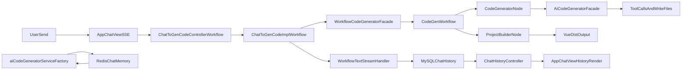

# Workflow/Vue 卡死与回显修复方案

## 已确认的核心问题
- 前端对 assistant 历史消息存在高频重复重解析，导致大消息回放时主线程阻塞；重点在 [ai-generate-code-frontend/src/page/App/AppChatView.vue](d:/mainJava/all%20Code/program/glyahh-ai-generate-code/ai-generate-code-frontend/src/page/App/AppChatView.vue)。
- SSE 尾包残片会被当成正文落入 UI，出现 `background` 这类孤立垃圾字段；重点在 [ai-generate-code-frontend/src/utils/workflowChatFilters.ts](d:/mainJava/all%20Code/program/glyahh-ai-generate-code/ai-generate-code-frontend/src/utils/workflowChatFilters.ts)。
- workflow + vue 路径存在双构建链路（一次在 facade 完成回调，一次在 project_builder 节点），会造成“分析中卡住很久”；重点在 [src/main/java/com/dbts/glyahhaigeneratecode/core/AiCodeGeneratorFacade.java](d:/mainJava/all%20Code/program/glyahh-ai-generate-code/src/main/java/com/dbts/glyahhaigeneratecode/core/AiCodeGeneratorFacade.java) 与 [src/main/java/com/dbts/glyahhaigeneratecode/LangGraph4j/node/ProjectBuilderNode.java](d:/mainJava/all%20Code/program/glyahh-ai-generate-code/src/main/java/com/dbts/glyahhaigeneratecode/LangGraph4j/node/ProjectBuilderNode.java)。
- `rounds=0` 双日志在并发首轮下可复现，需加请求幂等/首轮判定保护；重点在 [src/main/java/com/dbts/glyahhaigeneratecode/service/impl/ChatToGenCodeImpl.java](d:/mainJava/all%20Code/program/glyahh-ai-generate-code/src/main/java/com/dbts/glyahhaigeneratecode/service/impl/ChatToGenCodeImpl.java)。

## 修复实施步骤
1. 前端消息解析性能治理（先止卡）
- 目标：减少大历史下的重复解析与重排，缓解浏览器假死。
- 主要改动文件与大致行数：
  - `ai-generate-code-frontend/src/page/App/AppChatView.vue`：约 240–320 行（`displayMessages` & 相关 computed）、430–520 行（轮数展示与统计）、1450–1710 行（`buildUiSegmentsFromFullText` / `getMessageUiSegments` / `assistantHasRenderableOutput` / `rebuildGeneratedFilesFromHistory`）、1880–2055 行（`sendMessage` SSE 建连与事件处理）。
- 设计要点：
  - 在 `AppChatView` 引入“按消息版本缓存”的 `workflowSteps/uiSegments`，避免模板中对同一条消息多次调用重解析函数。
  - 历史消息首次加载时预处理并缓存 `uiSegments`，流式消息继续沿用 `uiState` 增量更新。
  - 对 `displayMessages` 的排序计算增加稳定缓存（仅在历史列表或会话列表变化时重算）。

2. 前端垃圾字段过滤治理（去掉 `background` 类噪声）
- 目标：消除 SSE 尾包残片导致的孤立单词/协议噪声。
- 主要改动文件与大致行数：
  - `ai-generate-code-frontend/src/utils/workflowChatFilters.ts`：约 150–200 行（`filterAssistantSseChunkForUi`）、247–273 行（`flushAssistantSseCarry`）、280–294 行（`stripAssistantNoiseLines`）。
- 设计要点：
  - 在 `workflowChatFilters` 的 `flushAssistantSseCarry` 增加“尾包可展示判定”：仅当残留内容满足最小可读条件（如包含中文句子或多词短句）时才回灌，否则丢弃。
  - 在 `stripAssistantNoiseLines` 增加行内片段剥离规则，处理“同一行混入 workflow 标记 + 噪声文本”的情况。
  - 增补最小 util 级测试或手工用例，覆盖：孤立英文词、半行协议、粘连 workflow 标签三类输入。

3. 后端重复构建收敛（先止血）
- 目标：确保同一次生成请求只触发一次 Vue 构建，缩短“分析代码 ing”时间。
- 主要改动文件与大致行数：
  - `src/main/java/com/dbts/glyahhaigeneratecode/core/AiCodeGeneratorFacade.java`：约 137–143 行（`generateAndSaveVueCodeStream` 调用链）、204–223 行（`onCompleteResponse` 内的 `vueProjectBuilder.buildProject` 调用）。
  - `src/main/java/com/dbts/glyahhaigeneratecode/LangGraph4j/node/ProjectBuilderNode.java`：约 21–50 行（`create` 实现与构建日志）。
- 设计要点：
  - 保留 workflow 的 `ProjectBuilderNode` 构建，移除或短路 `AiCodeGeneratorFacade#adaptVueTokenStream` 完成回调中的 VUE 构建调用，确保每个请求只构建一次。
  - 在构建链路日志中增加来源字段（appId、source=workflow|legacy），便于后续排查是否仍存在重复触发。

4. 首轮并发与重复请求保护
- 目标：避免同一 appId 在并发首轮下多次读取到 `rounds=0`，并抑制浏览器重连导致的双请求。
- 主要改动文件与大致行数：
  - `src/main/java/com/dbts/glyahhaigeneratecode/service/impl/ChatToGenCodeImpl.java`：约 52–92 行（普通链路首轮判定与保存）、100–148 行（workflow 链路首轮判定与 Guardrail 回滚）、169–189 行（参数校验/构建提示词）。
- 设计要点：
  - 在 `ChatToGenCodeImpl` 增加幂等键策略（如 appId + message 哈希 + 短时间窗口），防止重复点击/重连造成双请求。
  - 调整首轮判定与入库顺序，或引入轻量锁，避免并发请求都读取到 `rounds=0`。

5. Redis/MySQL 回显一致性核查与兜底（可选视问题严重程度启用）
- 目标：仅当观察到历史回显异常时，按需做一次针对性排查与修复，而不是必经路径。
- 主要改动文件与大致行数：
  - `src/main/java/com/dbts/glyahhaigeneratecode/service/impl/ChatHistoryServiceImpl.java`：约 481–517 行（`countRoundsByAppId` 日志）、520–579 行（`trySummarizeOldestRoundsIfNeeded`）、585–605 行（`countRoundsByAppIdInternal`）以及 666–683 行（`syncRedisAfterMerge`）。
- 设计要点：
  - 先通过增强日志与只读脚本确认 Redis 与 MySQL 是否存在明显偏离。
  - 如确认有问题，再触发“按 DB 重建 Redis memory”兜底流程，并验证目标 appId 的历史回显是否恢复正常。

## 数据流定位图

## 验证与清理标准
- 前端：在目标地址连续执行“首轮生成 + 返回主页再进入 + 加载历史 + 滚动历史”不再卡死，且不再出现孤立垃圾字段。
- 后端：同一请求仅出现一条构建链路日志；不再出现同时双构建。
- 存储（仅当执行了第 5 步排查时）：目标 appId 的 MySQL/Redis 消息数量与顺序在抽样检查下保持一致，历史回显与 DB 记录相符。
- 清理：删除临时调试日志、一次性诊断代码、临时脚本，保留必要可观测日志。