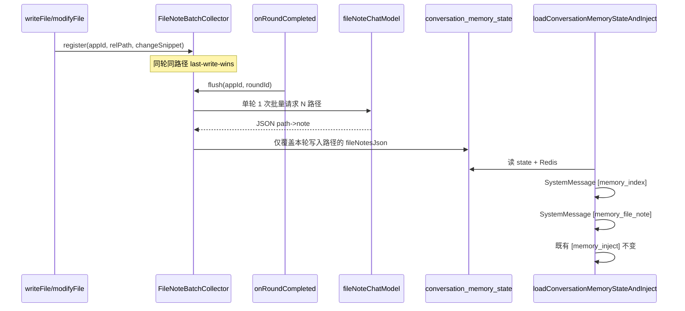

# 会话记忆方式 2：工具写盘后 fileNote 实施计划

## 背景与现状

仓库已有 V4 基础能力（见 [conversation-memory-v4-current-architecture.md](docs/PLANS/conversation-memory-v4-current-architecture.md)）：

- 轮次收口：`StreamHandlerExecutor` → `ChatHistoryService.onRoundCompleted` → [ConversationMemoryStateServiceImpl.java](src/main/java/com/dbts/glyahhaigeneratecode/service/impl/ConversationMemoryStateServiceImpl.java)（manifest diff、`changedFilesJson`、`cm:state`）
- 下轮注入：仅 `[memory_inject]` 读盘片段（[loadConversationMemoryStateAndInject](src/main/java/com/dbts/glyahhaigeneratecode/service/impl/ConversationMemoryStateServiceImpl.java) 约 144–213 行）
- 工具落盘：[FileWriteTool.java](src/main/java/com/dbts/glyahhaigeneratecode/ai/tool/tools/FileWriteTool.java) / [FileModifyTool.java](src/main/java/com/dbts/glyahhaigeneratecode/ai/tool/tools/FileModifyTool.java) **未**回调记忆服务

**缺口（与你的规范一致）：** 无 `fileNotesJson`、`[memory_file_note]`、`[memory_index]`、写盘后 debounce 批量摘要。

你已确认：**本期仅阶段 1**；DB 由你执行仓库提供的 **ALTER 脚本**。

---

## 目标架构（本期）




**与方式 3 边界：** `onRoundCompleted` 内 manifest diff 仍维护 `changedFilesJson`；fileNote 只处理「本轮工具实际写过的路径」，两者可并存，不重复实现 Parser 兜底摘要。

---

## 1. 数据模型与 SQL

### 1.1 MySQL

在 [sql/conversation_memory_tables.sql](sql/conversation_memory_tables.sql) 的 `conversation_memory_state` 表增加列（并新增独立迁移文件便于你手动执行）：

- 新文件建议：`sql/conversation_memory_state_add_file_notes_json.sql`
- 内容：`ALTER TABLE conversation_memory_state ADD COLUMN fileNotesJson LONGTEXT NULL COMMENT 'path->{note,roundId,updatedAt}' AFTER changedFilesJson;`

### 1.2 JSON 结构（持久化 + Redis `cm:state`）

```json
{
  "src/App.vue": {
    "note": "1-3句中文，≤120字/条建议",
    "roundId": 123456,
    "updatedAt": "2026-06-01T12:00:00"
  }
}
```

- **更新规则：** `flush` 时仅 merge 本轮 pending 路径；其余路径保留历史 `note`
- **Redis：** `loadStateFromDb` / `cacheMemoryStateToRedis` / `upsertConversationMemoryState` 同步带上 `fileNotesJson`

### 1.3 Java 实体与 Mapper


| 文件                                                                                                                          | 改动                                |
| --------------------------------------------------------------------------------------------------------------------------- | --------------------------------- |
| [ConversationMemoryState.java](src/main/java/com/dbts/glyahhaigeneratecode/model/Entity/ConversationMemoryState.java)       | 新增 `fileNotesJson` 字段             |
| [ConversationMemoryStateMapper.java](src/main/java/com/dbts/glyahhaigeneratecode/mapper/ConversationMemoryStateMapper.java) | `upsertByAppId` INSERT/UPDATE 增加列 |


---

## 2. 配置与专用模型 Bean

### 2.1 `application.yml`

在 `langchain4j.open-ai` 下新增块（**key 必须以 `model` 结尾**，以便 [Platform-Utils/model/main.py](Platform-Utils/model/main.py) 的 `collect_model_mappings` 自动识别）：

```yaml
langchain4j:
  open-ai:
    file-note-chat-model:
      base-url: https://dashscope.aliyuncs.com/compatible-mode/v1
      api-key: ${langchain4j.open-ai.chat-model.api-key}
      model-name: ${langchain4j.open-ai.file-note-chat-model.model-name}  # 你在 local 填具体模型
      max-tokens: 2048
      temperature: 0.2
      log-requests: false
      log-responses: false
```

在 `conversation.memory` 下扩展（绑定 [ConversationMemoryProperties.java](src/main/java/com/dbts/glyahhaigeneratecode/config/ConversationMemoryProperties.java)）：


| 配置项                             | 默认值    | 含义                                            |
| ------------------------------- | ------ | --------------------------------------------- |
| `file-note-enabled`             | `true` | 总开关                                           |
| `file-note-debounce-ms`         | `400`  | 写盘后空闲合并窗口（最终以 `onRoundCompleted` 强制 flush 为准） |
| `file-note-max-paths-per-round` | `20`   | 单轮摘要路径上限，超出记 warn 并截断                         |
| `file-note-input-chars`         | `2000` | 无 diff 时读盘截断上限                                |
| `file-note-max-note-chars`      | `120`  | 单路径 note 硬截断（防模型超长）                           |


### 2.2 新建配置类

参照 [CodeExamChatModelConfig.java](src/main/java/com/dbts/glyahhaigeneratecode/config/CodeExamChatModelConfig.java)：

- 新建 `FileNoteChatModelConfig.java`：`@ConfigurationProperties(prefix = "langchain4j.open-ai.file-note-chat-model")` + `@Bean fileNoteChatModel`

### 2.3 Platform-Utils/model

- **无需改 Python 扫描逻辑**（`key.endswith("model")` 已覆盖 `file-note-chat-model`）
- 可选：在 `Platform-Utils/model/model-usage.example.json`（或你本地 `.local/model-usage.json`）为 `file-note-chat-model` 加一行中文说明，便于 `list-models` 展示
- 你本地用：`python Platform-Utils/model/main.py replace-model --mapping file-note-chat-model=<你的模型> --apply`

---

## 3. 核心服务：`ConversationMemoryFileNoteService`

新建服务（建议包：`service` + `service/impl` 或 `core/memory`），职责拆分：

### 3.1 `registerPendingFileChange(appId, relativePath, changeHint)`

- **调用方：** `FileWriteTool` / `FileModifyTool` 在「成功写盘」且返回值非 `错误`/`警告` 后调用
- **路径校验：** 复用 `resolveNormalizedProjectRoot` + `startsWith(projectRoot)`（与工具一致，防穿越）
- **last-write-wins：** `ConcurrentHashMap<appId, Map<relativePath, PendingEntry>>`
- **changeHint 优先级：**
  - `modifyFile`：优先 `oldContent`→`newContent` 的短 diff 描述（可截断），不必读全文
  - `writeFile`：工具参数 `content` 截断；若无则读磁盘前 `file-note-input-chars` 字符

### 3.2 `flushPendingFileNotes(appId, roundId)`（在 `onRoundCompleted` 早期调用）

- pending 为空则直接返回
- 受 `file-note-enabled`、`file-note-max-paths-per-round` 约束
- **单轮 1 次 LLM：** 组装 Prompt（新建 `src/main/resources/Prompt/file_note_batch.txt`），要求严格 JSON：`{"relativePath":"描述",...}`
- 解析失败 / 单路径失败：**不阻塞主链路**，log warn，保留旧 note
- 成功则 merge 进 `fileNotesJson` 并 `upsert` + 刷新 `cm:state`
- 清空该 `appId` 的 pending

### 3.3 debounce 策略（实现建议）

- 写盘时：更新 pending + `ScheduledExecutorService` 延迟 `file-note-debounce-ms` 触发 flush（无 `roundId` 时用 state 中 `latestRoundId` 或跳过仅写 pending）
- `**onRoundCompleted` 开头：** `cancel` 定时任务 + **同步 flush**（保证规范「单轮 ≤1 次」且与 roundId 对齐）

> 说明：仅 debounce 不绑 round 可能偶发提前摘要；以 `onRoundCompleted` 同步 flush 为权威收口，debounce 作为同轮多次写盘的合并优化（可选简化：本期只保留 onRoundCompleted flush，去掉 scheduler 以降低复杂度——若你更倾向极简，实现时可二选一并在 PR 说明）。

---

## 4. 工具层挂钩（最小侵入）

在 [FileWriteTool.java](src/main/java/com/dbts/glyahhaigeneratecode/ai/tool/tools/FileWriteTool.java) / [FileModifyTool.java](src/main/java/com/dbts/glyahhaigeneratecode/ai/tool/tools/FileModifyTool.java)：

```java
// 成功落盘后
fileNoteService.registerPendingFileChange(appId, normalizedRelative, hint);
```

- 抽取 `normalizeRelativePath(projectRoot, path)` 到 [BaseTool](src/main/java/com/dbts/glyahhaigeneratecode/ai/tool/BaseTool.java) 或工具内私有方法，避免重复
- **禁止**在失败/越界/未修改分支调用

---

## 5. 注入层：`[memory_index]` + `[memory_file_note]`

修改 [ConversationMemoryStateServiceImpl.loadConversationMemoryStateAndInject](src/main/java/com/dbts/glyahhaigeneratecode/service/impl/ConversationMemoryStateServiceImpl.java)：

### 5.1 读取与解析

- 从 state 解析 `fileNotesJson` → `Map<String, FileNoteEntry>`
- `changedFiles` 仍来自 `changedFilesJson`（manifest 上轮结果）

### 5.2 新增 SystemMessage（在 `[memory_inject]` 之前注入，摘要优先于大段源码）

1. `**[memory_index]`**（单条即可）
  - 内容：`last_round_changed` 路径列表（用 `changedFilesJson`）
  - 固定免责声明：仅供参考，以用户当轮指令为准
2. `**[memory_file_note]**`（单条合并或多条按路径——建议**单条合并**控制条数）
  - 仅输出 `fileNotesJson` 中存在的路径
  - 格式示例：`[memory_file_note]\npath=src/App.vue\n说明...`

### 5.3 幂等

- 当前链路在「新建 `MessageWindowChatMemory`」时注入，天然不会在同一次 load 内重复
- 若同一 `chatMemory` 被二次 inject（未来 LIGHT_REFRESH），需在注入前 `removeIf` 前缀为 `[memory_index]` / `[memory_file_note]` 的 `SystemMessage`（本期可先实现 `stripMemoryTaggedSystemMessages` 工具方法，供后续复用）

### 5.4 本期明确不做

- 不收紧 [ConversationMemoryConstant](src/main/java/com/dbts/glyahhaigeneratecode/constant/ConversationMemoryConstant.java) 的 `DEFAULT_INJECT_CHAR_BUDGET`
- 不实现 G1 `softSummary`/`hardSummary` 注入（保留 TODO）

---

## 6. `onRoundCompleted` 接线

在 [ConversationMemoryStateServiceImpl.onRoundCompleted](src/main/java/com/dbts/glyahhaigeneratecode/service/impl/ConversationMemoryStateServiceImpl.java) 中，**manifest 稳定扫描之前或之后**（推荐：**manifest diff 完成后、upsert state 前**）：

1. `fileNoteService.flushPendingFileNotes(appId, roundId)`
2. 将返回的 merged `fileNotesJson` 写入本次 `upsertConversationMemoryState` 参数（避免 flush 与 upsert 双写竞态）

`changedFilesJson` 仍由 manifest diff 产生；fileNote 不替代 manifest。

---

## 7. 安全与失败隔离


| 约束    | 实现                                        |
| ----- | ----------------------------------------- |
| 路径    | 仅 `code_output` 项目根下相对路径                  |
| 隐私    | Prompt 禁止输出密钥/Token；note 落库前可做简单敏感词/长度截断  |
| 主链路   | 全部 try/catch，与现有 `onRoundCompleted` 一致    |
| 未修改文件 | 不进入 pending、不调用摘要 API                     |
| 摘要失败  | 保留旧 note，metrics 日志 `fileNoteStatus=skip` |


---

## 8. 测试与验收

### 8.1 单元测试（建议新增/扩展）


| 测试类                                               | 覆盖点                                                         |
| ------------------------------------------------- | ----------------------------------------------------------- |
| `ConversationMemoryFileNoteServiceTest`           | pending last-write-wins、JSON 解析、merge 仅覆盖写入路径、失败保留旧 note    |
| 扩展 `ConversationMemoryStateServiceImplInjectTest` | `[memory_index]`/`[memory_file_note]` 文本格式、无 fileNotes 时不注入 |


### 8.2 验收标准（对应你规范 §11）

1. 工具写盘成功后，**下一轮** `loadConversationMemoryStateAndInject` 可见 `[memory_file_note]`（且含对应路径）
2. 未修改路径 **不** 触发摘要 API；`note` 与上一轮一致
3. 单轮修改 N 个文件，摘要 API **调用次数 ≤ 1**（可配置上限 20 路径）
4. 主模型上下文 **不** 包含未变更文件的全文截断
5. 摘要失败时，生成/SSE/`onRoundCompleted` 仍成功完成

### 8.3 手工冒烟（实现后）

1. 执行 `sql/conversation_memory_state_add_file_notes_json.sql`
2. 在 `application-local.yml` 配置 `file-note-chat-model.model-name`
3. 走 workflow 生成，触发 `writeFile`/`modifyFile`
4. 第二轮对话前抓 Redis ChatMemory 或日志，确认 inject 块含 `[memory_file_note]`

---

## 9. 目标改动文件与预估规模


| 类别     | 文件                                                                   | 预估行数     |
| ------ | -------------------------------------------------------------------- | -------- |
| **新建** | `FileNoteChatModelConfig.java`                                       | ~50      |
| **新建** | `ConversationMemoryFileNoteService.java` + `Impl`                    | ~280–350 |
| **新建** | `Prompt/file_note_batch.txt`                                         | ~40      |
| **新建** | `sql/conversation_memory_state_add_file_notes_json.sql`              | ~10      |
| **新建** | `ConversationMemoryFileNoteServiceTest.java`                         | ~150     |
| **修改** | `FileWriteTool.java`, `FileModifyTool.java`                          | ~30      |
| **修改** | `ConversationMemoryStateServiceImpl.java`                            | ~120–150 |
| **修改** | `ConversationMemoryState.java`, `ConversationMemoryStateMapper.java` | ~25      |
| **修改** | `ConversationMemoryProperties.java`, `application.yml`               | ~35      |
| **修改** | `sql/conversation_memory_tables.sql`（注释/建表模板同步）                      | ~5       |
| **可选** | `model-usage.example.json`                                           | ~5       |


**合计：约 750–900 行**（含测试）；核心业务 **~500 行**。

实现完成后：删除临时 debug 日志与一次性测试脚本；**非隐私新文件**按你的惯例 `git add`（SQL、Java、Prompt、配置）。

---

## 10. 实施顺序（建议）

1. SQL + Entity/Mapper + Properties + `FileNoteChatModelConfig`
2. `ConversationMemoryFileNoteService`（含 Prompt、LLM 调用、merge 持久化）
3. 工具挂钩 + `onRoundCompleted` flush
4. `loadConversationMemoryStateAndInject` 注入 `[memory_index]` / `[memory_file_note]`
5. 单测 + 本地冒烟

---

## 风险与依赖

- **DB 列未执行前**：`upsert` 会失败；需在部署说明中强调先跑 ALTER
- **Caffeine 缓存命中旧 Service**（G3）：下轮可能仍不 re-inject——与现网一致；fileNote 写入 state 后，**新建会话/重建 Service** 才能看到 inject；若你后续要「每轮必刷新」，需另开 MemoryRefreshPolicy 任务
- **方式 3**：纯 Parser 无工具回调时仍无 fileNote，符合「本规范不重复实现」

