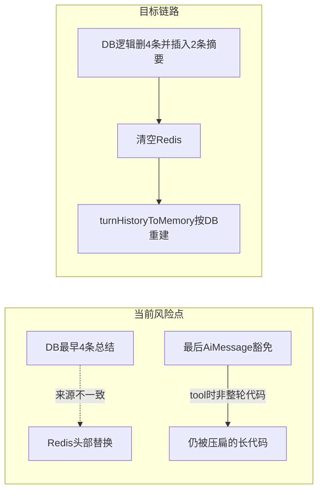

# 会话记忆压缩改造计划

## 现状（以当前仓库为准，纠正旧 Codex 结论）

- [`ChatHistoryConstant.MAX_ROUNDS_BEFORE_SUMMARY`](d:\mainJava\all Code\program\glyahh-ai-generate-code\src\main\java\com\dbts\glyahhaigeneratecode\constant\ChatHistoryConstant.java) 已为 **3**（不是 8）。
- [`ChatHistoryServiceImpl.turnHistoryToMemory`](d:\mainJava\all Code\program\glyahh-ai-generate-code\src\main\java\com\dbts\glyahhaigeneratecode\service\impl\ChatHistoryServiceImpl.java) 已对 **时间序上最后一条 AI 行** 跳过 `compactAiMessageForMemory`（约 539–566 行）。
- [`compactMemoryMessagesIfNeeded`](d:\mainJava\all Code\program\glyahh-ai-generate-code\src\main\java\com\dbts\glyahhaigeneratecode\service\impl\ChatHistoryServiceImpl.java) 对 Redis 中 **最后一条 `AiMessage`** 同样跳过压缩（约 963–973 行）。
- 仍存在的缺口：
  - **「最后一条 AiMessage」≠「上一轮完整代码」**：存在 tool 轮次时，最后一条 `AiMessage` 可能是短回复或工具说明，长代码在更早的 `AiMessage` 中，仍会被压缩。
  - [`trySummarizeOldestRoundsIfNeeded`](d:\mainJava\all Code\program\glyahh-ai-generate-code\src\main\java\com\dbts\glyahhaigeneratecode\service\impl\ChatHistoryServiceImpl.java) 用 **DB 最早 4 条** 生成摘要，但 [`syncRedisAfterMerge`](d:\mainJava\all Code\program\glyahh-ai-generate-code\src\main\java\com\dbts\glyahhaigeneratecode\service\impl\ChatHistoryServiceImpl.java) 改的是 **Redis 头部**；DB 与 Redis 语义可能不对齐（计划改为合并后 **按 DB 全量重建 Redis**，不再依赖头部替换）。
  - 写回 DB 的合并逻辑仍被注释（约 805–822 行）；你已选择 **合并后同步写 DB**；删策略见下文 **「DB 删策略定稿」**。
  - [`aiCodeGeneratorServiceFactory`](d:\mainJava\all Code\program\glyahh-ai-generate-code\src\main\java\com\dbts\glyahhaigeneratecode\ai\aiCodeGeneratorServiceFactory.java) 仍为 `maxMessages(80)`、`turnHistoryToMemory(..., 20)` 硬编码，与「约 3 轮 + 工具」缺少统一常量说明。
  - **P0** [`countRoundsByAppIdInternal`](d:\mainJava\all Code\program\glyahh-ai-generate-code\src\main\java\com\dbts\glyahhaigeneratecode\service\impl\ChatHistoryServiceImpl.java)：`chatMemoryStore.getMessages` 为空时返回 **0**，[`trySummarizeOldestRoundsIfNeeded`](d:\mainJava\all Code\program\glyahh-ai-generate-code\src\main\java\com\dbts\glyahhaigeneratecode\service\impl\ChatHistoryServiceImpl.java) 据此会 **误判「无需压缩」**；Redis TTL 过期或尚未 preload 时会 **跳过本应触发的合并**（见约 771–782、836–841 行）。计划内要求与「合并后轮数判断」统一：**Redis 无消息或 user 数为 0 时，用 DB 的 user 条数（仅 `isDelete=0`）作为轮数来源**，再与 `MAX_ROUNDS_BEFORE_SUMMARY` 比较。

## 目标行为（与你的产品描述对齐）

1. **更早历史**：超过阈值后，将最早两轮（4 条）合并为 1 轮摘要（User 摘要 + AI 摘要），且 **MySQL 与 Redis 同步**。MySQL 侧对「被合并的 4 条」采用 **逻辑删除**（见下节定稿）；插入 2 条摘要为新行须满足 **审计字段**（见下文 **「摘要行 audit 定稿」**）。**Redis 重建**：在 **`trySummarizeOldestRoundsIfNeeded` 整段 `while` 全部执行完毕且 DB 事务提交成功后，只执行一次**——**清空该 appId 的 ChatMemory** + **`turnHistoryToMemory` 从 DB 拉最近 N 条** 全量灌入；**禁止**在 `while` 每轮合并后都重建（减少开销与中间并发窗口），也**禁止**再依赖 `syncRedisAfterMerge` 的头部替换（可废弃该方法）。
2. **上一轮完整**：在 HTML/MULTI_FILE 下，**豁免压缩**的对象改为「**最后一个 UserMessage 之后、下一个 UserMessage 之前**」子序列中、**文本最长的那条 `AiMessage`**（若无则回退到最后一条 `AiMessage`）。这样 tool 穿插时仍尽量保留「主回答」全文。
3. **当前轮**：保持现有入口在写 user 后进生成；不重复压掉刚写入的 user。
4. **常量**：将 `20`、`80` 与 `MAX_ROUNDS_BEFORE_SUMMARY`、`MESSAGES_PER_MERGE` 的关系写进 [`ChatHistoryConstant`](d:\mainJava\all Code\program\glyahh-ai-generate-code\src\main\java\com\dbts\glyahhaigeneratecode\constant\ChatHistoryConstant.java)（例如 `MEMORY_PRELOAD_MESSAGE_ROWS`、`CHAT_MEMORY_MAX_MESSAGES`），避免注释与代码再漂移。

## 补充妥当点（按优先级速览）

| 优先级 | 主题 | 定稿要点 |
|--------|------|----------|
| P0 | Redis 空误跳过合并 | `trySummarizeOldestRoundsIfNeeded` 入口轮数：**Redis 无 user 时回退 DB user 计数**（`isDelete=0`），不得仅信 `countRoundsByAppIdInternal` 在空 Redis 时返回的 0。 |
| P0 | 摘要行 audit | 摘要 2 条走 **`addChatMessage(..., SKIP, NONE)`** 或实体显式 `SKIP`/`NONE`，与 [`ChatHistory`](d:\mainJava\all Code\program\glyahh-ai-generate-code\src\main\java\com\dbts\glyahhaigeneratecode\model\Entity\ChatHistory.java) 字段语义一致。 |
| P1 | Redis 重建次数 | **`while` 整段结束后只重建一次** Redis（清空 + `turnHistoryToMemory`），循环内不重建。 |
| P1 | 「最早 4 条」稳定序 | `listOldestMessagesForMerge`：**`createTime ASC, id ASC`**。 |

## DB 删策略定稿（避免导出/审计反复争议）

实体 [`ChatHistory`](d:\mainJava\all Code\program\glyahh-ai-generate-code\src\main\java\com\dbts\glyahhaigeneratecode\model\Entity\ChatHistory.java) 已使用 **`isDelete` + `isLogicDelete = true`**（MyBatis-Flex 全局逻辑删除）。

| 策略 | 做法 | 导出/审计 |
|------|------|-----------|
| **采用：逻辑删除（本计划定稿）** | 合并成功后，将被摘要替换的 **最早 4 条** 置 `isDelete=1`（或项目约定的删除值），**不**物理 `DELETE`；再 `save` 2 条摘要为新行。 | 默认列表/导出走 Flex 逻辑删过滤，用户看到的是「已合并后的时间线」；若合规要求保留可恢复原文，可后续增加 **管理员导出含已删行** 或 **归档表**（本计划不强制归档表，仅在 PR/用户文档中写明「已合并原文仅逻辑删，库内仍占空间」）。 |
| **不采用：物理删除** | `removeByIds` 硬删 | 审计链断裂，与「导出全量原始对话」冲突更大；除非产品书面确认不可恢复，否则不选。 |

若实现中发现合并与「仅逻辑删」并发冲突，在事务内以 **主键 + isDelete=0** 条件更新，避免误删已删行。

## 摘要行 audit 定稿（P0，避免 NOT NULL / 语义坑）

表与实体上 [`auditAction`](d:\mainJava\all Code\program\glyahh-ai-generate-code\src\main\java\com\dbts\glyahhaigeneratecode\model\Entity\ChatHistory.java)、[`auditHitRule`](d:\mainJava\all Code\program\glyahh-ai-generate-code\src\main\java\com\dbts\glyahhaigeneratecode\model\Entity\ChatHistory.java) 为业务必填语义；[`addChatMessage`](d:\mainJava\all Code\program\glyahh-ai-generate-code\src\main\java\com\dbts\glyahhaigeneratecode\service\impl\ChatHistoryServiceImpl.java) 已统一校验并默认 `SKIP`/`NONE`（约 121、108–131 行）。

**定稿**：合并产生的 2 条摘要（user 摘要 + ai 摘要）**优先**走现有 `addChatMessage(appId, text, messageType, userId, "SKIP", "NONE")`（或等价封装），保证与全站审查日志、默认值一致；若事务内必须 `save` 裸实体，则 **显式** `auditAction="SKIP"`、`auditHitRule="NONE"`（或与产品约定的「系统生成」枚举），并在 PR 中写明「摘要非用户输入，不参与 prompt 审查重跑」。

## 实现要点（按文件）

### 1. [`ChatHistoryServiceImpl.java`](d:\mainJava\all Code\program\glyahh-ai-generate-code\src\main\java\com\dbts\glyahhaigeneratecode\service\impl\ChatHistoryServiceImpl.java)

- **抽取**「在 `List<ChatHistory>` 或 `List<ChatMessage>` 上定位豁免压缩的 AI 下标」的私有方法（同一套规则供 `turnHistoryToMemory` 与 `compactMemoryMessagesIfNeeded` 使用）：  
  - 从后往前找最后一个 `UserMessage`/`USER`；再在其后子列表中找最长 `AiMessage`/`AI` 文本。  
  - VUE 路径若仍跳过消息级压缩可不变。
- **`trySummarizeOldestRoundsIfNeeded`**：  
  - **轮数判定（P0）**：`roundCount` 以 **Redis 中 `UserMessage` 条数** 为主；若 Redis 列表为空或 user 数为 **0**（TTL 过期、尚未加载等），**必须回退**为 **DB 统计**（`appId` + `messageType=user` + `isDelete=0` 的 `count`），再与 `MAX_ROUNDS_BEFORE_SUMMARY` 比较，避免「Redis 空 → roundCount=0 → 永远不合并」。参考现有 [`countRoundsByAppIdInternal`](d:\mainJava\all Code\program\glyahh-ai-generate-code\src\main\java\com\dbts\glyahhaigeneratecode\service\impl\ChatHistoryServiceImpl.java) 异常分支回退 DB 的思路（约 836–858 行），改为 **空 Redis 也走 DB 回退**。  
  - 合并前 **以 DB 为准** 取最早 4 条：扩展 [`listOldestMessagesForMerge`](d:\mainJava\all Code\program\glyahh-ai-generate-code\src\main\java\com\dbts\glyahhaigeneratecode\service\impl\ChatHistoryServiceImpl.java)（约 865–870 行）为 **`createTime ASC`、`id ASC` 二级排序**（**P1**），避免同毫秒时间戳下每轮选中的「最早 4 条」集合抖动。  
  - **`while` 内（P1）**：每轮仅 **DB 侧**逻辑删 4 条 + 插入 2 条摘要（审计见上节）；**不在循环内**清空/重建 Redis；每轮结束后 **`roundCount` 须按与入口一致的原则重算**（优先 Redis user 条数；若 Redis 仍空则再查 DB user 数），避免沿用过期计数导致多合并或少合并。  
  - **`while` 结束后（P1）**：**单次** `chatMemoryStore` 清空该 `appId` + 调用与工厂一致的 **`turnHistoryToMemory(appId, memory, MEMORY_PRELOAD_MESSAGE_ROWS)`**（或抽公共方法），完成 **按 DB 全量重建 Redis**；**不再**调用 `syncRedisAfterMerge`。  
  - 修正注释中「循环直到不超过 20 轮」等过时文案，改为与 `MAX_ROUNDS_BEFORE_SUMMARY` 一致。
- **幂等与并发**：同一 `appId` 下合并与聊天并发时，考虑与现有 [`ChatToGenCodeImpl`](d:\mainJava\all Code\program\glyahh-ai-generate-code\src\main\java\com\dbts\glyahhaigeneratecode\service\impl\ChatToGenCodeImpl.java) 首轮锁类似的最小锁或 DB 乐观条件，避免双次合并。

### 2. [`aiCodeGeneratorServiceFactory.java`](d:\mainJava\all Code\program\glyahh-ai-generate-code\src\main\java\com\dbts\glyahhaigeneratecode\ai\aiCodeGeneratorServiceFactory.java)

- `turnHistoryToMemory` 的 `maxCount` 与 `maxMessages` 改为读取 `ChatHistoryConstant` 新常量（预加载行数 ≥「保留轮数 × 每轮条数」+ 余量，例如 3 轮 × 2 + 若干 error/tool 占位，具体值在实现时取保守上界）。

### 3. 测试

- 扩展 [`ChatHistoryServiceImplMemoryCompressionTest`](d:\mainJava\all Code\program\glyahh-ai-generate-code\src\test\java\com\dbts\glyahhaigeneratecode\service\impl\ChatHistoryServiceImplMemoryCompressionTest.java) 与 [`ChatHistoryServiceImplTest`](d:\mainJava\all Code\program\glyahh-ai-generate-code\src\test\java\com\dbts\glyahhaigeneratecode\service\impl\ChatHistoryServiceImplTest.java)：  
  - **场景 A**：Redis 中 User-AI-tool-AI（短）-AI（长代码）→ 压缩后「长代码」条不被压。  
  - **场景 B**：合并后 DB 可见行变化、摘要 `auditAction`/`auditHitRule` 为 `SKIP`/`NONE`；**一次** `trySummarize` 后 Redis 与 DB 时间线一致。  
  - **场景 C（P0）**：Redis 为空、DB user 轮数 **> 阈值** 时仍会触发合并（或至少进入合并判断并落 DB），不因 `roundCount==0` 误跳过。  
  - **场景 D（P1）**：同 `createTime` 多行下连续合并，「最早 4 条」主键顺序稳定。  
  - 若合并走真实 `chatModel.chat`，用 Mockito 注入 `ChatModel` 或抽取 `summarizeTwoRoundsWithAi` 为可测接口（按项目现有测试风格）。

### 4. 文档

- 更新或废弃旧文件 [`.cursor/plans/记忆截断问答核对_3ae492f3.plan.md`](d:\mainJava\all Code\program\glyahh-ai-generate-code\.cursor\plans\记忆截断问答核对_3ae492f3.plan.md) 中「仍为 8」等段落（避免后续 Codex 误读）；本计划通过后以本文件为唯一依据。

## 验收标准

- HTML/MULTI_FILE：构造「最后一轮」中含多条 `AiMessage` 且最长条远大于 2400 字符，执行 `compactMemoryMessagesIfNeeded` 后，**该最长条全文不变**，更早 AI 条可被压缩。
- 当 **有效用户轮数**（Redis 有则用 Redis user 条数，否则用 DB user 条数，`isDelete=0`）**> 3** 时触发合并：**DB** 最早 4 条被 **逻辑删除**，出现 2 条新摘要行（audit 已填）；**整次** `trySummarize` 的 `while` 结束后 **仅一次** 清空 Redis 并由 `turnHistoryToMemory` 从 DB 重建；已删 4 条不应出现在默认查询中。  
- 无回归：`./mvnw test` 下相关单测通过；合并失败时 **DB 与 Redis 均不回滚到半状态**（事务边界清晰）；**不在** `while` 每轮内重复重建 Redis。

## 预估改动规模

| 区域 | 体量 |
|------|------|
| `ChatHistoryServiceImpl` | 中（约 120–220 行：豁免逻辑抽取 + DB 合并事务 + 注释修正） |
| `ChatHistoryConstant` + `aiCodeGeneratorServiceFactory` | 小（约 20–40 行） |
| 测试 | 中（约 80–150 行，视是否引入 Mockito） |

**残留说明**：逻辑删后 DB 仍存被合并原文（`isDelete=1`），占存储；若日后要「管理员一键导出含已删」或「冷归档到独立表」，在 PR 中单列为扩展需求即可。
