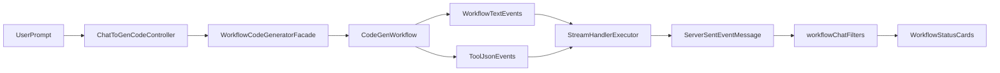

# 修复 workflow 流式状态卡片与空消息异常（最小改动）

## 目标
- 让 `workflow` 模式下的 `VUE` 与 `MULTI_FILE` 都能稳定输出并展示工作流状态卡片。
- 修复 `MyException: 消息内容不能为空`（由流式解析后空内容落库触发）。
- 保持既有 SSE 协议兼容（`message` + `done`），并补齐回归测试。
- 尽量不修改核心工作流编排、节点执行顺序与业务校验逻辑。
- **范围约束（你补充的要求）**：非必要不改动原本 `AiCodeGeneratorFacade/ai service` 那套路线；只改动 `workflow` 这一条路线相关代码，以达到效果。

## 根因摘要（已验证）
- 后端 `workflow` 产生的是文本进度行（如 `[workflow] 第 n 步完成...`），但 `VUE` 分支被送入 JSON 解析处理器，非 JSON chunk 被过滤。
- 过滤后 AI 汇总内容为空，流结束写历史消息时触发非空校验异常。
- 前端 workflow 卡片先注入“初始化”占位，若后续步骤没到或未识别，就会长期停留在初始化。

## 实施步骤
1. **后端：仅对 workflow 路线做兼容修正（优先）**
   - 只修改 `workflow` 入口相关链路（从 controller 的 workflow 接口开始），避免影响“非 workflow 的 ai service 路线”。\n+   - 首选落点：在 `workflow` 的流式封装处做“文本 + JSON”兼容（只对白名单 `[workflow]`、`[workflow_notice]` 文本旁路透传），不要改动通用的 `JsonMessageStreamHandler` 行为。\n+   - 备选落点：如果必须复用现有 handler，则确保改动仅在 workflow 调用点启用（例如新增 workflow 专用 handler/开关），不影响其他调用方。

2. **后端：workflow 路线的空消息写入保护**
   - 仅在 workflow 路线的“流结束写入历史消息”位置增加非空保护，避免把空串落库引发 `消息内容不能为空`。\n+   - 明确保持 [src/main/java/com/dbts/glyahhaigeneratecode/service/impl/ChatHistoryServiceImpl.java](src/main/java/com/dbts/glyahhaigeneratecode/service/impl/ChatHistoryServiceImpl.java) 的非空校验不变；由 workflow 路线上游保证不传空值。

3. **前端 workflow 步骤识别增强**
   - 调整 [ai-generate-code-frontend/src/utils/workflowChatFilters.ts](ai-generate-code-frontend/src/utils/workflowChatFilters.ts)。
   - 仅补充对后端真实标签（如“提示词增强/智能路由/项目构建”及必要英文节点名）的映射，避免阶段被压缩后看起来“卡初始化”。
   - 保持现有 UI 阶段顺序策略，不重构卡片体系，只做兼容扩展。

4. **前端流式状态回退策略优化**
   - 调整 [ai-generate-code-frontend/src/page/App/AppChatView.vue](ai-generate-code-frontend/src/page/App/AppChatView.vue) 中 `getWorkflowStepsForMessage` 与流式 merge 逻辑。
   - 仅在“只有初始化占位且增量步骤为空”时启用内容回退补偿，避免大范围改动现有消息渲染逻辑。

5. **测试补齐与回归**
   - 后端新增/增强：
     - [src/test/java/com/dbts/glyahhaigeneratecode/controller/ChatToGenCodeControllerWorkflowTest.java](src/test/java/com/dbts/glyahhaigeneratecode/controller/ChatToGenCodeControllerWorkflowTest.java)
     - [src/test/java/com/dbts/glyahhaigeneratecode/core/WorkflowCodeGeneratorFacadeMarkdownTest.java](src/test/java/com/dbts/glyahhaigeneratecode/core/WorkflowCodeGeneratorFacadeMarkdownTest.java)
     - [src/test/java/com/dbts/glyahhaigeneratecode/service/impl/ChatToGenCodeImplWorkflowTest.java](src/test/java/com/dbts/glyahhaigeneratecode/service/impl/ChatToGenCodeImplWorkflowTest.java)
   - 前端新增轻量用例（如有测试框架则接入；无则至少补函数级断言脚本）覆盖 `workflowChatFilters` 的步骤提取与映射。

6. **真实链路验证（按你的测试数据）**
   - 以“普通用户 / 11451400”登录后，使用 `workflow + MULTI_FILE` 发送：`帮我生成一个介绍电子科技大学成都学院的网站,不超过200行`。
   - 验证项：
     - 卡片从初始化推进到代码生成/检查/完成。
     - SSE 正常结束含 `done`。
     - 后端无 `消息内容不能为空`。
     - 最终代码产物与历史消息均正常落库。

7. **清理无用代码与调试残留**
   - 清理本次修复产生的临时日志、一次性测试钩子、临时代码分支，确保提交只保留必要实现与测试。

## 关键数据流（修复后）

## 风险与回滚点
- 风险：若兼容范围过大，可能误放行非预期文本 chunk。
- 控制：仅对白名单文本前缀（`[workflow]`、`[workflow_notice]`）做旁路透传，不放宽通用 JSON 协议。
- 回滚：保留原 JSON 处理主路径，异常时仅回退兼容分支即可。