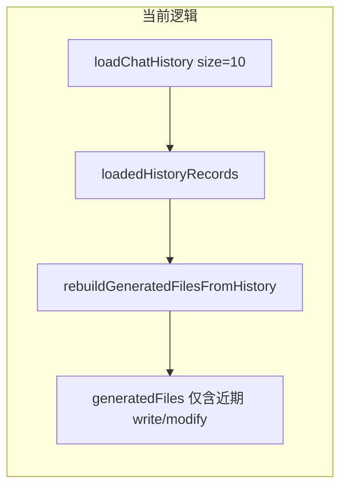
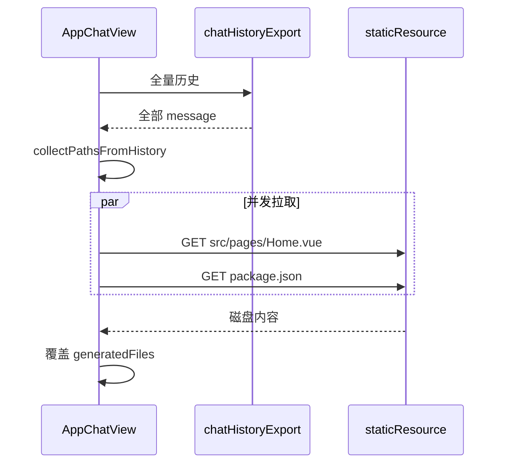

# Vue 项目「全量文件回显」前端改造

## 根因

- 红框数据来自 [`AppChatView.vue`](ai-generate-code-frontend/src/page/App/AppChatView.vue) 的 `generatedFiles`（约 L287–297、L2088–2118、L2838–2843）。
- `rebuildGeneratedFilesFromHistory()` **只遍历** `loadedHistoryRecords`（分页默认 `size: 10`，见 L2578）。
- 多轮对话后，列表里多为近期 **modify** 记录 → 回显变成「本轮改动的 3–4 个文件」，与 Redis `fileNotesJson` 中完整项目（约 10 个）不一致。
- 流式阶段 `recordGeneratedFile`（L1451、L1575、L2475）只追加本轮触及路径，**不会**补全未改文件。

## 目标方案（你已选：磁盘真源）

**路径**：`GET /chatHistory/export/{appId}` 全量历史 → 解析所有 `[工具调用] 写入/修改/删除文件` 路径（复用 [`toolOutputBlockParsers.ts`](ai-generate-code-frontend/src/utils/toolOutputAdapters/toolOutputBlockParsers.ts)）。

**内容**：`GET /static/{deployKey}/{relativePath}`（与预览同源，`deployKey = vue_project_{appId}`，见 L839–846）。

**合并**：路径 = 导出历史 ∪ 当前 `generatedFileMap`（生成中尚未落盘时兜底）；删除工具路径从集合移除。

## 实现要点

### 1. 新建 [`ai-generate-code-frontend/src/utils/projectFilesEcho.ts`](ai-generate-code-frontend/src/utils/projectFilesEcho.ts)（约 120–150 行）

| 导出函数 | 职责 |
|---------|------|
| `getStaticDeployKey(codeGenType, appId)` | 与 `normalizeCodeGenType` 一致，Vue → `vue_project_{id}` |
| `collectFilePathsFromHistoryMessages(msgs)` | write/modify 入集；解析 `[工具调用] 删除文件` 出集 |
| `shouldIncludeEchoPath(path)` | 对齐后端 `SNAPSHOT_IGNORE_DIRS` + `TEXT_FILE_EXTS`（[`ConversationMemoryConstant.java`](src/main/java/com/dbts/glyahhaigeneratecode/constant/ConversationMemoryConstant.java)） |
| `fetchProjectFileFromStatic(baseUrl, deployKey, path)` | `fetch` + credentials；404 跳过 |
| `loadProjectFilesEchoFromDisk(opts)` | 导出 API → 路径集 → 有限并发（如 8）拉静态 → `GeneratedFileItem[]` |

路径规范化：统一 `/`、去 leading `./`；排序可沿用现有 `isCoreFile` 逻辑（[`AppChatView.vue`](ai-generate-code-frontend/src/page/App/AppChatView.vue) L1698–1709）。

### 2. 改造 [`AppChatView.vue`](ai-generate-code-frontend/src/page/App/AppChatView.vue)（约 50–70 行净改）

- 新增 `refreshProjectFilesEchoFromDisk()`（带 `loadingEcho` / 防抖，避免与 `loadAppInfo`、SSE `done` 连打）。
- **替换** `rebuildGeneratedFilesFromHistory()` 在以下场景的「最终态」职责：
  - `loadChatHistory` 完成后（L2593）
  - `loadAppInfo` 兜底（L2647）
  - SSE `[DONE]` / `done` 事件（L2463–2485）
  - 可选：`handleManualRefreshApp` 成功后
- **保留** `recordGeneratedFile`：流式过程仍即时更新已写入文件；磁盘刷新完成后整体覆盖。
- 条件：`isVueProject && (hasGeneratedCode || hasGenerated)` 才走磁盘全量；否则仅保留流式/当前页历史解析（首轮生成中）。
- `loadAppInfo` 里 L2640–2642 **清空** 保留，但紧接 `loadChatHistory` 后走全量刷新，避免空白窗口过长（刷新期间可保留旧列表直至新数据就绪）。

### 3. 不改后端

仅消费已有 [`chatHistoryOpenApiExportAppIdUsingGet`](ai-generate-code-frontend/src/api/chatHistoryController.ts)、静态资源与现有预览 base URL；**不**新增 Controller / 不读 Redis。

### 4. 测试后清理

- 不保留临时 debug `console.log`、一次性脚本。
- 无需 `openapi2ts`（无新接口）。

## 验收标准

1. 多轮仅 modify 后，红框文案为**全项目文件数**（如 10），而非本轮 `changedFiles` 数量（如 3–4）。
2. 「查看回显」弹窗列出**全部**源码文件，内容与磁盘一致（改 `Evidence.vue` 后打开回显可见最新替换结果）。
3. **刷新页面**、**加载更多历史**后条数不缩水。
4. **首轮流式生成**：工具写入时仍实时出现；本轮 `done` 后自动扩全。
5. `cd ai-generate-code-frontend && npm run build` 通过。

## 改动文件与规模

| 文件 | 类型 | 预估 |
|------|------|------|
| [`projectFilesEcho.ts`](ai-generate-code-frontend/src/utils/projectFilesEcho.ts) | 新增 | +120~150 行 |
| [`AppChatView.vue`](ai-generate-code-frontend/src/page/App/AppChatView.vue) | 修改 | ±50~70 行 |
| `toolOutputBlockParsers.ts` | 可选 | +15 行（`extractToolDeleteFilePaths`） |

**合计**：约 180–220 行，单 PR 可审。

## 已知边界（非补丁式兜底）

- 路径依赖历史中出现过工具记录；若磁盘存在但从未出现在 chat 的极端文件，仍不会出现（与「历史路径 + 静态内容」方案一致）。若后续要 100% 目录扫描，需后端只读 manifest 接口或 zip 解压（本次不做）。
