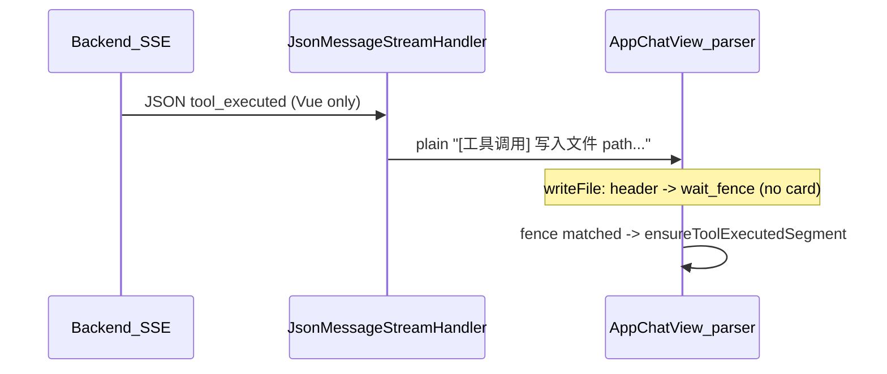
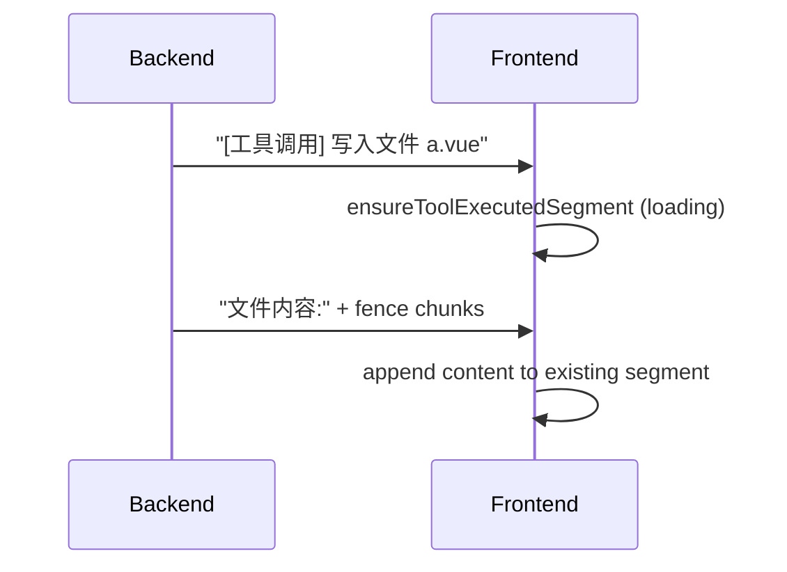

# 工具调用 SSE 空窗修复计划

## 问题复核结论

代码审阅确认你的根因判断成立，并补充一条架构事实：

- **Vue 主链路**：[`adaptVueTokenStream`](src/main/java/com/dbts/glyahhaigeneratecode/core/AiCodeGeneratorFacade.java) 向 SSE 推 JSON 行 → [`JsonMessageStreamHandler`](src/main/java/com/dbts/glyahhaigeneratecode/core/handler/JsonMessageStreamHandler.java) 再转成 `[选择工具]` / `[工具调用]` 纯文本 → 前端 [`processAssistantChunkIntoUiState`](ai-generate-code-frontend/src/page/App/AppChatView.vue) 用正则建段。
- **Legacy HTML/MULTI_FILE**：[`emitLegacyHtmlToolStreamChunk`](src/main/java/com/dbts/glyahhaigeneratecode/core/util/LegacyHtmlToolStreamSupport.java) 直接推纯文本，**仅 writeFile** 有 synthetic executed（L84-88）。
- **Workflow**：[`adaptWorkflowCodeChunk`](src/main/java/com/dbts/glyahhaigeneratecode/core/WorkflowCodeGeneratorFacade.java) 经 `BaseTool.generateToolExecutedResult`，fallback 已是 `[工具调用]`；但 Legacy/Json 兜底仍是 **`[滚木工具]`**，与前端正则不匹配（放大器 [3]）。



**与 bug 清单的对应关系**

| ID | 严重度 | 现状（已核实） |
|----|--------|----------------|
| [1] | 主因 | `tool_exec_write` 在 L1315 仅 `stage=tool_exec_wait_fence`；`ensureToolExecutedSegment` 在 L1440（围栏后） |
| [2] | 主因 | Vue partial 仅 `"writeFile"`（L574）；Legacy L87 同样；`onCompleteToolExecutionRequest` 只补 ToolRequest（L593-600） |
| [3] | 放大器 | 前端 L1174-1178 硬编码中文；`JsonMessageStreamHandler` / `LegacyHtmlToolStreamSupport.fallbackToolExecutedPlain` 输出 `[滚木工具]` |
| [4] | 放大器 | `tool_exec_wait_fence` / modify 等待阶段 `break` 不渲染（L1428-1432、L1494-1496）；`drainBufferToSegments` 仅在 stopStream/done 路径（L2245、L2287） |

**modifyFile 特例**：header 到达时已 `ensureToolExecutedModifyFileSegment`（L1334），卡片壳存在；空窗主要在「替换前/替换后」围栏等待期（[4]），与 writeFile 的「整卡缺失」不同。

---

## 实施顺序（推荐三 PR 粒度，可一次合并）

### Phase A — 前端主因 + 过程可见性（[1] + [4]）

**文件**：[`ai-generate-code-frontend/src/page/App/AppChatView.vue`](ai-generate-code-frontend/src/page/App/AppChatView.vue)

1. **writeFile header 即时建卡**（L1300-1316）
   - 识别 `TOOL_EXEC_HEADER_RE_WRITE_FILE` 后立刻：
     - `lang = inferLanguageFromFilePath(filePath)`
     - `ensureToolExecutedSegment(state, filePath, lang)`（`done: false`, `content: ''`）
     - 再进入 `tool_exec_wait_fence`
   - `tool_exec_wait_fence` 只消费 `文件内容:` + 起始围栏，向**已存在**的 `activeToolIndex` 段追加，不再负责“是否建卡”。

2. **等待态 UI**（模板 L3147-3200 一带）
   - writeFile：`!segment.content && !segment.done` 时显示轻量 loading 文案（可复用 `getToolRequestShimmerText` 风格或固定「等待文件内容…」）。
   - modifyFile：在 `tool_exec_modify_wait_before_fence` / `tool_exec_modify_wait_after_fence` 期间，对空的 `beforeContent` / `afterContent` 且对应 `*Done === false` 显示 section 级 skeleton（卡片已存在，补子区占位）。
   - 可选类型扩展：`UiToolExecutedWriteFileSegment` 增加 `contentPending?: boolean`（默认由 `!done && !content` 推导，避免历史回放分支大改）。

3. **`drainBufferToSegments` 小扩展**（L1145-1166）
   - 若 `stage === 'tool_exec_wait_fence'` 且已有 active write 段：不要把 buffer 误落 markdown；可保留 buffer 或标记段为 waiting（与 [1] 一致，避免 stop 时丢 header 后状态）。

4. **历史回放一致性**
   - `buildUiSegmentsFromFullText` 走同一 `processAssistantChunkIntoUiState`，无需分叉逻辑；改完后用已有历史文本抽测一次。

**不改**：modify/delete/read 的 header 建段逻辑（delete/read 已在 header 即 push simple segment）。

---

### Phase B — 后端 synthetic  parity（[2]）

**核心文件**

- [`LegacyHtmlToolStreamSupport.java`](src/main/java/com/dbts/glyahhaigeneratecode/core/util/LegacyHtmlToolStreamSupport.java) — 抽取/扩展 synthetic 构建
- [`AiCodeGeneratorFacade.java`](src/main/java/com/dbts/glyahhaigeneratecode/core/AiCodeGeneratorFacade.java) — `adaptVueTokenStream` 与 Legacy 共用 helper

**设计原则**（保持现有 writeFile 行为）

- `syntheticExecutedIds` + `nativeToolExecutedMode` 语义不变：同一 `toolCallId` 只渲染一张 executed 卡。
- Synthetic 输出形态不变：Vue 仍发 **JSON** `tool_executed`；Legacy 仍 `tool.generateToolExecutedResult(argsObj)` 转 plain（与 L106-116 一致）。

**新增 helper（建议放在 `LegacyHtmlToolStreamSupport`）**

| 工具 | complete/partial 触发条件 | 输出 |
|------|---------------------------|------|
| `modifyFile` | 可解析 `relativeFilePath` + `oldContent` + `newContent` | 同 writeFile：JSON → `FileModifyTool.generateToolExecutedResult` |
| `readFile` / `readDir` / `deleteFile` | 可解析 path（`relativeFilePath` 或 `relativeDirPath`） | 最小 plain/header 级 synthetic（经 tool 类生成完整 `[工具调用] …` 一行） |

**接线点**

1. `emitLegacyHtmlToolStreamChunk`：将 L84-88 的 `!"writeFile"` 改为按 toolName 分派；`isPartialDelta=false`（complete）时优先尝试 synthetic（补齐「只有 complete 才有完整 args」场景）。
2. `adaptVueTokenStream`：
   - `onPartialToolExecutionRequest`：在 writeFile 分支旁增加 modifyFile partial 提取（参数够长再发，避免半包 JSON 脏卡）。
   - `onCompleteToolExecutionRequest`（L593-600）：若 `!syntheticExecutedIds.contains(toolCallId)`，用 complete arguments 再尝试一次 synthetic（覆盖 native executed 迟迟不到）。
3. **不改动** `onToolExecuted` 去重逻辑（L602-614）：synthetic 已发则跳过 native。

**测试扩展**：[`AiCodeGeneratorFacadeStreamingTest.java`](src/test/java/com/dbts/glyahhaigeneratecode/core/AiCodeGeneratorFacadeStreamingTest.java)

- 新增 `buildSyntheticModifyFileToolExecutedMessage_*` / complete-only readFile 用例
- 断言：`tool_executed` 条数、arguments 字段、与 native 重复时仅 1 条（沿用 L130-139 模式）

---

### Phase C — 协议文案统一 + 前端容错（[3]）

**后端（必须先做，收益最大）**

统一为与 [`BaseTool.generateToolRequestResponse`](src/main/java/com/dbts/glyahhaigeneratecode/ai/tool/BaseTool.java) / 各 `File*Tool.generateToolExecutedResult` 一致：

```
\n\n[选择工具] {displayName}\n
[工具调用] {displayName} {path}\n
```

| 位置 | 当前问题 | 改法 |
|------|----------|------|
| [`LegacyHtmlToolStreamSupport.fallbackToolExecutedPlain`](src/main/java/com/dbts/glyahhaigeneratecode/core/util/LegacyHtmlToolStreamSupport.java) L172 | `[滚木工具]` | 改为 `[工具调用] %s %s\n`，toolName 映射到 `getDisplayName()`（未知工具用英文名） |
| [`JsonMessageStreamHandler.fallbackToolExecutedFormatting`](src/main/java/com/dbts/glyahhaigeneratecode/core/handler/JsonMessageStreamHandler.java) L291 | 同上 | 与 Workflow 的 L286-298 对齐 |
| 未知 tool 的 request fallback | `[选择工具] %s` 缺尾部 `\n`（L182） | 与 BaseTool 双换行一致 |

**前端（第二步，小改）**

在 [`AppChatView.vue`](ai-generate-code-frontend/src/page/App/AppChatView.vue) L1174-1178：

- 正则改为容忍 header 前后空白：`/\[工具调用\]\s*写入文件\s+([^\r\n]+)/` 已较宽松；可补充 `\s*` 于标签内、使 `文件内容:` 行可选已在 wait_fence 处理。
- 不建议本阶段引入独立 JSON 协议解析（与你「不大改架构」一致）。

---

## 数据流（修复后目标）



---

## 验证清单（按你提供的场景）

**命令**

```powershell
.\mvnw.cmd -q -DskipTests compile
cd ai-generate-code-frontend
npm run type-check
```

**手工场景**

1. Vue 首轮连续 5~10 个 writeFile：每个 header 到达即见卡片 + loading，围栏后代码流式填入。
2. 编辑轮 modifyFile：卡片即时出现，「替换前/后」等待期有 section loading，非整段空白。
3. readFile/readDir/deleteFile：request 后尽快出现 executed（含 complete-only synthetic）。
4. 极碎 SSE（header / `文件内容:` / 开围栏 / 闭围栏分包）：无长时间无卡空窗。
5. Workflow beta：确认 adapt 后文本仍匹配 `[工具调用]` 正则。

**回归注意**

- writeFile synthetic 与 native 同 ID 仍只 1 卡（现有测试保留）。
- 历史消息 `buildUiSegmentsFromFullText` 与流式 `uiState` 渲染一致。
- `[滚木工具]` 历史记录：统一 fallback 后仅影响新流；旧 DB 文本仍可能不匹配（可选：前端加一条废弃前缀兼容，非必须）。

---

## 风险与边界

- **modifyFile partial synthetic**：仅在 arguments 可完整解析时发送，避免半包导致错误 diff 展示。
- **read/delete synthetic**：占位 executed 不含大段 body，避免与后续 native 重复（依赖 toolCallId 去重）。
- **范围外**：不把 SSE 升级为结构化 event（如 `tool-phase`）；不重构 `processAssistantChunkIntoUiState` 为状态机类文件（除非后续单独立项）。
