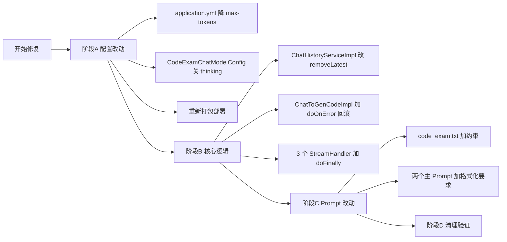

## 总览

四个 Bug 中：
- **Bug 1**: 必须动 2 处核心逻辑 + 重启服务（不需要改 Evaluator）
- **Bug 2**: 必须动 3 个 StreamHandler（每个加 8~10 行 doFinally）
- **Bug 3**: 已存档到 [bugs/potential-issues.md](bugs/potential-issues.md)，本轮不修
- **Bug 4**: 性能改配置 + 主 prompt 加 1 段格式化要求

下面按风险从低到高排，建议这个顺序实现。

---

## 阶段 A：零代码风险（先做，验证立竿见影）

### A1. 关掉质检模型的 reasoning + 降 max_tokens

**改 [src/main/resources/application.yml](src/main/resources/application.yml)**（约第 99-100 行）：
- `code-exam-chat-model.max-tokens`: `2048` → `768`

**改 [src/main/java/com/dbts/glyahhaigeneratecode/config/CodeExamChatModelConfig.java](src/main/java/com/dbts/glyahhaigeneratecode/config/CodeExamChatModelConfig.java)**：
- `OpenAiChatModel.builder()` 链上加：

```java
.customHeaders(Map.of("X-DashScope-EnableThinking", "false"))
// 兜底：用 extra-body 再传一次（部分 OpenAI 兼容模式只认 body）
```

实际写法用 LangChain4j 1.1.0 的 `defaultRequestParameters` 注入 `extra_body`，或者干脆走 `customHeaders`。

**预期效果**：单次质检从 ~39s 降到 ~5-8s，`reasoning_tokens=3782` 直接消失。

### A2. 重新打包部署，让 PromptSafetyAuditEvaluator 的 2200 限制生效

- 不改代码，只 `./mvnw clean package` + 重启
- 验证：日志里"输入内容过长"提示从「1000 字」变成「2200 字」

---

## 阶段 B：核心逻辑改动（必要，但范围最小化）

### B1. Bug 1 - 重试时清干净 ChatMemory（Redis）

**改 [src/main/java/com/dbts/glyahhaigeneratecode/service/impl/ChatHistoryServiceImpl.java](src/main/java/com/dbts/glyahhaigeneratecode/service/impl/ChatHistoryServiceImpl.java)** `removeLatestFailedAiMessageForRetry`（732-773 行）：

```java
// 现在：只 pop 末尾一条 AiMessage
// 改成：pop 末尾一条 AiMessage + 紧邻的一条 UserMessage（只动 Redis ChatMemoryStore，不动 DB）
List<ChatMessage> messages = new ArrayList<>(chatMemoryStore.getMessages(memoryId));
// 从末尾倒查：删 1 条 AiMessage + 1 条 UserMessage
// 加防御：只删最近一对，找不到就 no-op + warn 日志
chatMemoryStore.updateMessages(memoryId, messages);
```

**MySQL `chat_history` 表不动**（最终成功的 AI 回复要跟这条 user 配对显示）。

### B2. Bug 1 - Guardrail 拒绝时回滚 DB 里的 user 消息

**改 [src/main/java/com/dbts/glyahhaigeneratecode/service/impl/ChatToGenCodeImpl.java](src/main/java/com/dbts/glyahhaigeneratecode/service/impl/ChatToGenCodeImpl.java)** `chatToGenCodeByWorkflow`（118-141 行）：

在 Flux 链上加 `doOnError`：

```java
.doOnError(InputGuardrailException.class, e -> {
    chatHistoryService.removeUserMessageByContent(appId, userId, originalPrompt);
    log.warn("Guardrail 拒绝，已回滚 DB user 消息：appId={}", appId);
})
```

**新增方法** `removeUserMessageByContent`：按 (appId, userId, message, type=USER) 删最新一条，避免误删历史同名消息。

### B3. Bug 2 - 三个 StreamHandler 加 doFinally(CANCEL) 持久化部分回复

**改 3 个文件**（每个加 ~10 行）：
- [src/main/java/com/dbts/glyahhaigeneratecode/core/handler/SimpleTextStreamHandler.java](src/main/java/com/dbts/glyahhaigeneratecode/core/handler/SimpleTextStreamHandler.java)
- [src/main/java/com/dbts/glyahhaigeneratecode/core/handler/WorkflowTextStreamHandler.java](src/main/java/com/dbts/glyahhaigeneratecode/core/handler/WorkflowTextStreamHandler.java)
- [src/main/java/com/dbts/glyahhaigeneratecode/core/handler/JsonMessageStreamHandler.java](src/main/java/com/dbts/glyahhaigeneratecode/core/handler/JsonMessageStreamHandler.java)

公共改法：

```java
AtomicBoolean persisted = new AtomicBoolean(false);
StringBuilder aiResponseBuilder = new StringBuilder();

return flux
    .doOnNext(chunk -> aiResponseBuilder.append(chunk))
    .doOnComplete(() -> {
        if (persisted.compareAndSet(false, true)) {
            chatHistoryService.addChatMessage(...AI..., aiResponseBuilder.toString());
        }
    })
    .doOnError(err -> {
        if (persisted.compareAndSet(false, true)) {
            chatHistoryService.addChatMessage(...AI..., "[出错] " + err.getMessage());
        }
    })
    .doFinally(signal -> {
        if (signal == SignalType.CANCEL && persisted.compareAndSet(false, true)) {
            String partial = aiResponseBuilder.toString();
            if (StrUtil.isNotBlank(partial)) {
                chatHistoryService.addChatMessage(...AI..., partial + "\n\n[中断]");
            }
        }
    });
```

`AtomicBoolean persisted` 兜底防 doOnComplete + doFinally 都触发导致写两条。

---

## 阶段 C：Prompt 改动（按你确认的 both_change 方案）

### C1. 质检 prompt 放宽 + 禁推理（小改）

**改 [src/main/resources/Prompt/code_exam.txt](src/main/resources/Prompt/code_exam.txt)**：

在文末追加：

```
## 输出约束
- 不要输出任何推理过程（thinking/reasoning），直接给最终 JSON。
- errors 仅用于「会导致页面无法渲染、JS 报错、关键功能失效」的问题。
- 形如「class 命名不规范」「margin 用了 px 而非 rem」「h:200px 简写」这类
  风格问题一律放到 suggestions，不要进 errors。
```

### C2. 主生成 prompt 加格式化要求

**改 [src/main/resources/Prompt/Single_File_Prompt.txt](src/main/resources/Prompt/Single_File_Prompt.txt)** 和 **[src/main/resources/Prompt/Various_File_Prompt.txt](src/main/resources/Prompt/Various_File_Prompt.txt)**：

各加一节：

```
## 代码格式要求（强制）
- HTML / CSS / JS 必须输出多行格式化代码，禁止压缩成单行。
- CSS 每个属性独占一行，规则块之间空一行。
- HTML 标签合理换行缩进（缩进 2 空格）。
- JS 函数体换行，避免单行 if/for。
- 即使受字数/行数约束，也优先保证可读性。
```

**风险**：动主 prompt 会影响所有生成结果。已和你确认接受。

---

## 阶段 D：清理与验证

按 CLAUDE.md：
- 跑 `./mvnw test`
- 删除本次新增的临时调试日志
- 提交前用 `git diff` 复核每处改动

---

## 改动清单总览



| 文件类型 | 文件数 | 行数估算 |
|---|---|---|
| Java 核心逻辑 | 5 | ~80 行（多为加 callback） |
| 配置文件 | 1 | 1 行（max-tokens） |
| Prompt 文件 | 3 | 各加 5-8 行 |
| 不动的核心 | PromptSafetyAuditEvaluator、CodeGenWorkflow、PromptEnhancerNode、ChatMemoryStore 配置 | 0 |