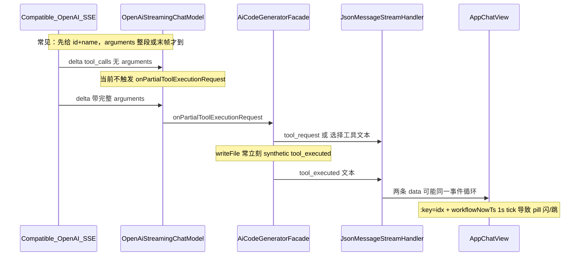
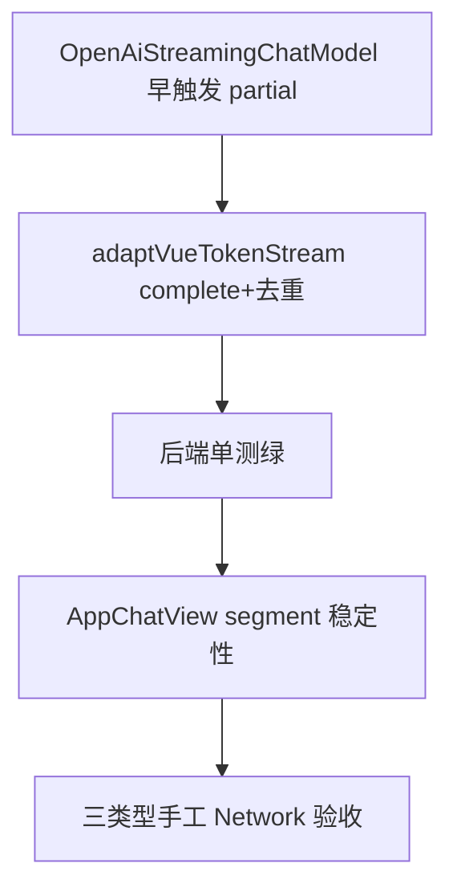

# 选择工具卡片早显（/chat/gen/code 根治方案）

## 问题复述（对照截图红框）

用户期望：后端**首次**解析到 AI 的 `tool_request` 时，SSE 立刻带出 `[选择工具]`，前端**立即**渲染胶囊；当前体感是等到 `[工具调用]` / 使用工具卡片出现时才与选择工具**一起**出现。

你已确认验收范围：**仅 `[/chat/gen/code](src/main/java/com/dbts/glyahhaigeneratecode/controller/ChatToGenCodeController.java)`**，覆盖 **HTML、MultiFile、Vue** 三种类型（不含 workflow 专项验收）。

---

## 根因结论（全项目检索后）

**不是**前端「等 onComplete 才建卡」——`[processAssistantChunkIntoUiState](ai-generate-code-frontend/src/page/App/AppChatView.vue)` 在 buffer 内匹配到完整 `[选择工具]` 行后**同步** `segments.push`（约 L1252–1275）。

**是**下游 SSE 到达太晚 / 同 tick 批量到达 + 渲染 remount：

| 层级         | 文件                                                                                                                                  | 根因                                                                                                                   |
| ---------- | ----------------------------------------------------------------------------------------------------------------------------------- | -------------------------------------------------------------------------------------------------------------------- |
| 模型 SSE     | `[OpenAiStreamingChatModel.java](src/main/java/dev/langchain4j/model/openai/OpenAiStreamingChatModel.java)` L206–220                | **仅** `partialArguments` 非空才 `onPartialToolExecutionRequest`；name/id 先到时不通知                                          |
| Vue 适配     | `[AiCodeGeneratorFacade.adaptVueTokenStream](src/main/java/com/dbts/glyahhaigeneratecode/core/AiCodeGeneratorFacade.java)` L539–619 | **未注册** `onCompleteToolExecutionRequest`；兼容 API 若只在 complete 给完整 request，则 **永远晚于** synthetic/native `tool_executed` |
| Vue 适配     | 同上 L553–555                                                                                                                         | 每个 partial 都 `sink.next(ToolRequestMessage)`，去重推迟到 Handler；**首包仍依赖模型 partial 时机**                                    |
| HTML/Multi | `[LegacyHtmlToolStreamSupport](src/main/java/com/dbts/glyahhaigeneratecode/core/util/LegacyHtmlToolStreamSupport.java)` L69–82      | 逻辑正确（toolCallId+name 首次即 `[选择工具]`），但 **上游 partial 来得晚则一起晚**                                                          |
| 执行时序       | `[AiServiceStreamingResponseHandler](src/main/java/dev/langchain4j/service/AiServiceStreamingResponseHandler.java)` L134+           | `onCompleteResponse` 内同步 `toolExecutor.execute()`；readFile/modifyFile 极快 → 两条 SSE 间隔可忽略                              |
| 前端 DOM     | `[AppChatView.vue](ai-generate-code-frontend/src/page/App/AppChatView.vue)` L3077 `:key="idx"`                                      | segment 插入时 remount，pill **像**晚出现或闪一下                                                                                |
| 前端 DOM     | 同上 L2291–2293、`v-if` shimmer L3085–3092                                                                                             | 每秒 `workflowNowTs` 全树 refresh；pending 时 `v-if` 拆 shimmer 子树                                                          |

**明确排除（不做补丁）**

- 不在前端用 `requestAnimationFrame` / `setTimeout` 人为拆帧显示选择工具。
- 不扩 `maybeInjectToolSelectHint`（`[AppChatView.vue](ai-generate-code-frontend/src/page/App/AppChatView.vue)` L1715–1722）去「猜」工具名；仅保留与后端协议一致的标记逻辑或删除无用状态（若实施时发现完全无引用再删）。
- 不新增 SSE event 类型；继续 `[选择工具]` / `[工具调用]` 文本协议，避免历史回放分叉。

---

## 实施方案

### 阶段 1：后端 — 模型层尽早触发 partial（三种 gen 类型共用）

**改 `[OpenAiStreamingChatModel.handle()](src/main/java/dev/langchain4j/model/openai/OpenAiStreamingChatModel.java)`**

在 `updateId` / `updateName` 之后增加 **按 index 去重** 的「首次可见 tool 元数据」通知：

- 当 `toolName`（或 id）**首次非空**时，调用一次 `onPartialToolExecutionRequest`，`arguments` 允许 `""` 或当前 builder 已累积片段。
- 保留现有「arguments delta 非空再 partial」逻辑，但与「name/id 首次」**独立**（同一 index 的 name 通知只一次）。
- 注意 index 切换时已有 `onCompleteToolExecutionRequest`（L194–200），勿重复 complete。

**预期效果**：DashScope/兼容 OpenAI 流在 arguments 整段到达前，Facade 就能推 `[选择工具]`。

### 阶段 2：后端 — Vue 路径与 HTML 对齐

**改 `[adaptVueTokenStream](src/main/java/com/dbts/glyahhaigeneratecode/core/AiCodeGeneratorFacade.java)`**

1. 新增 `Set<String> seenToolRequestIds`（与 `[wireHtmlMultiFileTokenStream](src/main/java/com/dbts/glyahhaigeneratecode/core/AiCodeGeneratorFacade.java)` L244 一致）。
2. 注册 `.onCompleteToolExecutionRequest(...)`：
  - 每个 `toolCallId` **仅首次** `sink.next(new ToolRequestMessage(...))`；
  - 覆盖「从不 partial、仅 complete」的兼容 API（`[LegacyHtmlToolStreamSupport` 注释 L35–37](src/main/java/com/dbts/glyahhaigeneratecode/core/util/LegacyHtmlToolStreamSupport.java) 已说明该模式）。
3. `onPartialToolExecutionRequest` 内同样 **seenToolRequestIds 去重后再 emit**，避免重复 JSON 行（与 `[JsonMessageStreamHandler` TOOL_REQUEST 分支](src/main/java/com/dbts/glyahhaigeneratecode/core/handler/JsonMessageStreamHandler.java) L173–186 语义一致，但把「首次」前移到 Facade）。

**不改** synthetic `tool_executed` 策略（writeFile 早显执行卡是产品行为）；早显 **选择工具** 后，执行卡仍可紧随其后，但 Network 上应能先看到 `[选择工具]` 行。

**HTML/MultiFile**：仅受益于阶段 1；`[wireHtmlMultiFileTokenStream](src/main/java/com/dbts/glyahhaigeneratecode/core/AiCodeGeneratorFacade.java)` 已有 partial+complete + `LegacyHtmlToolStreamSupport`，**无需重复造轮子**。

### 阶段 3：后端 — 单测锁定时序契约

扩展 `[AiCodeGeneratorFacadeStreamingTest](src/test/java/com/dbts/glyahhaigeneratecode/core/AiCodeGeneratorFacadeStreamingTest.java)`：

| 用例                                                           | 断言                                                                                   |
| ------------------------------------------------------------ | ------------------------------------------------------------------------------------ |
| `onlyCompleteToolRequest_emitsToolRequestBeforeToolExecuted` | FakeTokenStream 只 emit complete + executed → 列表里 **tool_request 下标 < tool_executed** |
| `duplicatePartialAndComplete_emitsSingleToolRequest`         | 同一 toolCallId partial+complete → 仅一条 `type=tool_request` JSON                        |
| （可选）`OpenAiStreamingChatModel` 纯单元                           | mock delta：仅 name → 再 arguments → partial 回调 ≥2 次，且第一次 arguments 可为空                 |

运行：`.\mvnw.cmd test -Dtest=AiCodeGeneratorFacadeStreamingTest`

### 阶段 4：前端 — 收到即稳定渲染（非延迟补丁）

**改 `[AppChatView.vue](ai-generate-code-frontend/src/page/App/AppChatView.vue)`**

1. **segmentId**：创建 `tool_request` / `tool_executed_`* 时写入稳定 id（`tool-req-${toolCallId}` 或 `tool-req-${messageId}-${seq}`；历史 `buildUiSegmentsFromFullText` 用确定性 seq）。
2. **模板**：`v-for` 改为 `:key="segment.segmentId ?? \`seg-${idx}"`（替换 L3077` :key="idx"`）。
3. **uiSegmentsSnapshot**（或 `uiRenderVersion`）：在 `appendAssistantChunkToStream` / `processAssistantChunkIntoUiState` 变更后重建 segment 数组；模板 **不要** 在 `v-for` 源上每次 render 调用 `getMessageUiSegments(m)`（该函数含 slice/合并，放大 diff）。
4. **Shimmer**：`tool-hint-pill` 始终保留 shimmer 容器；用 class `tool-hint-pill--pending` / `--done` 控制动画，**去掉** `v-if="isToolRequestPending"` 对 shimmer 根的挂载/卸载（pending 逻辑可保留给文案/aria）。
5. **workflowNowTs**：`startWorkflowSlowHintTicker` 的 1s interval **仅**驱动 workflow 慢提示与 writeFile 分级文案；readFile/modifyFile 的 tool pill **不**依赖该 tick（或 shimmer 改用 CSS `@keyframes`）。

**保持不动**：`[processAssistantChunkIntoUiState](ai-generate-code-frontend/src/page/App/AppChatView.vue)` 协议优先级（`tool_request_any` 在 candidates 中最靠前，L1207–1250）；`[workflowChatFilters.ts](ai-generate-code-frontend/src/utils/workflowChatFilters.ts)` 对协议行的保留策略。

### 阶段 5：验收与清理

- 手工：DevTools → Network → `gen/code` EventStream，同一 toolCall 必须先有 `[选择工具]` 再有 `[工具调用]`。
- 三种类型各测 1 次：Vue readFile、单文件 HTML writeFile、MultiFile modifyFile。
- `cd ai-generate-code-frontend && npm run build`
- 删除实施中临时 `console.log`、一次性 debug 代码；**不**新增 openapi / 数据库生成。

---

## 验收标准（可勾选）

### 时序（Network + UI）

1. 同一轮工具调用，EventStream 中 **必须先出现**含 `[选择工具]` 的 `data` 行，**后出现**含 `[工具调用]` 的行（允许同毫秒，**禁止仅有后者**）。
2. 第一条 `[选择工具]` SSE 到达后，当前 assistant 气泡内 **立即**出现「选择工具 · {工具名}」pill（不必等使用工具卡片 mount）。
3. writeFile 大参数：pill 先稳定显示 shimmer，再出现使用工具卡片；pill **不消失**。

### 防闪烁

1. 流式全程：已出现的「选择工具」pill **不跳位、不闪灭再出现**（动画可继续，整卡不 remount）。
2. 连续多轮工具：每轮一张选择工具 + 一张使用工具，顺序与刷新后历史一致。

### 回归

1. 流式结束与刷新后 `buildUiSegmentsFromFullText` 卡片数量、顺序一致。
2. `npm run build` 与 `AiCodeGeneratorFacadeStreamingTest` 新增用例通过。

### 已知下限（如实写入 PR，非兜底）

若上游在**同一 delta** 内同时给出完整 name+arguments 且立刻 `onCompleteResponse`，两条 SSE 仍可能在**同一浏览器 tick** 渲染——属 API 行为下限；本方案保证：**只要后端能更早 emit，前端立刻且稳定显示**。

---

## 目标改动文件与预估规模

| 文件                                                                                                                                    | 改动要点                                                  | 预估行数    |
| ------------------------------------------------------------------------------------------------------------------------------------- | ----------------------------------------------------- | ------- |
| `[OpenAiStreamingChatModel.java](src/main/java/dev/langchain4j/model/openai/OpenAiStreamingChatModel.java)`                           | name/id 首次 → partial request；index 去重                 | +35~50  |
| `[AiCodeGeneratorFacade.java](src/main/java/com/dbts/glyahhaigeneratecode/core/AiCodeGeneratorFacade.java)`                           | `adaptVueTokenStream`：seenToolRequestIds + onComplete | +30~40  |
| `[AiCodeGeneratorFacadeStreamingTest.java](src/test/java/com/dbts/glyahhaigeneratecode/core/AiCodeGeneratorFacadeStreamingTest.java)` | complete-only / 去重顺序                                  | +35~45  |
| `[AppChatView.vue](ai-generate-code-frontend/src/page/App/AppChatView.vue)`                                                           | segmentId、snapshot、key、shimmer class、ticker 收敛        | +75~110 |
| （可选）`[OpenAiStreamingChatModel` 测试类](src/test/java)                                                                                   | delta 顺序单测                                            | +40~60  |

**合计：约 175~~245 行，4~~5 个文件**（不新增冗余 Support 类；Vue 在 Facade 内对齐 HTML 已有模式）。

---

## 实施顺序（建议 Claude 严格执行）

1. 先后端模型 + Vue Facade + 单测（可独立验证 SSE 顺序）。
2. 再前端 DOM 稳定性（避免误把后端未修时的同 tick 当成前端 bug 打补丁）。
3. 每步提交前自查：无 `setTimeout` 假早显、无重复 `tool_request` JSON 洪水。

---

## 手工验证清单（实施后）

1. 启动后端 `.\mvnw.cmd spring-boot:run` + 前端 `npm run dev`。
2. 打开应用聊天，Network 过滤 `gen/code`。
3. 分别触发：Vue readFile、HTML writeFile、MultiFile modifyFile。
4. 截图或复制两条 `data` 行时间戳；录屏 5~10s 对比 pill 首帧 vs 工具卡片。
5. 刷新页面，对比卡片顺序与数量。

