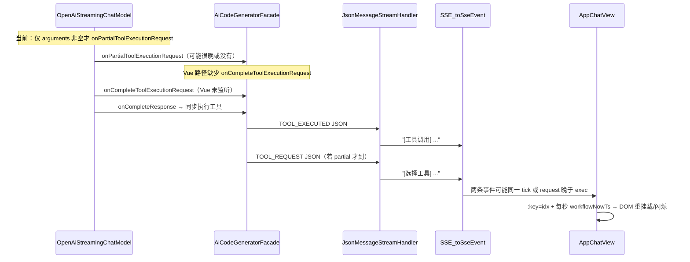

# 选择工具卡片：早显 + 防闪烁（第二轮）

## 关于视频/图片

**可以发。** Cursor 对话里可上传短视频或录屏；我也能看静态截图。若需精确核对时序，请优先附 **DevTools → Network → EventStream** 里同一轮工具调用的两条 `data` 行（含到达时间），比口述更可靠。

---

## 你已确认的约束

| 项 | 你的选择 |
|---|---|
| 早显定义 | **前端首次收到后端 `[选择工具]` 文本即渲染卡片**，不等待 `[工具调用]` |
| 验收范围 | **`/chat/gen/code` 全类型**：HTML、MultiFile、Vue 均需正确时序 |
| 原则 | 根因修复，不做兜底补丁、不引入冗余状态机 |

---

## 根因分析（两轮叠加）

### 问题 A：卡片与工具调用「一起出来」

1. **上游模型层**（[`OpenAiStreamingChatModel.java`](src/main/java/dev/langchain4j/model/openai/OpenAiStreamingChatModel.java)）：`onPartialToolExecutionRequest` **仅在 `arguments` 非空时触发**（约 L207）。很多兼容 API 先给 `id/name`，arguments 整段或最后一帧才到 → 后端很晚才发 `[选择工具]`。
2. **Vue 适配层**（[`AiCodeGeneratorFacade.adaptVueTokenStream`](src/main/java/com/dbts/glyahhaigeneratecode/core/AiCodeGeneratorFacade.java)）：**缺少** `onCompleteToolExecutionRequest`；HTML/MultiFile 路径在 [`wireHtmlMultiFileTokenStream`](src/main/java/com/dbts/glyahhaigeneratecode/core/AiCodeGeneratorFacade.java) 已通过 [`LegacyHtmlToolStreamSupport`](src/main/java/com/dbts/glyahhaigeneratecode/core/util/LegacyHtmlToolStreamSupport.java) 补齐。Vue 与 HTML **不对称**。
3. **工具执行同步**：`onCompleteResponse` 内立刻 `onToolExecuted`（[`AiServiceStreamingResponseHandler`](src/main/java/dev/langchain4j/service/AiServiceStreamingResponseHandler.java)），readFile/modifyFile 毫秒级完成 → 即使顺序正确，体感仍「同时」；**必须先让 `[选择工具]` 在模型流式阶段就作为独立 SSE 发出**。

### 问题 B：流式「一闪一闪」

1. **不稳定 Vue key**：[`AppChatView.vue`](ai-generate-code-frontend/src/page/App/AppChatView.vue) L3029 `v-for ... :key="idx"`，segment 插入/合并时 DOM 被 remount。
2. **模板内重复计算**：`getMessageUiSegments(m)` 每次 render 新建数组（含 markdown+buffer 合并），放大 diff。
3. **shimmer 用 `v-if` 挂载/卸载**：`isToolRequestPending` 在紧随其后的 `tool_executed` 段出现时立刻拆掉 shimmer 子树 → 视觉闪动。
4. **`workflowNowTs` 每秒 tick**（L2245-2247）：流式期间全消息重绘，非 writeFile 的 pill 也会跟着 refresh。

前端逻辑本身在收到 chunk 时会 **同步** `processAssistantChunkIntoUiState`（L2328），不是「等工具调用才渲染」；问题在于 **SSE 到达太晚/同 tick** + **渲染不稳定**。

---

## 方案（分层、非补丁）

### 1. 后端：尽早、独立发出 `[选择工具]`（三种 gen 类型统一受益）

**1.1 改 vendored [`OpenAiStreamingChatModel.handle()`](src/main/java/dev/langchain4j/model/openai/OpenAiStreamingChatModel.java)**

- 在 `updateId` / `updateName` 之后，当 **tool name 首次非空**（按 `index` 去重）即调用 `onPartialToolExecutionRequest`，arguments 允许为空字符串。
- 保持现有「arguments delta 非空时再 partial」逻辑，但 **name/id 首次出现必须额外通知一次**（与 [`LegacyHtmlToolStreamSupport` 注释 L35-37](src/main/java/com/dbts/glyahhaigeneratecode/core/util/LegacyHtmlToolStreamSupport.java) 的设计意图一致）。
- 这是 **唯一能从模型流式阶段提前 SSE** 的根因点；HTML/MultiFile/Vue 共用同一 TokenStream 链路。

**1.2 补齐 Vue 路径 `onCompleteToolExecutionRequest`**

在 [`adaptVueTokenStream`](src/main/java/com/dbts/glyahhaigeneratecode/core/AiCodeGeneratorFacade.java) 增加与 HTML 对称的处理：

- 新增 `Set<String> seenToolRequestIds`；
- `onPartial` / `onComplete` 均：**每个 toolCallId 仅首次** `sink.next(ToolRequestMessage JSON)`；
- `onComplete` 作为「从不 partial、只在 complete 才有完整 request」的兜底（HTML 已验证的模式）。

**1.3 不改协议文本形态**

继续走 `JsonMessageStreamHandler` → `[选择工具] %s` / `BaseTool.generateToolRequestResponse()`，**不新增前端特殊 event 类型**，避免历史回放分叉。

**1.4 单测**

扩展 [`AiCodeGeneratorFacadeStreamingTest`](src/test/java/com/dbts/glyahhaigeneratecode/core/AiCodeGeneratorFacadeStreamingTest.java)：

- `onlyCompleteToolRequest_emitsToolRequestBeforeToolExecuted`（FakeTokenStream 只 emit complete + executed）；
- `duplicatePartialAndComplete_emitsSingleToolRequest`（去重）。

可选：为 `OpenAiStreamingChatModel` 增加纯单元测试（mock delta：先 name 后 arguments → 两次 partial 回调）。

---

### 2. 前端：收到即渲染 + 稳定 DOM（非延迟补丁）

**2.1 Segment 稳定 identity**

在 [`AppChatView.vue`](ai-generate-code-frontend/src/page/App/AppChatView.vue) 的 `UiToolRequestSegment` / 其它 segment 创建处写入 **`segmentId`**（流式：`tool-req-${toolCallId}` 或 `tool-req-${messageId}-${seq}`；历史回放从顺序生成一致 id）。

模板改为 `:key="segment.segmentId ?? idx"`。

**2.2 减少无效重绘**

- 为每条 assistant 消息维护 **`uiSegmentsSnapshot`**（或在 `appendAssistantChunkToStream` 后递增 `uiRenderVersion`），模板不再在 `v-for` 源上直接调用会 `slice()` 的函数；仅在 `uiState` 变更时重建 snapshot。
- **`workflowNowTs` tick 仅驱动 writeFile 分级 shimmer**（或改为 CSS `@keyframes` 做 dots 动画，静态文案「工具执行中」），避免 readFile/modifyFile pill 每秒整树 refresh。

**2.3 Shimmer 不卸载 DOM**

- `tool_request` pill **始终渲染** shimmer 容器；
- 用 class `tool-hint-pill--pending` / `--done` 控制动画与文案，**不用 `v-if` 拆掉 shimmer 节点**，避免完成瞬间闪灭。

**2.4 保持现有解析器**

[`processAssistantChunkIntoUiState`](ai-generate-code-frontend/src/page/App/AppChatView.vue) 已在单 chunk 内按 buffer 位置优先处理 `[选择工具]`（L1204-1286），**无需** `requestAnimationFrame` 人为拆帧（那属于补丁）。

**2.5 可选（本轮不做除非 snapshot 仍不够）**

抽离 `toolProtocolUiParser.ts` — 仅当 AppChatView 改动超 100 行时再考虑；默认 **不抽**，控制 diff。

---

## 验收标准

### 时序（Network + UI）

1. 对 **Vue readFile / modifyFile** 与 **HTML/MultiFile writeFile**，在 EventStream 中同一 toolCall：
   - 必须先出现含 **`[选择工具]`** 的 `data` 行；
   - 后出现含 **`[工具调用]`** 的 `data` 行（允许同毫秒，但 **不得只有后者**）。
2. **UI**：第一条 `[选择工具]` SSE 到达后，**当前 assistant 气泡内立即出现**「选择工具 · {工具名}」pill（允许与后续 markdown/工具卡片同屏，但 pill **不得等到工具卡片出现才首次 mount**）。
3. **慢工具**（writeFile 大文件）：pill 先稳定显示 shimmer，再出现「使用工具」卡片；pill **不消失**。

### 防闪烁

4. 流式全程：已出现的「选择工具」pill **位置不跳、不闪灭再出现**（shimmer 动画可继续，整卡不得 remount 到错误位置）。
5. 连续多次工具调用：每次各一张「选择工具」+ 一张「使用工具」，顺序与刷新后历史 **一致**。

### 回归

6. 流式结束态与 **刷新后** `buildUiSegmentsFromFullText` 卡片数量、顺序一致。
7. `cd ai-generate-code-frontend && npm run build` 通过；后端 `AiCodeGeneratorFacadeStreamingTest` 新增用例通过。

---

## 目标改动文件与预估规模

| 文件 | 改动内容 | 预估行数 |
|------|----------|----------|
| [`OpenAiStreamingChatModel.java`](src/main/java/dev/langchain4j/model/openai/OpenAiStreamingChatModel.java) | name/id 首次出现时触发 partial request | **+30~45** |
| [`AiCodeGeneratorFacade.java`](src/main/java/com/dbts/glyahhaigeneratecode/core/AiCodeGeneratorFacade.java) | `adaptVueTokenStream` 补 `onCompleteToolExecutionRequest` + 去重 | **+25~35** |
| [`AiCodeGeneratorFacadeStreamingTest.java`](src/test/java/com/dbts/glyahhaigeneratecode/core/AiCodeGeneratorFacadeStreamingTest.java) | complete-only / 去重用例 | **+30~40** |
| [`AppChatView.vue`](ai-generate-code-frontend/src/page/App/AppChatView.vue) | segmentId、snapshot、shimmer class、key/ticker 收敛 | **+70~100** |
| （样式同文件 `<style>`） | pending/done shimmer class | **+15~25** |

**合计：约 170~245 行，4 个文件**（不新增冗余 Support 类，Vue 侧直接在 Facade 内对齐 HTML 已有模式）。

---

## 手工验证步骤（实施后用）

1. 启动后端 + 前端，打开应用聊天，DevTools Network 过滤 `gen/code`。
2. 分别用 **Vue 项目**（readFile+modifyFile）、**单文件 HTML**、**MultiFile** 各触发 1 次工具调用。
3. 记录 EventStream 两条 `data` 顺序；录屏 5~10s 对比 pill 首次出现帧 vs 工具卡片。
4. 刷新页面，对比卡片数量/顺序。
5. 若仍异常，把 **Network 两条 event 截图 + 5s 录屏** 发回，对照是 SSE 同批还是 DOM 闪烁。

---

## 仍可能的外部限制（如实说明）

若上游模型 **在同一 SSE delta 内同时给出 name+完整 arguments 且立刻进入 onCompleteResponse**，则 `[选择工具]` 与 `[工具调用]` 仍可能在 **同一浏览器 tick** 渲染——这是模型/API 行为下限，无法在前端「猜意图」更早显示。本方案保证：**只要后端能更早 emit request，前端立刻渲染且不再闪**。
