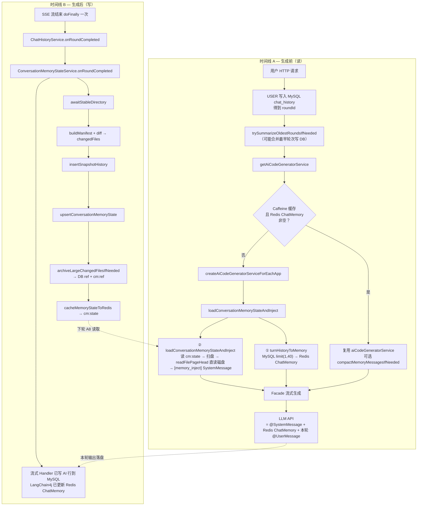
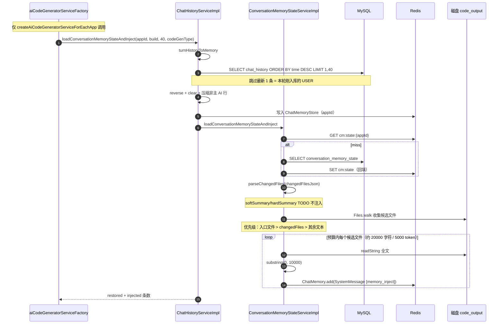
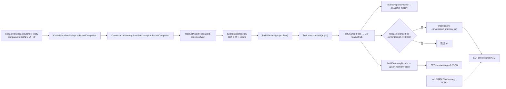
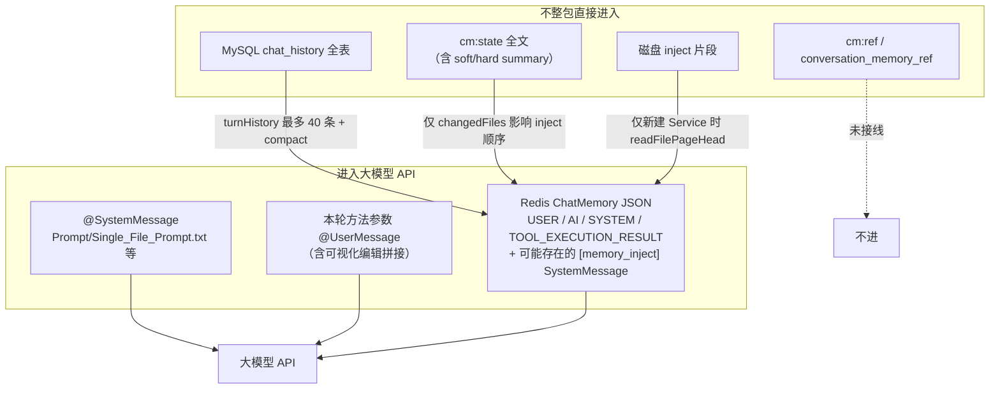

# 会话记忆 V4：当前架构（As-Is）

面向读者：后端 / 全栈维护 `ConversationMemoryStateServiceImpl`、`ChatHistoryService`、`aiCodeGeneratorServiceFactory` 的同学。

**文档性质**：描述仓库**当前已实现**的链路与存储；标注 `TODO` / `未接线` / `仅缓存命中行为` 处，避免与目标态混淆。

**配对文档**：[conversation-memory-v4-target-architecture.md](./conversation-memory-v4-target-architecture.md)（完全完工目标态）。

---

## 1. 三层存储与职责

| 层级 | 载体 | 真相源？ | 当前用途 |
|------|------|----------|----------|
| 对话时间线 | MySQL `chat_history` | 是 | 用户/AI/审计字段持久化；预加载时最多取 40 条灌 Redis |
| 对话热窗口 | Redis `ChatMemoryStore`（LangChain4j，key 以 `appId` 为 memoryId） | 否（由 DB 重建） | **直接构成 LLM 上下文** 的 USER/AI/SYSTEM/TOOL JSON |
| 工程状态 | MySQL `conversation_memory_state` + Redis `cm:state:{appId}` | 是（DB） | 软/硬摘要、`changedFilesJson`；**摘要尚未注入模型** |
| 工程快照 | MySQL `snapshot_history` | 是 | manifest 清单；供 diff 出 `changedFiles` |
| 大文件归档 | MySQL `conversation_memory_ref` + Redis `cm:ref:{refId}` | 是（DB） | ≥8000 字符的 changed 文件全文；**读回注入未实现** |
| 源码 | 磁盘 `temp/code_output/{type}_{appId}/` | 是 | 生成/工具修改的真实文件；工具链与 inject 直读 |

---

## 2. Redis Key 一览（当前）

| Key 模式 | 写入时机 | 读取时机 | TTL（默认） | 进 LLM？ |
|----------|----------|----------|-------------|----------|
| LangChain4j ChatMemory（`appId`） | 预加载 `turnHistoryToMemory`；流式生成中 LangChain4j 追加 | 每轮 `getAiCodeGeneratorService` → 模型请求 | 见 LangChain4j/Redis 配置 | **是（主通道）** |
| `cm:state:{appId}` | `onRoundCompleted` → `cacheMemoryStateToRedis` | `loadConversationMemoryStateAndInject` 开头 | 14 天 | **否**（仅用 `changedFilesJson` 排序 inject） |
| `cm:ref:{refId}` | `archiveLargeChangedFilesIfNeeded` | **无读回链路** | 3 天 | **否** |

---

## 3. 总览：一条用户消息的两条时间线



---

## 4. 入口类与调用链（普通生成）

| 步骤 | 类 / 方法 | 输出 |
|------|-----------|------|
| 1 | `ChatToGenCodeImpl.chatToGenCode` | `roundId` |
| 2 | `ChatHistoryService.addChatMessageAndReturnId` | MySQL USER 行 |
| 3 | `ChatHistoryService.trySummarizeOldestRoundsIfNeeded` | 可能删并合并最早 4 条消息 |
| 4 | `AiCodeGeneratorFacade.generateAndSaveCodeStream` | `Flux<String>` |
| 5 | `aiCodeGeneratorServiceFactory.getAiCodeGeneratorService` | 缓存或新建 Service |
| 6 | `StreamHandlerExecutor.doExecute` | 包装 `onRoundCompleted` |
| 7 | Handler（`SimpleTextStreamHandler` / `JsonMessageStreamHandler` / `WorkflowTextStreamHandler`） | SSE + `addChatMessage` AI |

Workflow 入口：`ChatToGenCodeImpl.chatToGenCodeByWorkflow` → `WorkflowCodeGeneratorFacade` → 同一 `StreamHandlerExecutor`。

---

## 5. 预加载与注入（新建 AI Service 时）



**缓存命中时不走上图 6–17 步**：`getAiCodeGeneratorService` 直接返回旧 Service，Redis ChatMemory 沿用上一轮 LangChain4j 追加的内容。

---

## 6. 轮次收口 onRoundCompleted（当前）



---

## 7. 最终进入 LLM 的上下文（当前真相）



---

## 8. 压缩与治理（当前已接线）

| 机制 | 触发点 | 作用对象 | 说明 |
|------|--------|----------|------|
| `compactAiMessageForMemory` | `turnHistoryToMemory` | 非「最后一轮主 AI」的 HTML/MULTI AI 行 | 超长压摘要，阈值约 2400 字符 |
| `trySummarizeOldestRoundsIfNeeded` | 每轮用户消息入库后 | MySQL 最早 2 轮 → 1 轮摘要 | USER 轮数 > 3 时循环合并 |
| `compactMemoryMessagesIfNeeded` | Service 缓存命中 | Redis ChatMemory 内 AI 行 | 在线压缩 |
| `cleanupMemoryRefsAndSnapshots` | `@Scheduled` 每 30 分钟 | `conversation_memory_ref` | 条数/天数/总字节 |

---

## 9. 当前缺口清单（与目标态差异）

| 编号 | 缺口 | 代码锚点 |
|------|------|----------|
| G1 | `softSummary` / `hardSummary` 未注入 ChatMemory | `ConversationMemoryStateServiceImpl` TODO memory-v4 |
| G2 | `cm:ref` / DB ref 未读回模型 | `archiveLargeChangedFilesIfNeeded` 注释 |
| G3 | inject 仅在新建 Service 时执行；缓存命中不 inject | `aiCodeGeneratorServiceFactory.getAiCodeGeneratorService` |
| G4 | 工具轮 AI 仍可能落库整页 ` ```html ` | 流式 Handler 持久化策略 |
| G5 | inject 与 ChatMemory 内 HTML / USER 片段可能重复 | 无去重策略 |

---

## 10. 关键常量（当前默认值）

| 常量 | 值 | 位置 |
|------|-----|------|
| `MEMORY_PRELOAD_MESSAGE_ROWS` | 40 | `ChatHistoryConstant` |
| `CHAT_MEMORY_MAX_MESSAGES` | 80 | `ChatHistoryConstant` |
| `DEFAULT_PAGE_SIZE` | 10000 字符 | `ConversationMemoryConstant` |
| `DEFAULT_INJECT_CHAR_BUDGET` | 20000 | `ConversationMemoryConstant` |
| ref 归档阈值 | 8000 字符 | `archiveLargeChangedFilesIfNeeded` |
| `state-ttl-seconds` | 1209600（14 天） | `application.yml` |
| `ref-ttl-seconds` | 259200（3 天） | `application.yml` |

---

## 11. 相关源码索引

| 模块 | 路径 |
|------|------|
| 轮次收口 + inject + ref | `service/impl/ConversationMemoryStateServiceImpl.java` |
| 预加载编排 | `service/impl/ChatHistoryServiceImpl.java` |
| Service 缓存与新建 | `ai/aiCodeGeneratorServiceFactory.java` |
| SSE 收口 | `core/handler/StreamHandlerExecutor.java` |
| 入口 | `service/impl/ChatToGenCodeImpl.java` |
| 配置 | `config/ConversationMemoryProperties.java`、`application.yml` `conversation.memory.*` |
| 学习复盘 | `learn/会话记忆指南（会话记忆重构V4学习复盘）.md` |

---

*author By glyahh · 当前架构快照 · 与代码同步请以源码为准*
