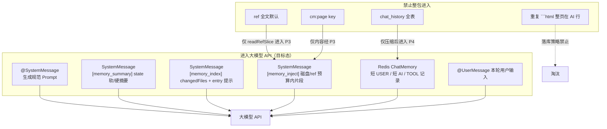
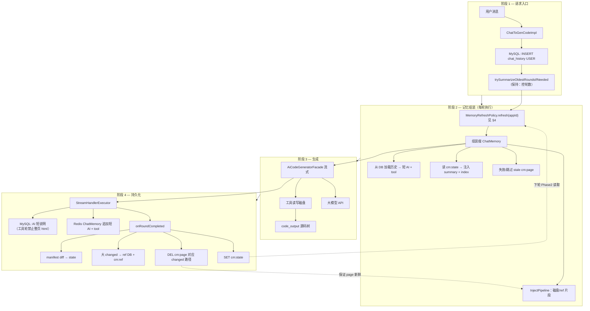
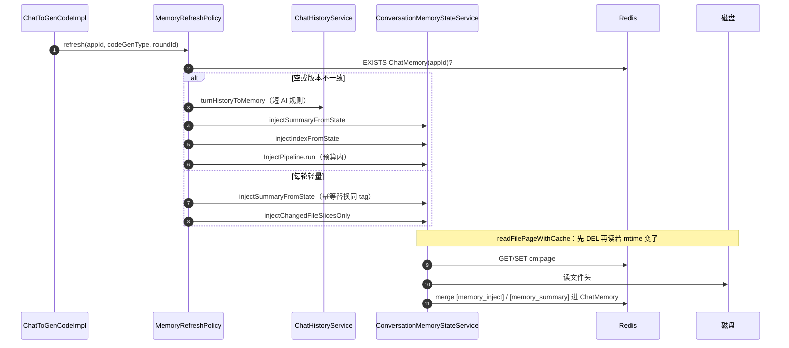
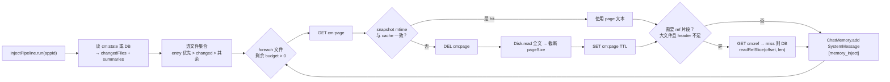
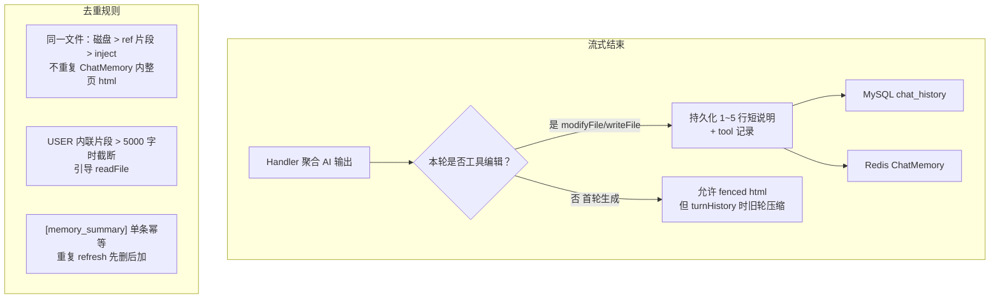
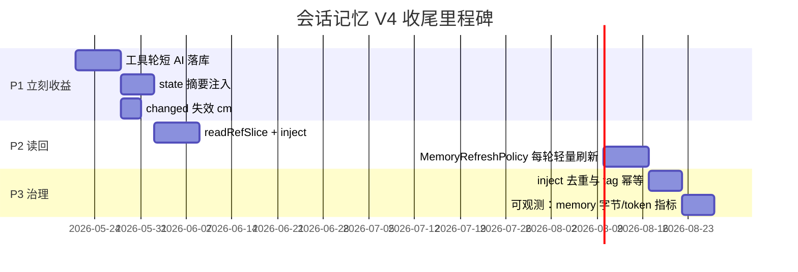

# 会话记忆 V4：目标架构（To-Be / 完全完工）

面向读者：实现 memory-v4 收尾、治理 token 与「磁盘为准」编辑链路的开发同学。

**文档性质**：在 [conversation-memory-v4-current-architecture.md](./conversation-memory-v4-current-architecture.md) 基础上，描述**完全接线后**的目标态；每条链路标明数据形态与是否进入 LLM。

**设计原则（四条）**

1. **聊天里只留短 AI + tool 记录**（不重复整页源码）。
2. **代码以磁盘为准**（readFile / modifyFile / writeFile）。
3. **state 摘要 + ref 按需片段**进入 ChatMemory（预算内）。
4. **page 仅作读盘 IO 缓存**（变更即失效）。

---

## 1. 目标分层

| 层级 | 载体 | 真相源 | 目标职责 |
|------|------|--------|----------|
| 对话审计 | MySQL `chat_history` | 是 | 全量可回溯；进模型前强压缩 |
| 对话窗口 | Redis ChatMemory | 否 | **瘦上下文**：短 USER/AI、TOOL、摘要 SystemMessage、inject 片段 |
| 工程索引 | `conversation_memory_state` + `cm:state` | 是 | summary + changedFiles + 指针；**摘要注入 LLM** |
| 快照 | `snapshot_history` | 是 | manifest diff 驱动 changedFiles |
| 大文件冷库 | `conversation_memory_ref` + `cm:ref` | 是 | 全文归档；**按 filePath/refId 分页读回** |
| 读盘缓存 | `cm:page` | 否 | 文件头缓存；**changed 时 DEL** |
| 源码 | `temp/code_output/...` | 是 | 唯一完整源码真相 |

---

## 2. 目标：进入 LLM 的唯一拼装规则

---

## 3. 目标总览：一轮对话端到端

---

## 4. 目标：MemoryRefreshPolicy（取代「仅新建 Service 才 inject」）

| 策略 | 触发条件 | 动作 |
|------|----------|------|
| `FULL_REBUILD` | Redis ChatMemory 空；或 `memoryGeneration` 版本落后 | `turnHistoryToMemory` + 全量 `InjectPipeline` |
| `LIGHT_REFRESH` | 每轮生成前；或 `onRoundCompleted` 后 | 仅更新 summary/index inject；刷新 changed 文件头片段 |
| `CACHE_ONLY` | 单轮内多次工具调用 | 不重复 inject；依赖磁盘 + tool 结果 |

---

## 5. 目标：InjectPipeline（page / ref / 磁盘）

**ref 读回约定（目标 API）**

- `readRefSlice(appId, refId, offset, maxChars)` → 仅返回片段。
- 默认不注入全文；仅当 Rubric 需要「跨轮恢复」时提高 budget。

---

## 6. 目标：落库与 ChatMemory 瘦身

---

## 7. 目标 Redis Key 行为

| Key | 写 | 读 | 失效 |
|-----|----|----|------|
| ChatMemory(`appId`) | 瘦消息 + tagged SystemMessage | 每轮 LLM | 窗口 80 条 + 压缩 |
| `cm:state:{appId}` | onRoundCompleted | 每轮 refresh 读 summary/index | TTL 14d |
| `cm:page:{appId}:{path}:0` | InjectPipeline miss | InjectPipeline | **changedFiles 含 path 时 DEL** |
| `cm:ref:{refId}` | 归档 ≥8KB changed | readRefSlice | TTL 3d + DB 治理 |

---

## 8. 目标与当前差异对照

| 能力 | 当前（As-Is） | 目标（To-Be） |
|------|---------------|---------------|
| state 摘要进 LLM | TODO | `[memory_summary]` SystemMessage |
| ref 进 LLM | 无 | `readRefSlice` → inject |
| page 触发 | 仅新建 Service | 每轮 `LIGHT_REFRESH` + 变更失效 |
| AI 落库 | 可整页 html | 工具轮仅短说明 |
| inject 去重 | 无 | §6 Dedup |
| 源码真相 | 已是磁盘 | 强化 Prompt：禁止重复 echo 全文件 |

---

## 9. 实施里程碑（建议顺序）

| 阶段 | 交付物 | 验收 |
|------|--------|------|
| P1 | Handler 策略 + `injectSummaryFromState` + page 失效 | 工具编辑后 Redis 无第三份整页 html |
| P2 | `readRefSlice` + `LIGHT_REFRESH` | 缓存命中下轮仍更新 changed 片段 |
| P3 | 去重 + 指标 | 单次请求上下文可观测且低于基线 30%+ |

---

## 10. 目标源码模块（建议新增/调整）

| 模块 | 建议路径 | 职责 |
|------|----------|------|
| `MemoryRefreshPolicy` | `service/memory/MemoryRefreshPolicy.java` | 统一 refresh 策略 |
| `InjectPipeline` | `service/memory/InjectPipeline.java` | page/ref/磁盘注入 |
| `RefSliceReader` | `service/memory/RefSliceReader.java` | ref 分页读回 |
| `PageCacheInvalidator` | `service/memory/PageCacheInvalidator.java` | changed 时 DEL page |
| `AiPersistencePolicy` | `core/handler/AiPersistencePolicy.java` | 工具轮短落库 |

现有类**保留**：`ConversationMemoryStateServiceImpl` 收敛为编排入口，具体步骤委托上述组件。

---

## 11. 相关文档

| 文档 | 说明 |
|------|------|
| [conversation-memory-v4-current-architecture.md](./conversation-memory-v4-current-architecture.md) | 当前已实现架构 |
| `learn/会话记忆指南（会话记忆重构V4学习复盘）.md` | 名词与流程科普 |
| `CLAUDE.md` | 仓库级会话记忆配置指针 |

---

*author By glyahh · 目标架构 · 实施时以 Issue/PR 勾选 §9 里程碑*
