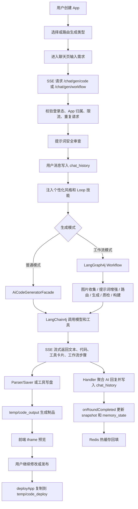

# glyahh-ai-generate-code 项目面试准备

适用场景：本科生找 Java 后端 / 全栈 / AIGC 应用开发实习。  
表达原则：先讲业务价值，再讲自己负责的链路，最后讲技术取舍和踩坑。

## 1. 一分钟介绍项目

这个项目是一个对话式 AI 应用生成平台。用户输入自然语言需求后，系统会通过大模型生成前端制品，支持单页 HTML、多文件 HTML/CSS/JS，以及 Vue 3 工程。生成过程通过 SSE 实时返回给前端，用户可以边看生成过程边看到工具调用、工作流步骤和最终代码。代码会落盘到本地目录，前端用 iframe 预览，也可以发布到静态资源目录，生成可访问的部署地址。

我在介绍这个项目时会重点讲三条线：

1. 生成链路：用户请求从 Controller 进入，经过权限校验、提示词安全审查、会话历史落库，再调用 LangChain4j / LangGraph4j 生成代码，最后通过 SSE 返回。
2. 制品链路：模型输出不是只展示文本，而是会解析、写入磁盘、构建 Vue 项目、提供静态预览和部署。
3. 记忆链路：长对话会越来越大，所以项目用 MySQL 做真相源，Redis 做热缓存，结合摘要、快照和 changedFiles 维护上下文。

如果面试官问“这个项目解决了什么问题”，可以回答：

> 它解决的是“从一句需求到可预览、可下载、可发布前端应用”的闭环。普通聊天机器人只能返回代码片段，这个项目把代码生成、流式展示、文件落盘、历史记忆、预览部署和二次修改串成一条业务链路。

## 2. 业务流程梳理

### 2.1 用户创建应用

用户在前端输入应用名称、初始需求和代码类型。代码类型可以由用户显式选择，也可以由后端调用路由模型判断是 HTML、多文件项目还是 Vue 项目。后端创建 `App` 记录，保存 `appName`、`initPrompt`、`codeGenType`、`userId` 等信息。

如果创建时绑定了 Loop 技能，系统会把 Loop 和 App 建立关联。Loop 可以理解成一段可复用的提示词技能，比如“生成企业风格后台页面”或“按某种 UI 规范输出”。

涉及代码：

- `AppServiceImpl.createApp`
- `aiCodeGeneratorRoutineService`
- `LoopInjectService`

### 2.2 用户发起代码生成

前端聊天页通过 `EventSource` 请求 SSE 接口：

- 普通生成：`GET /api/chat/gen/code`
- 工作流生成：`GET /api/chat/gen/workflow`

后端入口在 `ChatToGenCodeController`。这里会校验 `appId`、`message` 和登录态，然后把业务交给 `ChatToGenCodeImpl`。

`ChatToGenCodeImpl` 主要做这些事：

1. 查询 App，校验当前用户是不是应用创建者。
2. 根据 App 的 `codeGenType` 确定生成类型。
3. 做短时间重复请求拦截，避免用户连续点击造成重复生成。
4. 判断是否首轮生成，并用 `ReentrantLock` 避免同一个 App 并发请求都读到首轮状态。
5. 对用户输入做提示词安全审查。
6. 先把用户消息写入 `chat_history`，拿到本轮 `roundId`。
7. 注入用户个性化风格和可选 Loop 技能。
8. 调用普通 Facade 或 Workflow Facade 生成代码。
9. 在流结束时交给 `StreamHandlerExecutor` 做会话收口。

可以这样讲：

> 我没有直接在 Controller 里调用大模型，而是把 Controller、业务服务、生成 Facade、流处理器分开。Controller 负责 HTTP 和 SSE，Service 负责权限和会话，Facade 负责生成，Handler 负责流式聚合和落库。

### 2.3 普通生成链路

普通链路由 `AiCodeGeneratorFacade` 统一处理。它根据生成类型分三种情况：

- `HTML`：生成单个 `index.html`。
- `MULTI_FILE`：生成 `index.html`、`style.css`、`script.js`。
- `VUE`：通过工具写入多个 Vue 工程文件，再触发本地构建。

HTML 和多文件项目分为首轮生成和后续编辑。首轮生成时模型输出完整代码，流结束后由 Parser 解析，再由 Saver 写入磁盘。后续编辑时更偏向工具调用，由工具直接修改磁盘文件，避免整段覆盖。

Vue 项目使用 `TokenStream`，模型可以调用 `writeFile`、`modifyFile`、`readFile`、`readDir`、`exit` 等工具。后端会把工具请求和工具执行结果适配成前端能展示的卡片。

涉及代码：

- `AiCodeGeneratorFacade.generateAndSaveCodeStream`
- `VueTokenStreamAdapter`
- `CodeParserExecutor`
- `CodeFileSaverExecutor`
- `HtmlCodeFileSaverTemplate`
- `MultiFileCodeFileSaverTemplate`

### 2.4 工作流生成链路

工作流链路使用 LangGraph4j，把一次生成拆成多个节点：

1. `image_collector`：根据需求收集图片资源。
2. `prompt_enhancer`：增强用户提示词。
3. `router`：决定生成类型。
4. `code_generator`：调用原有生成 Facade 生成代码。
5. `code_quality_check`：对代码质量做检查。
6. `project_builder`：Vue 项目通过质检后执行构建。

质检失败时会回到 `code_generator` 重试，最多 3 次。重试时会把上一轮错误信息拼入提示词，并限制模型只做针对性修复，尽量避免重写整个项目。

面试回答可以这样说：

> 我们把复杂生成流程做成图结构，而不是在一个方法里写一串 if else。这样好处是每个节点职责清楚，后续要加截图、质检、构建、重试都比较自然。工作流每完成一步会把 `[workflow]` 进度通过 SSE 推给前端，前端展示成步骤卡片。

涉及代码：

- `CodeGenWorkflow`
- `WorkflowCodeGeneratorFacade`
- `RouterNode`
- `CodeGeneratorNode`
- `CodeQualityCheckNode`
- `ProjectBuilderNode`

### 2.5 SSE 流式返回

后端返回的是 `Flux<ServerSentEvent<String>>`。普通文本 chunk 直接下发，特殊标记会转成具名事件：

- `memory-compress`：通知前端正在做会话压缩。
- `workflow-step`：通知前端工作流步骤完成。
- `done`：流结束事件。

前端 `AppChatView.vue` 里用 `EventSource` 接收流，并把内容解析成不同 UI 片段：

- 普通 Markdown 文本。
- 代码块。
- 工具请求卡片。
- 工具执行卡片。
- 工作流步骤卡片。
- 生成状态卡片。

这里可以强调一个细节：

> 前端不能简单把所有 chunk 拼成一段文本，因为工具调用、代码围栏和工作流步骤都有结构。项目里做了流式解析状态机，用 buffer 和 stage 判断当前是在普通 Markdown、工具执行代码块，还是 modifyFile 的 before/after 内容。

涉及代码：

- `ChatToGenCodeController.toSseEvent`
- `StreamHandlerExecutor`
- `SimpleTextStreamHandler`
- `WorkflowTextStreamHandler`
- `JsonMessageStreamHandler`
- `AppChatView.vue`
- `workflowChatFilters.ts`
- `markdownParser.ts`

### 2.6 代码落盘、预览和发布

生成后的代码会写入：

- `temp/code_output/html_{appId}/`
- `temp/code_output/multi_file_{appId}/`
- `temp/code_output/vue_project_{appId}/`

预览时，后端 `StaticResourceController` 把 `/api/static/{deployKey}/**` 映射到 `temp/code_output` 下的文件，前端 iframe 加载这个地址。为了避免用户看到旧页面，静态响应里设置了 `Cache-Control: no-cache`。

发布时，`AppServiceImpl.deployApp` 会校验应用归属和产物完整性。HTML 必须有 `index.html`，多文件项目还要有 `style.css` 和 `script.js`。Vue 项目会先执行 `npm build`，然后把 `dist` 作为发布源，复制到 `temp/code_deploy/{deployKey}/`。

发布成功后，数据库记录 `deployKey` 和 `deployedTime`，并异步生成应用截图上传到 OSS。

涉及代码：

- `StaticResourceController`
- `AppServiceImpl.deployApp`
- `vueProjectBuilder`
- `ScreenshotService`
- `OssManager`

### 2.7 会话记忆和长上下文治理

这个项目的记忆不是只放在一个 List 里。当前设计是三层：

- MySQL `chat_history`：对话真相源，保存用户和 AI 消息。
- Redis `ChatMemoryStore`：大模型请求时直接使用的热窗口。
- MySQL `conversation_memory_state` 和 `snapshot_history`：保存工程状态、文件快照、changedFiles、摘要等。

每轮生成完成后，`StreamHandlerExecutor` 在 `doFinally` 里只触发一次 `onRoundCompleted`。它会统计本轮输出字符数和耗时，然后交给 `ConversationMemoryStateServiceImpl`：

1. 等待生成目录稳定，避免文件还没写完就扫描。
2. 构建当前 manifest。
3. 找上一轮 manifest，diff 出 changedFiles。
4. 写入 `snapshot_history`。
5. 更新 `conversation_memory_state`。
6. 回填 Redis 热缓存。

长对话超过阈值后，`trySummarizeOldestRoundsIfNeeded` 会把较早轮次摘要写入 `memory_shrink`，再重建 Redis ChatMemory。这样 MySQL 保留完整历史，模型上下文只保留摘要和近期消息。

面试可以这样讲：

> 我们把“用户看得到的历史”和“模型要吃的上下文”分开治理。MySQL 保留完整历史，避免数据丢失；Redis 只做热窗口，过期后可以从 MySQL 重建；工程状态用快照和 changedFiles 维护，避免每轮都把整个项目塞给模型。

涉及代码：

- `ChatHistoryServiceImpl`
- `ConversationMemoryStateServiceImpl`
- `ChatHistoryAiMemoryRebuildSupport`
- `ChatHistoryEchoRedisSupport`
- `ConversationMemoryManifestSupport`

## 3. 技术亮点总结

### 3.1 SSE 流式生成闭环

项目不是等模型全部生成完再返回，而是用 `Flux` 和 SSE 实时推送。这样用户能看到生成进度、工具调用和工作流步骤，体验更接近真实 AI 编程助手。

可以补充：

> 流式链路里最容易出问题的是结束状态和异常状态。项目里用 `onErrorResume` 保证 SSE 会返回失败文案和 done 事件；用 `doFinally` 做统一收口；用 `AtomicBoolean` 防止 complete/error/cancel 分支重复落库。

### 3.2 首轮和编辑轮分离

首轮生成倾向于产出完整项目，后续编辑倾向于读取和修改已有文件。这样能减少大模型反复输出整份代码，也能降低已有功能被覆盖的风险。

### 3.3 AI Service 缓存和记忆重建

`aiCodeGeneratorServiceFactory` 用 Caffeine 缓存每个 App 的 AI Service，降低重复构建成本。同时它会检查 Redis ChatMemory 是否为空，如果 Redis 过期而 Caffeine 还在，就主动失效本地缓存并从 MySQL 重建记忆，避免拿到一个“有 Service 但没上下文”的状态。

### 3.4 LangGraph4j 工作流编排

工作流把生成拆成节点，并支持质检失败后的重试。相比单次模型调用，它更适合复杂任务，也方便后续加入更多节点，比如截图检查、自动修复、资源采集、构建诊断。

### 3.5 会话记忆 V4

记忆设计区分了对话历史、模型热窗口和工程快照。这个设计能回答面试官关于“长上下文怎么处理”“Redis 丢了怎么办”“为什么不每次把所有文件发给模型”的追问。

### 3.6 工具调用可视化

模型调用 `writeFile`、`modifyFile`、`readFile` 等工具时，后端会把工具请求和执行结果转成结构化消息，前端展示成卡片。用户能知道模型正在写哪个文件、改了什么内容，而不是只看到一大段文本。

### 3.7 权限、限流和安全审查

生成接口会校验用户只能操作自己的 App；接口上有基于用户的限流；用户输入会经过 Prompt 安全审查；用户取消流时会回滚本轮用户消息，避免取消的请求污染后续上下文。

## 4. 高频面试问题和参考回答

### Q1：你这个项目是做什么的？

答：

> 这是一个对话式 AI 应用生成平台。用户用自然语言描述想要的页面或应用，后端调用大模型生成 HTML、多文件前端项目或 Vue 3 工程。生成过程通过 SSE 实时推给前端，代码会落盘，用户可以在 iframe 里预览，也可以发布成静态访问地址。相比普通聊天机器人，它多了文件落盘、预览部署、会话记忆、工作流质检和二次编辑这些工程闭环。

### Q2：你在项目里主要做了哪些后端工作？

答：

> 我主要围绕 AI 代码生成链路做后端设计和实现。包括 SSE 流式接口、用户消息落库、生成类型路由、LangChain4j Service 构建、工具调用适配、生成结果解析落盘、工作流节点编排，以及会话记忆压缩和 Redis 缓存重建。这个项目不是简单调一次模型接口，重点在于把模型输出变成稳定的可预览制品。

如果想说得更谦虚一点：

> 作为本科项目，我更重点学习和实现了其中的生成链路、流式处理和会话记忆部分。很多地方也做了测试和复盘，比如 SSE 完整性、工具卡片展示、取消请求后的历史回滚。

### Q3：从用户点击生成到前端显示结果，中间发生了什么？

答：

> 前端用 EventSource 请求 `/api/chat/gen/code` 或 `/api/chat/gen/workflow`。后端先校验登录态、App 归属和参数，然后把用户消息写入 `chat_history`，拿到 roundId。接着根据 App 的 `codeGenType` 调用普通生成 Facade 或 LangGraph4j 工作流。模型输出通过 Reactor `Flux` 变成 SSE chunk 返回给前端。流结束时，Handler 聚合 AI 回复并落库，`StreamHandlerExecutor` 触发 `onRoundCompleted`，更新工程快照、changedFiles 和 Redis 记忆缓存。前端收到 chunk 后解析成文字、代码块、工具卡片或工作流步骤卡片，同时 iframe 预览磁盘上的生成文件。

### Q4：为什么用 SSE，不用 WebSocket？

答：

> 这个场景主要是服务端单向持续推送，用户发起一次生成请求后，后端不断返回 token、工具状态和步骤状态。SSE 比 WebSocket 更轻，浏览器原生 `EventSource` 支持自动重连和事件类型，后端用 Spring WebFlux 的 `Flux<ServerSentEvent<String>>` 也比较自然。WebSocket 更适合双向高频通信，而这个项目的主要需求是单向流式输出。

可以补一句不足：

> 如果后续要做多人协作、实时中断控制或更复杂的双向协议，WebSocket 会更合适。

### Q5：SSE 过程中如果出错了怎么办？

答：

> Controller 层对内容流做了 `onErrorResume`，上游异常时会返回用户可见的失败文案，并在最后追加 `done` 事件，避免前端一直等。Handler 层也区分 complete、error、cancel：complete 时聚合 AI 文本落库；error 时写入失败提示；cancel 时回滚本轮用户消息并清掉 AI ChatMemory，避免取消轮进入下一轮上下文。

### Q6：怎么避免同一轮消息重复落库？

答：

> 流式处理有 complete、error、cancel 等不同结束路径，理论上某些边界可能导致收口逻辑重复触发。项目里用 `AtomicBoolean.compareAndSet(false, true)` 控制只执行一次落库或一次 `onRoundCompleted`。另外，`ChatToGenCodeImpl` 里还有 12 秒重复请求窗口，用 appId、userId、channel 和消息 hash 做重复请求拦截，避免用户连续点击发送造成重复生成。

### Q7：首轮生成和后续修改有什么区别？

答：

> 首轮生成没有历史文件，目标是快速生成完整制品。HTML 和多文件项目首轮可以直接让模型输出完整代码，流结束后解析落盘；Vue 首轮只开放写文件工具，避免一开始就读改不存在的文件。后续修改时，系统会根据用户意图判断为编辑轮，注入已有文件上下文，让模型通过 readFile、modifyFile 等工具做局部修改，减少整项目重写带来的风险。

### Q8：你的代码是怎么落盘的？

答：

> HTML 和多文件类型会先用 Parser 从模型输出里解析出结构化结果，比如 `HtmlCodeResult` 或 `MultiFileCodeResult`，再交给 Saver 模板写入对应目录。目录命名跟类型和 appId 绑定，比如 `html_{appId}`、`multi_file_{appId}`。Vue 项目则更多依赖工具调用直接写入工程文件，结束后可以执行构建。

### Q9：为什么要设计 Parser 和 Saver，而不是直接写文件？

答：

> 因为模型输出不稳定，可能带 Markdown 围栏、说明文字，甚至多文件混在一起。Parser 负责把模型文本收敛成结构化对象，Saver 负责统一校验、建目录和写文件。这样新增一种生成类型时，只需要补对应 Parser/Saver，不用把所有逻辑写在 Facade 里。

### Q10：会话历史是怎么保存的？

答：

> 用户消息和 AI 消息都写入 MySQL 的 `chat_history`，这是历史真相源。前端查历史时优先读 Redis echo 缓存，缓存 miss 再查 MySQL 并回填。大模型上下文不是直接读完整历史，而是通过 LangChain4j 的 Redis ChatMemoryStore 保存热窗口，必要时从 MySQL 和摘要重建。

### Q11：Redis 里的记忆过期了怎么办？

答：

> 项目里没有把 Redis 当真相源。`aiCodeGeneratorServiceFactory` 取 Caffeine 缓存的 AI Service 时，会检查 Redis ChatMemory 是否为空。如果 Redis 过期但本地 Service 还在，就失效 Caffeine 缓存，重新创建 Service，并从 MySQL 的 `chat_history` 和 memory 状态重建 ChatMemory。

### Q12：长对话上下文越来越大怎么处理？

答：

> 项目里做了几层治理。第一层是 Redis ChatMemory 只保留有限窗口。第二层是 `trySummarizeOldestRoundsIfNeeded`，当未合并用户轮数超过阈值时，把较早轮次用 AI 摘要写入 `memory_shrink`，然后重建 Redis ChatMemory。第三层是工程状态不靠整段代码历史，而是通过 `snapshot_history`、manifest diff 和 changedFiles 记录项目变化。

### Q13：为什么 MySQL 和 Redis 都要用？

答：

> MySQL 负责可靠持久化，Redis 负责高频读取。聊天历史、App 信息、部署信息这些不能丢，所以放 MySQL。前端回显历史和大模型热窗口访问频繁，用 Redis 可以减少数据库压力。Redis 失效后可以从 MySQL 重建，所以它不是唯一数据源。

### Q14：工作流模式比普通模式强在哪里？

答：

> 普通模式更像一次生成调用，链路短，适合简单页面。工作流模式把复杂任务拆成图片资源收集、提示词增强、路由、代码生成、质量检查、项目构建等节点。它的优势是可观测、可重试、可扩展。比如质检失败后可以带着错误信息回到生成节点重新修复，而不是直接把失败结果返回给用户。

### Q15：质检失败后怎么重试？

答：

> `CodeQualityCheckNode` 会把结果写入 `WorkflowContext`。条件边 `routeAfterCodeGenerator` 判断 `QualityResult.isValid`，如果失败且重试次数没超过 3 次，就回到 `code_generator`。重试时会设置 `firstRound=false`，并把错误信息拼到提示词里，要求模型只做针对性修复。超过最大次数就结束，避免无限循环。

### Q16：前端怎么展示工具调用？

答：

> 后端把工具请求和执行结果适配成文本协议，比如选择工具、写入文件、修改文件这些片段。前端不是简单渲染字符串，而是用解析器把 SSE chunk 拆成 UI segment。不同 segment 渲染成不同组件，比如工具请求提示、写文件结果卡片、修改文件 before/after 卡片、代码块组件等。

### Q17：项目里怎么做权限控制？

答：

> 生成和部署都要求当前用户是 App 创建者。比如 `ChatToGenCodeImpl` 会校验 `app.getUserId().equals(user.getId())`，`AppServiceImpl.deployApp` 也会校验只能部署自己的应用。管理端接口则通过用户角色区分管理员。还有自定义 `@MyRole` 和 AOP 用于部分接口鉴权。

### Q18：怎么做限流？

答：

> 生成接口上用了自定义 `@RateLimit` 注解，按用户维度限制 60 秒内最多 5 次请求。底层有 Redis / Redisson 配置支持限流。除此之外，业务层还有重复请求拦截，防止同一用户短时间重复提交完全相同的生成内容。

### Q19：为什么要做提示词安全审查？

答：

> 因为用户输入会直接进入大模型和工具链，如果没有审查，可能出现恶意提示词、越权操作或不适合生成的内容。项目里先用 `PromptSafetyAuditEvaluator` 做最小审查，记录命中的规则和动作。如果被拦截，用户消息虽然已尝试进入流程，但会在生成前阻断，避免继续调用模型。

### Q20：Vue 项目为什么要本地 build？

答：

> Vue 项目不是一个静态 HTML 文件，最终发布需要 `dist` 产物。项目在发布 Vue 应用时会调用 `vueProjectBuilder.buildProject` 执行构建，确认生成 `dist` 后再复制到部署目录。这样发布出去的是浏览器可直接访问的静态资源，而不是源码目录。

### Q21：静态预览怎么实现？

答：

> 生成文件保存在 `temp/code_output`。后端提供 `/api/static/{deployKey}/**` 访问这些文件，请求目录时默认返回 `index.html`，并根据扩展名设置 Content-Type。前端 iframe 加载这个地址，所以用户能在聊天页右侧实时预览生成结果。

### Q22：取消生成后怎么处理脏数据？

答：

> 如果用户取消 SSE，`StreamHandlerExecutor` 会识别 `SignalType.CANCEL`，跳过 `onRoundCompleted`，并调用 `removeUserMessageByContent` 删除刚写入的用户消息，同时清理 echo 缓存和 AI ChatMemory。这样取消的半截请求不会污染后续生成上下文。

### Q23：你们怎么处理模型输出不完整的问题？

答：

> 对传统 HTML 流，`SimpleTextStreamHandler` 在完成时会调用 `LegacyHtmlStreamIntegrity.appendIntegrityNoticeIfNeeded`，检查末尾是否像未闭合标签这类截断情况。如果疑似截断，会在历史消息里追加提示。落盘时也会判断解析结果是否为空，避免空内容写入导致后续链路误判成功。

### Q24：这个项目里你觉得最难的点是什么？

答：

> 最难的是流式链路的一致性。因为一轮生成同时涉及前端显示、AI ChatMemory、MySQL 历史、磁盘文件和工程快照。任何一个环节失败，都可能造成“用户看到了结果但历史没保存”或“历史保存了但文件没写好”。所以项目里把流处理、落库、取消回滚和 `onRoundCompleted` 收口拆开，并尽量让记忆更新失败不影响 SSE 主链路。

### Q25：如果让你继续优化，你会做什么？

答：

> 我会优先做三件事。第一，把 memory_state 里的 softSummary/hardSummary 更稳定地注入模型上下文，目前文档里也标了 TODO。第二，把大文件 ref 的分页读回链路补完整，让模型按需读取大文件，而不是依赖短索引。第三，增强构建失败诊断，把 npm build 错误结构化后交给工作流自动修复。

### Q26：你这个项目和普通 CRUD 项目相比有什么不同？

答：

> 普通 CRUD 主要围绕数据库增删改查，这个项目的难点在状态流转。用户一次生成会同时产生 SSE 流、聊天历史、模型记忆、文件产物、工程快照和部署状态。后端要保证这些状态最终能对齐，而且模型输出本身是不稳定的，所以需要 Parser、Saver、工具协议、重试和上下文治理。

### Q27：为什么用 MyBatis-Flex？

答：

> MyBatis-Flex 比原生 MyBatis 写法更简洁，能保留 SQL 可控性，又能用 `QueryWrapper` 和 `ServiceImpl` 快速做分页、条件查询、批量查询等业务。项目里 App、ChatHistory、Loop 等表都有比较多条件筛选，用 MyBatis-Flex 能减少样板代码。

### Q28：你怎么理解这个项目里的“制品交付”？

答：

> 制品交付指的是模型输出最后不是停在一段文本，而是变成可运行的文件。这个项目会把代码写到 `temp/code_output`，前端能预览，用户能下载，发布时复制到 `temp/code_deploy` 并生成 deployKey。也就是说，AI 输出经过解析、保存、构建和发布，变成了一个真正能访问的前端应用。

### Q29：如果面试官问你 Redis 缓存穿透/雪崩有没有处理，怎么说？

答：

> Loop 注入里有一个比较典型的 cache-aside 处理。读取 `loop:compiled:{loopId}` 时先查 Redis，miss 再查 MySQL。如果 DB 也没有，会写一个短 TTL 的空值 `{}` 防止缓存穿透；正常缓存会加 30 分钟左右 TTL，并加几分钟随机抖动，降低同一时间大量 key 过期造成的雪崩风险。

### Q30：你项目里有哪些测试？

答：

> 后端有 JUnit 5 测试，覆盖控制器 SSE 事件、Facade 流式生成、Parser/Saver、会话记忆、Redis 回显、Workflow 工作流、工具流适配、输出安全过滤等。前端也做过 Playwright 截图和页面流程验证。对于 AI 项目来说，测试重点不是断言模型每次输出完全一样，而是验证协议、状态收口、缓存重建和异常分支稳定。

## 5. 可以放进简历的项目描述

简洁版：

> 基于 Spring Boot 3 + LangChain4j + LangGraph4j + Vue 3 实现对话式 AI 应用生成平台，支持自然语言生成单页 HTML、多文件项目和 Vue 工程，提供 SSE 流式输出、工具调用可视化、代码落盘、iframe 预览、静态发布和会话记忆压缩能力。

技术点版：

> 负责 AI 代码生成核心链路：设计 `Controller -> Service -> Facade -> StreamHandler` 分层，基于 WebFlux `Flux<ServerSentEvent>` 实现流式输出；封装 Parser/Saver 将模型文本收敛为可运行制品；接入 LangGraph4j 工作流完成提示词增强、代码生成、质量检查和构建重试；设计 MySQL + Redis 双轨会话记忆，支持长对话摘要压缩、Redis 过期重建和工程 changedFiles 快照。

偏后端版：

> 使用 MyBatis-Flex 管理 App、ChatHistory、Loop 等核心表；基于 Redis/Caffeine 优化 AI Service 和会话历史读取；实现用户维度限流、应用归属校验、提示词安全审查、取消生成回滚和发布产物完整性校验，提升 AI 生成链路的稳定性。

## 6. 面试时的回答结构

### 6.1 介绍业务时按这个顺序

1. 这个项目面向谁：想快速生成前端页面或应用的用户。
2. 用户怎么用：创建应用，输入需求，等待流式生成，预览，继续修改，发布。
3. 后端做了什么：权限校验、历史落库、模型调用、工具执行、文件落盘、记忆更新。
4. 项目难点：模型输出不稳定，流式状态复杂，长对话上下文膨胀。
5. 你的解决：SSE 分层处理、Parser/Saver、工作流重试、MySQL + Redis 记忆治理。

### 6.2 被问技术细节时按这个顺序

1. 先说结论。
2. 再说具体类或流程。
3. 最后说为什么这么设计。

例子：

> 这个项目 Redis 不是唯一数据源。聊天历史真相源在 MySQL 的 `chat_history`，Redis 只是模型上下文和前端回显的热缓存。`aiCodeGeneratorServiceFactory` 获取 AI Service 时会检查 Redis ChatMemory 是否为空，如果 Redis 过期，就失效 Caffeine Service，再从 MySQL 重建上下文。这样可以兼顾性能和可靠性。

### 6.3 不要过度包装的地方

可以说：

> 这个项目仍有一些可以继续完善的地方，比如 memory_state 的 soft/hard summary 还没有完全接入模型上下文，大文件 ref 读回也还在目标架构里。现在已经能支撑基本的长对话压缩和 changedFiles 注入，但还不是最终形态。

这样回答反而更可信。

## 7. 项目业务流程图

## 8. 项目模块对照表

| 模块 | 作用 | 面试讲法 |
|---|---|---|
| `controller` | HTTP/SSE 接口 | 接收请求、转 SSE、做基础参数校验 |
| `service` | 业务编排 | App 权限、历史、发布、Loop 注入 |
| `core` | 生成主链路 | Facade、Parser、Saver、StreamHandler、Memory |
| `ai` | LangChain4j Service 和工具 | 构建模型服务、绑定工具、处理 ChatMemory |
| `LangGraph4j` | 工作流编排 | 节点化生成、质检、重试、构建 |
| `guardrail` | 安全过滤 | 用户输入审查和输出清洗 |
| `rateLimiter` | 限流 | 用户维度限制生成频率 |
| `model/mapper` | 数据模型 | App、ChatHistory、Memory、Loop 等表 |
| `ai-generate-code-frontend` | 前端交互 | 聊天、SSE 解析、预览、工具卡片、可视化编辑 |

## 9. 面试前重点复习代码

建议按这个顺序看：

1. `ChatToGenCodeController`
2. `ChatToGenCodeImpl`
3. `AiCodeGeneratorFacade`
4. `aiCodeGeneratorServiceFactory`
5. `StreamHandlerExecutor`
6. `SimpleTextStreamHandler` / `WorkflowTextStreamHandler` / `JsonMessageStreamHandler`
7. `CodeGenWorkflow`
8. `CodeGeneratorNode` / `CodeQualityCheckNode`
9. `ChatHistoryServiceImpl`
10. `ConversationMemoryStateServiceImpl`
11. `AppServiceImpl.deployApp`
12. `AppChatView.vue` 的 EventSource 和 UI segment 解析逻辑

## 10. 最容易被追问的点

1. SSE 为什么比 WebSocket 更适合这个项目。
2. Redis 过期后上下文怎么恢复。
3. 取消生成如何避免污染历史。
4. 首轮生成和后续修改为什么要分开。
5. 工作流质检失败怎么重试。
6. 模型输出怎么从文本变成文件。
7. Vue 项目怎么构建和部署。
8. 为什么需要 changedFiles 和 snapshot。
9. Prompt 安全审查做在什么位置。
10. 如果模型输出坏代码，系统怎么兜底。

## 11. 自我介绍时可以自然带出的说法

> 我现在大二，项目经验主要集中在 Java 后端和 AI 应用工程化。这个项目对我帮助比较大，因为它不只是写 CRUD，而是把大模型、SSE 流式输出、Redis 缓存、MySQL 持久化、文件系统和前端预览串到了一起。我对其中的生成链路和会话记忆比较熟，能讲清楚从用户发消息到代码落盘、预览、发布以及下一轮继续修改的完整过程。

