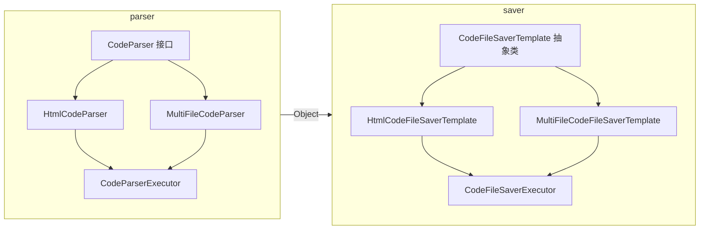

# Parser & Saver 重构模式总结

> 本文档提炼 `core/parser` 与 `core/saver` 两套实现中的**三种可复用架构思想**。  
> 即使完全忘记实现细节，只要记住这三种模式，即可在 AI 辅助下快速恢复或扩展代码。

---

## 一、总览：两套结构，三种模式



| 文件夹 | 职责 | 核心角色 |
|--------|------|----------|
| **parser** | 把「原始字符串」解析成「结构化结果」 | 接口 + 多实现 + 执行器 |
| **saver** | 把「结构化结果」落盘成「目录 + 文件」 | 抽象模板 + 子类 + 执行器 |

两套结构里都复用了同一种「**执行器**」思想：**用枚举 switch + Object 做统一入口，对外只暴露一个方法**。

### 三种模式一句话对照

| 模式 | 一句话 | 典型用法 |
|------|--------|----------|
| **模式一** 接口+泛型 | 接口定契约 String→T，实现类各干各的，T 对应不同结果 | 多种「解析策略」选一种 |
| **模式二** 抽象模板 | 父类定流程，子类只填「写什么」「目录名用啥」 | 多种「保存流程」步骤一致、细节不同 |
| **模式三** 执行器 | 一个入口 + 枚举 switch + Object 强转，内部调实现/模板 | 上层只调一个方法，不关心具体实现类 |

---

## 二、模式一：接口 + 多实现 + 泛型（Parser）

### 核心思想

- **一个接口**定义「入参 → 出参」的契约，**出参用泛型 T**，支持多种结果类型。
- **多个实现类**各自实现 `T parse(输入)`，**每个实现类绑定一种 T**（如 `HtmlCodeResult`、`MultiFileCodeResult`）。
- 调用方不关心具体实现，只关心「按类型要一种结果」。

### 一句话记忆

> **接口定契约（String → T），实现类各干各的，泛型 T 对应不同结果模型。**

### 结构速览

```
CodeParser<T>  (接口)
    ├── T parse(String codeContent)
    │
    ├── HtmlCodeParser         implements CodeParser<HtmlCodeResult>
    └── MultiFileCodeParser    implements CodeParser<MultiFileCodeResult>
```

### 和 AI 复现时的关键提示

- 接口方法签名：`T parse(String codeContent)`，仅此一个。
- 实现类与「结果类」一一对应：类名与泛型 T 对应（如 HtmlCodeParser → HtmlCodeResult）。
- 解析逻辑（正则、拆分等）全部写在各自实现类里，接口不包含业务细节。

---

## 三、模式二：抽象模板 + 模板方法 + 子类（Saver）

### 核心思想

- **一个抽象类**定义「固定步骤」（如：校验 → 建目录 → 写文件 → 返回），其中**只有写文件这一步**由子类实现。
- **模板方法**（如 `save(T)`）里按顺序调：校验、建目录、抽象方法「写文件」、返回目录；子类只实现「写文件」和「返回业务类型标识」。
- 新增一种保存方式 = 新增一个子类，不改父类。

### 一句话记忆

> **父类定流程（校验→建目录→写文件→返回），子类只填「写什么文件」和「目录名用啥标识」。**

### 结构速览

```
CodeFileSaverTemplate<T>  (抽象类)
    │
    │  save(T)  [final]
    │     → validateInput(T)
    │     → buildUniqueDirName()  [内部用 getBizType()]
    │     → saveFiles(dir, T)     [抽象，子类实现]
    │     → return new File(dir)
    │
    ├── getBizType(): String      [抽象]
    ├── saveFiles(dir, T): void   [抽象]
    └── writeSingleFile(...)      [protected 工具方法，子类可调]
    │
    ├── HtmlCodeFileSaverTemplate      → 写 index.html
    └── MultiFileCodeFileSaverTemplate → 写 index.html + style.css + script.js
```

### 和 AI 复现时的关键提示

- 步骤拆成私有方法：校验、拼目录路径、创建目录、写文件，各干一事。
- 子类只实现：`getBizType()`（返回目录名里的类型标识）和 `saveFiles(目录路径, T)`（往目录里写哪些文件）。
- 父类提供 `writeSingleFile(Path, fileName, content)`，子类在 `saveFiles` 里多次调用即可。

---

## 四、模式三：执行器（枚举 switch + Object 统一入口）

### 核心思想

- **一个 Executor 类**对外只暴露一个方法，例如：`execute(枚举, 输入) → 输出`。
- 入参或出参里用 **Object** 兼容多种具体类型；**内部用枚举 switch** 分支，在分支里**强转 Object 为具体类型**，再调对应的「实现类 / 模板子类」的方法。
- 异常统一用项目约定（如 `MyException`）抛出，不把底层实现异常直接抛给上层。

### 一句话记忆

> **一个入口方法 + 枚举 switch + Object 强转，内部调对应实现/模板，失败统一抛业务异常。**

### 结构速览（Parser / Saver 共用同一套路）

```
CodeParserExecutor                    CodeFileSaverExecutor
    │                                      │
    │  execute(CodeGenTypeEnum, String)    │  execute(CodeGenTypeEnum, Object)
    │       → switch (enum)                │       → switch (enum)
    │           HTML   → htmlParser.parse  │           HTML   → htmlSaver.save((HtmlCodeResult) o)
    │           MULTI  → multiParser.parse │           MULTI  → multiSaver.save((MultiFileCodeResult) o)
    │       → return Object                │       → return File
    │       → 异常 → MyException           │       → 异常 → MyException
```

### 和 AI 复现时的关键提示

- 执行器内部持有「各实现类 / 各模板子类」的实例（或静态调用），不在 execute 里 new。
- 先判空枚举、再 try-switch，default 分支抛「不支持的生成类型」。
- catch 里：若是业务异常直接 rethrow，其余包一层 MyException 再抛。

---

## 五、三者如何组合（门面层）

门面只做两件事：

1. **拿数据**：调 AI 服务拿到「原始字符串」或「已解析结果」。
2. **解析 + 保存**：
   - 若是**原始字符串**（如流式拼接结果）→ 先 `CodeParserExecutor.execute(枚举, 字符串)` 得到 Object，再 `CodeFileSaverExecutor.execute(枚举, Object)` 得到 File。
   - 若是**已解析结果**（如普通接口返回的 HtmlCodeResult）→ 直接 `CodeFileSaverExecutor.execute(枚举, result)`。

可抽一个门面内私有方法，例如：`parseCodeContentAndSave(枚举, 字符串)` = 先解析再保存，返回 File。

---

## 六、给 AI 的速查提示（复制即用）

下面这段可直接粘贴给 AI，用于「根据这份架构回忆并实现/扩展代码」：

```text
本项目 core 下有两套结构：

1. parser（解析）：接口 CodeParser<T>，方法 T parse(String)。实现类如 HtmlCodeParser、MultiFileCodeParser，各对应一种结果类型。CodeParserExecutor 对外 execute(CodeGenTypeEnum, String)，内部 switch 调对应 parser.parse，返回 Object，异常用 MyException。

2. saver（保存）：抽象类 CodeFileSaverTemplate<T>，模板方法 save(T)：校验→建唯一目录→子类 saveFiles(dir,T)→返回 File。子类实现 getBizType() 和 saveFiles。CodeFileSaverExecutor 对外 execute(CodeGenTypeEnum, Object)，内部 switch 强转后调对应 Template 的 save，返回 File，异常用 MyException。

3. 门面：有「原始字符串」时先 ParserExecutor 再 SaverExecutor；已有结果时只调 SaverExecutor。可抽 parseCodeContentAndSave(枚举, 字符串) 复用两 Executor。
```

---

## 七、文件清单（便于定位）

| 包 | 文件 | 角色 |
|----|------|------|
| **parser** | `CodeParser.java` | 接口，`T parse(String)` |
| | `HtmlCodeParser.java` | 实现类，→ HtmlCodeResult |
| | `MultiFileCodeParser.java` | 实现类，→ MultiFileCodeResult |
| | `CodeParserExecutor.java` | 执行器，switch + Object |
| **saver** | `CodeFileSaverTemplate.java` | 抽象模板，save = 校验+建目录+saveFiles+返回 |
| | `HtmlCodeFileSaverTemplate.java` | 子类，写 index.html |
| | `MultiFileCodeFileSaverTemplate.java` | 子类，写 html+css+js |
| | `CodeFileSaverExecutor.java` | 执行器，switch + Object → File |

---

*文档目的：忘记实现时，凭「接口+实现+泛型」「抽象模板+子类」「执行器 switch+Object」三条主线 + 速查提示，即可借 AI 快速恢复或扩展。*
