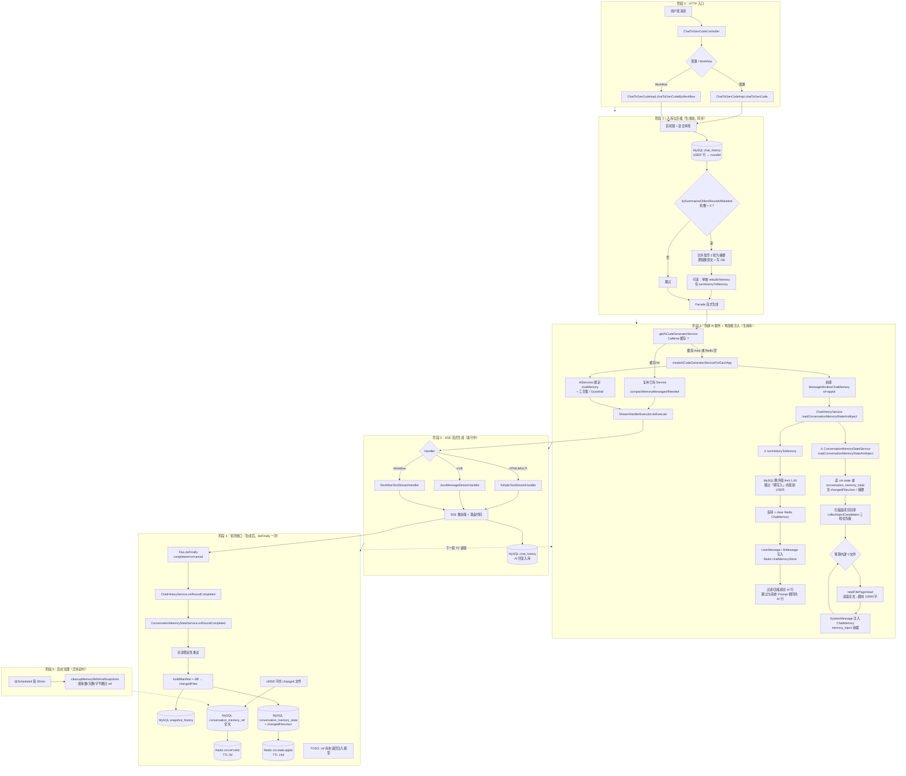

# 会话记忆完整架构图

本文用 **Mermaid flowchart** 描述从 HTTP 入口到后台治理的**端到端会话记忆链路**（普通生成与 Workflow 共用记忆路径）。在支持 Mermaid 的预览中（VS Code / Cursor、GitHub）可直接渲染。

> 关联文档：`learn/会话记忆精简图.md`（仅「进不进 LLM API」视角）、`learn/会话记忆指南（会话记忆重构V4学习复盘）.md`、`learn/数据库表结构图-会话记忆与核心域.md`

---

## 全流程（T0 → T5）

---

## 阶段速查

| 阶段 | 时机 | 核心职责 |
|------|------|----------|
| T0 | HTTP 请求 | 路由普通 / Workflow 生成入口 |
| T1 | 生成前（同步） | USER 入库、`roundId`、超 3 轮合并最早 2 轮摘要 |
| T2 | 生成前 | Caffeine/Redis 复用或新建 Service；`turnHistoryToMemory` + 状态/磁盘注入 |
| T3 | 生成中 | SSE 流式输出、代码落盘、AI 行入库 |
| T4 | 生成后（`doFinally`） | manifest/diff、snapshot/state/ref 落库与 Redis 热缓存 |
| T5 | 定时异步 | 清理过期 ref / snapshot，控制存储体量 |

---

## 存储分工（与图一致）

| 介质 | 典型 Key / 表 | 作用 |
|------|----------------|------|
| MySQL `chat_history` | 每轮 USER/AI | 对话真相源、`roundId` |
| MySQL `conversation_memory_state` | 每 `appId` 一行 | 摘要、`changedFilesJson`、最新轮次指针 |
| MySQL `snapshot_history` | 每轮 manifest | 项目文件清单快照 |
| MySQL `conversation_memory_ref` | 大文件全文 | ≥8000 字变更文件的 ref 归档 |
| Redis `chatMemoryStore` | LangChain4j ChatMemory | 近期 User/Ai 消息窗口 |
| Redis `cm:state:{appId}` | TTL 14d | 状态热读 |
| Redis `cm:ref:{refId}` | TTL 3d | 大文件 ref 热读（**注入 TODO**） |
| 磁盘 `temp/code_output/...` | 生成项目目录 | 注入候选与 manifest diff 来源 |
