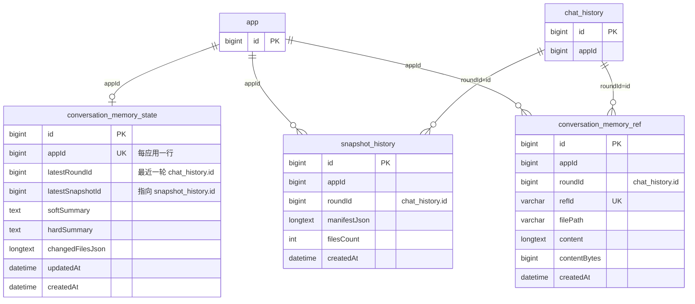
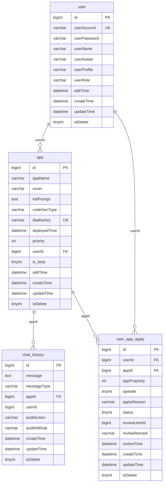
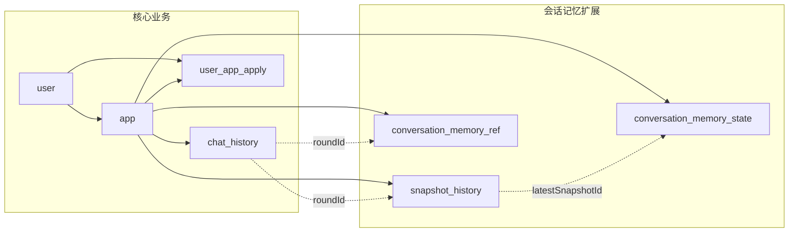

# 数据库表结构图（Markdown 预览）

本文用 **Mermaid** 描述表字段与逻辑关联。在支持 Mermaid 的预览中（如 VS Code / Cursor 预览、GitHub）可直接渲染。

> 来源：`sql/conversation_memory_tables.sql`、`sql/create_table.sql` 及代码中的 `roundId` = `chat_history.id` 约定。会话记忆三张表在 Java 侧为 `IF NOT EXISTS` 建表，**未声明 MySQL 外键**，图中关系为**业务逻辑关联**。

---

## 1. 会话记忆相关（`conversation_memory_*` + `snapshot_history`）

> `conversation_memory_state.latestSnapshotId` 逻辑上指向 `snapshot_history.id`（图中不画边，避免可选 FK 在 Mermaid 里歧义）。

### 关系说明（逻辑层）

| 从表 | 字段 | 含义 |
|------|------|------|
| `conversation_memory_state` | `appId` | 与 `app.id` 一一对应（`uk_app_id`） |
| `conversation_memory_state` | `latestRoundId` | 最近更新的轮次，对应 `chat_history.id` |
| `conversation_memory_state` | `latestSnapshotId` | 对应当轮写入的 `snapshot_history.id` |
| `snapshot_history` | `roundId` | 本轮 `chat_history` 主键 |
| `conversation_memory_ref` | `roundId` | 同上，大文件归档所属轮次 |

---

## 2. 核心业务表（用户 / 应用 / 对话 / 申请）

### 外键与约束（`user_app_apply`）

- `userId` → `user(id)`
- `appId` → `app(id)`
- `operate`：`CHECK (operate in (1, 2))`

`chat_history`、`app` 等在 `create_table.sql` 中主要为索引，**未**对 `appId` 声明 FK（与线上常见做法一致）。

---

## 3. 会话记忆与核心域总览（简图）

---

## 本地预览说明

- **Cursor / VS Code**：打开本文件 → 右上角或命令面板选择 Markdown 预览；若 Mermaid 未渲染，可安装 “Markdown Preview Mermaid Support” 等扩展。
- **GitHub**：推送到仓库后在网页上打开本 `.md` 文件即可渲染 Mermaid。
